# BACS Import — specification

| | |
|---|---|
| **Product** | Mobius PAS — Accounts › BACS › Import |
| **Version** | 1.1 |
| **Date** | 30 September 2026 |
| **Status** | Ready for prototype build |
| **Source** | Figma frames exported to `screenshots/` (IM-FF-SS naming) |
| **Related** | Originators spec (Accounts › BACS › Originators) — same shell, table, toast and tooltip patterns |
| **Audiences** | Developers, product stakeholders, Claude Code (clickable HTML/CSS prototype) |

---

## 1. Purpose

After BACS processes direct debits, it sends reports back to the originator. Users import these files into Mobius so Mobius can update client accounts and policies. This feature replaces two legacy menu options, **Load ARUDD file** and **Load AUDDIS Return / ADDACS file**, with one Import tab. The tab gives users:

- **One import flow** for both file types.
- **A history of every import**, with its result.
- **A detail page for each import**, showing every record in the file and whether Mobius applied it.
- **A searchable reference** of every BACS reason code, in a blade.

### 1.1 Glossary

| Term | Meaning |
|---|---|
| ARUDD | Automated Return of Unpaid Direct Debits. Lists collections that failed, each with a reason code. |
| AUDDIS | Automated Direct Debit Instruction Service. An AUDDIS return lists new Direct Debit Instructions that the payer's bank rejected. |
| ADDACS | Automated Direct Debit Amendment and Cancellation Service. Lists changes and cancellations to instructions, made by payers or their banks. |
| DDI | Direct Debit Instruction. |
| Originator | The BACS service user (SUN). Set up on the Originators tab. |
| Applied | Mobius matched the record to a policy and updated it. |
| Not applied | Mobius couldn't match the record to a policy, so nothing was updated. |

---

## 2. Screen index

The screenshots folder holds only unique frames. Where Figma exported identical frames for different flows, the flow references the shared screen instead.

| ID | File | Shows |
|---|---|---|
| IM-00-01 | `screenshots/IM-00-01.png` | Previous imports, the default state |
| IM-01-01 | `screenshots/IM-01-01.png` | Import result filter open |
| IM-02-01 | `screenshots/IM-02-01.png` | BACS file type filter open |
| IM-03-01 | `screenshots/IM-03-01.png` | Import modal opened, no file type chosen |
| IM-03-02 | `screenshots/IM-03-02.png` | File type dropdown open, ARUDD file hovered |
| IM-03-03 | `screenshots/IM-03-03.png` | ARUDD file chosen, hint and drop zone shown |
| IM-03-04 | `screenshots/IM-03-04.png` | Operating system file picker |
| IM-03-05 | `screenshots/IM-03-05.png` | File attached, Import enabled |
| IM-03-06 | `screenshots/IM-03-06.png` | Importing… |
| IM-03-07 | `screenshots/IM-03-07.png` | New row In-progress, toast "File submitted for import" |
| IM-03-08 | `screenshots/IM-03-08.png` | Row Completed, toast "File import completed" |
| IM-04-01 | `screenshots/IM-04-01.png` | File type dropdown open, AUDDIS Return / ADDACS file hovered |
| IM-04-02 | `screenshots/IM-04-02.png` | AUDDIS Return / ADDACS file chosen, hint and drop zone shown |
| IM-05-01 | `screenshots/IM-05-01.png` | File format error in the modal |
| IM-06-01 | `screenshots/IM-06-01.png` | Failed pill tooltip |
| IM-06-02 | `screenshots/IM-06-02.png` | Failed import detail page |
| IM-07-01 | `screenshots/IM-07-01.png` | Partial pill tooltip |
| IM-08-01 | `screenshots/IM-08-01.png` | Row hover, ARUDD import |
| IM-08-02 | `screenshots/IM-08-02.png` | ARUDD import detail page (Partial) |
| IM-08-03 | `screenshots/IM-08-03.png` | Reason codes blade, default state |
| IM-08-04 | `screenshots/IM-08-04.png` | Row menu open |
| IM-08-05 | `screenshots/IM-08-05.png` | Row menu item hovered |
| IM-09-01 | `screenshots/IM-09-01.png` | Row hover, AUDDIS Return/ADDACS import |
| IM-09-02 | `screenshots/IM-09-02.png` | AUDDIS Return/ADDACS import detail page (Completed) |
| IM-10-01 | `screenshots/IM-10-01.png` | Import new file disabled (no permission) |
| IM-10-02 | `screenshots/IM-10-02.png` | Permission tooltip |

**Shared frames:**

- IM-00-01 is also the first step of IM-03, IM-04, IM-07, IM-08 and IM-09.
- IM-03-01 and IM-03-04 are also steps of IM-04.
- After IM-04-02, the AUDDIS flow continues exactly as IM-03-05 to IM-03-08.

### 2.1 Feature map

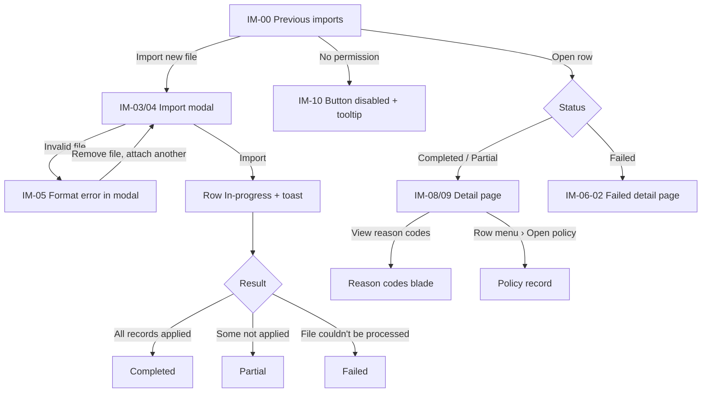
```mermaid
flowchart TD
  A[IM-00 Previous imports] -->|Import new file| B[IM-03/04 Import modal]
  A -->|No permission| P[IM-10 Button disabled + tooltip]
  B -->|Invalid file| E[IM-05 Format error in modal]
  E -->|Remove file, attach another| B
  B -->|Import| C[Row In-progress + toast]
  C --> D{Result}
  D -->|All records applied| D1[Completed]
  D -->|Some not applied| D2[Partial]
  D -->|File couldn't be processed| D3[Failed]
  A -->|Open row| F{Status}
  F -->|Completed / Partial| G[IM-08/09 Detail page]
  F -->|Failed| H[IM-06-02 Failed detail page]
  G -->|View reason codes| R[Reason codes blade]
  G -->|Row menu › Open policy| Q[Policy record]
```

---

## 3. Shared layout and components

### 3.1 Design system

Build with **Buckholt**, the Mobius design system, and Bootstrap wherever Buckholt has a matching component. **Buckholt has no blade component.** Section 9 defines the blade in full, so the builder has to extrapolate it from Buckholt's tokens and patterns. Build it as a reusable component, because other features will need it.

These colours were sampled from the Figma exports. Use the matching Buckholt tokens where they exist; use these values only as a fallback.

| Role | Value |
|---|---|
| Primary button, active tab underline | `#0f40c5` |
| Link text | `#1748d0` |
| Sidebar, blade header | `#2249b1` |
| Sidebar active item | `#241860` |
| Table header background | `#efefef` |
| Body text / secondary text | `#1a1a1a` / `#454545` |
| Muted text | `#707070` |
| Input border | `#919191` |
| Row divider | `#e2e2e2` |
| Info alert background / left bar | `#e8edfb` / `#3f66d1` |
| Success pill background (Completed, Applied) | `#e8f4e8`, with green border and text |
| Warning pill background (Partial, Not applied) | `#fff2e6`, with orange border and text |
| Error pill / alert background (Failed) | `#fce7e7`, with red border and text |
| Blade section header and "What to do" box | `#f6f6f6` |
| Neutral chip (code chip, "No matching policy") | `#efefef` |

### 3.2 App shell

- **Top bar:** logo, global search ("Search by name, reference or email"), "What can I search?", Live indicator, clock and date, Accounts menu, user avatar.
- **Sidebar:** AutoRek and BACS, with **BACS** highlighted on every screen in this feature, including detail pages. Collapse menu at the bottom.
- **BACS section tabs:** Process, **Import**, Originators, Calendar. Import is active on the list page. Detail pages replace the tabs with a back link.

### 3.3 Status pills

Every pill has an icon and text, so status never relies on colour alone.

| Pill | Style | Icon | Used for |
|---|---|---|---|
| In-progress | Info (blue) | Info circle | File still being processed |
| Completed | Success (green) | Tick circle | Every record applied |
| Partial | Warning (orange) | Warning triangle | At least one record not applied |
| Failed | Error (red) | Exclamation circle | File couldn't be processed |
| Applied | Success (green) | Tick circle | Record-level outcome |
| Not applied | Warning (orange) | Warning triangle | Record-level outcome, always followed by a neutral "No matching policy" chip |

### 3.4 Tooltips

- **Where they appear:** tooltips show on **hover and on keyboard focus**, the same as the OR-10 bin icon in Originators. The Partial and Failed pills and the disabled Import new file button all have one.
- **Focus:** the pill or button must be able to receive focus (`tabindex="0"`), and the tooltip content must be linked with `aria-describedby`.
- **Disabled button:** use `aria-disabled="true"` rather than `disabled`, so the button can still receive focus and its tooltip stays reachable.

### 3.5 Toasts

- **Component:** use the native Bootstrap toast, as in Originators.
- **Position and behaviour:** bottom right, with a close button. Auto-hides after Bootstrap's default of 5000 ms.
- **Styles:** success for submitted and Completed, warning for Partial, error for Failed. Use Buckholt's toast variants and keep the wording short, as in section 7.

### 3.6 Alerts on detail pages

- **Info alert:** used on Completed and Partial imports. It has a left bar, an icon, a title and a body.
- **Error alert:** used on Failed imports.
- **No close button:** alerts on detail pages can't be dismissed, because they summarise the page.

---

## 4. Data model

```ts
type FileType = 'ARUDD' | 'AUDDIS_ADDACS';
type ImportStatus = 'IN_PROGRESS' | 'COMPLETED' | 'PARTIAL' | 'FAILED';
type RecordOutcome = 'APPLIED' | 'NOT_APPLIED';

interface BacsImport {
  id: string;
  filename: string;            // as uploaded
  fileType: FileType;
  status: ImportStatus;
  importedBy: { name: string; initials: string };
  importedAt: string;          // ISO datetime
  records: ImportRecord[];     // empty for IN_PROGRESS and FAILED
  failureMessage?: string;     // FAILED only
}

interface ImportRecord {
  policyRef: string;           // e.g. "CV/7482910-01"
  clientName: string;          // from the policy; from the file if unmatched (upper case, max 18 chars)
  amount?: number;             // ARUDD only, in pounds
  date: string;                // ARUDD: collection date. AUDDIS/ADDACS: date the bank reported it
  recordType?: 'AUDDIS return' | 'ADDACS'; // AUDDIS_ADDACS only
  reasonCode: string;          // e.g. "0", "B"
  outcome: RecordOutcome;
  notAppliedReason?: 'NO_MATCHING_POLICY';
}
```

### 4.1 Status rules

| Status | Rule |
|---|---|
| IN_PROGRESS | The file has been accepted and is being processed. |
| COMPLETED | The file was processed and every record is APPLIED. |
| PARTIAL | The file was processed and at least one record is NOT_APPLIED. |
| FAILED | The file couldn't be processed after upload. No records were posted. |

- **Format errors never create a row.** The modal catches them before import (IM-05). FAILED only covers problems found after upload.
- **Unmatched records.** A record is NOT_APPLIED when no policy matches it. Its client name comes from the file, as BACS sent it: upper case, maximum 18 characters.

### 4.2 Formats

| Item | Format | Example |
|---|---|---|
| Table dates | `dd/mm/yyyy HH:mm` (imports), `dd/mm/yyyy` (records) | 02/09/2026 09:51 |
| Detail page subtitle | `{file type label} • imported by {name} on {d MMMM yyyy}, {HH:mm}` | ARUDD file • imported by Jane Smith on 2 September 2026, 09:51 |
| Amount | £ with two decimals, right-aligned, tabular figures | £48.07 |
| Reason | `{code} – {title}`, with an en dash | 0 – Refer to payer |
| File type label (tables and filter) | `ARUDD file` / `AUDDIS Return/ADDACS file` | |
| File type label (import modal) | `ARUDD file` / `AUDDIS Return / ADDACS file` | As shown in Figma. See open question 7. |

---

## 5. IM-00 Previous imports

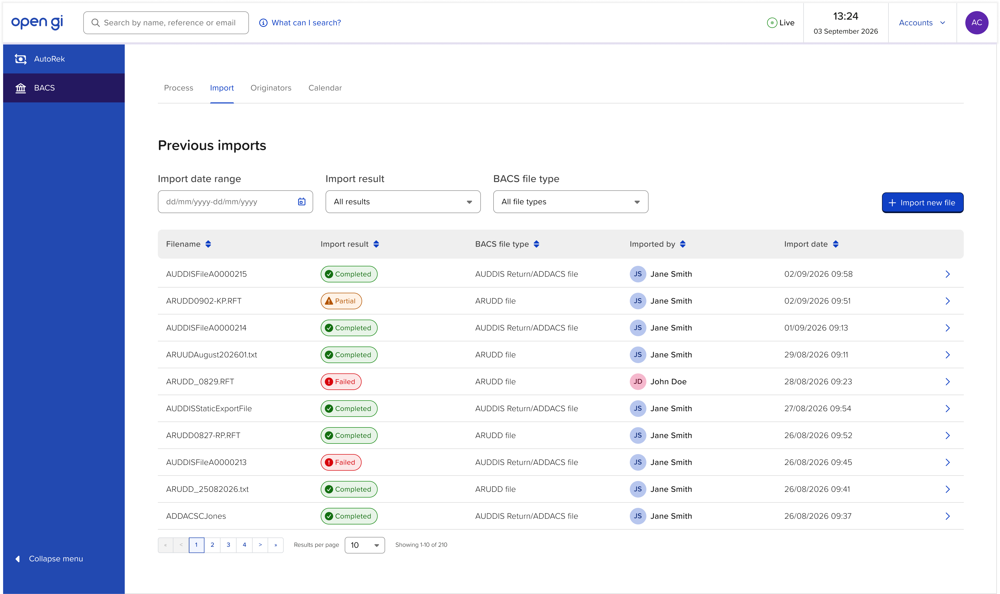

### Layout

- **Heading:** "Previous imports".
- **Filters:** Import date range, Import result, BACS file type.
- **Primary button:** "+ Import new file", right-aligned.
- **Table columns:** Filename, Import result, BACS file type, Imported by (avatar with initials, then name), Import date, and a chevron.
- **Pagination:** first, previous, pages, next and last buttons, "Results per page" (10, 25, 50; default 10), then "Showing 1–10 of 210".

### Rules

- **Default sort:** import date, newest first. Every column header can be sorted and toggles between ascending and descending.
- **Filters:** they apply together (AND), and changing one resets to page 1.
- **Default filter values:** Import result shows "All results"; BACS file type shows "All file types".
- **Date range input:** `dd/mm/yyyy-dd/mm/yyyy`, with a calendar picker. Both dates are inclusive.
- **Opening an import:** the whole row opens the detail page. The chevron is a focusable button labelled "View import {filename}". The row has a hover background and the chevron has a hover state (IM-08-01, IM-09-01).
- **In-progress rows** can't be opened. The chevron is shown disabled until the import finishes. *(Not in Figma — confirmed.)*
- **Partial and Failed pills** show tooltips (IM-07-01, IM-06-01).
- **No results:** when the filters return nothing, show "No imports match these filters" and "Try a different date range, result or file type." *(Not in Figma — confirmed.)*

### Copy

| Element | Copy |
|---|---|
| Partial tooltip title | Some records weren't applied |
| Partial tooltip body | {X} of {Y} records couldn't be matched to a policy, so they haven't been applied. The rest have been applied. Open the import to see which records need attention. |
| Partial tooltip body, when X = 1 | 1 of {Y} records couldn't be matched to a policy, so it hasn't been applied. The rest have been applied. Open the import to see which records need attention. |
| Failed tooltip title | The file import failed |
| Failed tooltip body | The file could not be processed. Check the file matches the selected BACS file type and try importing it again. |

---

## 6. IM-01 and IM-02 Filters

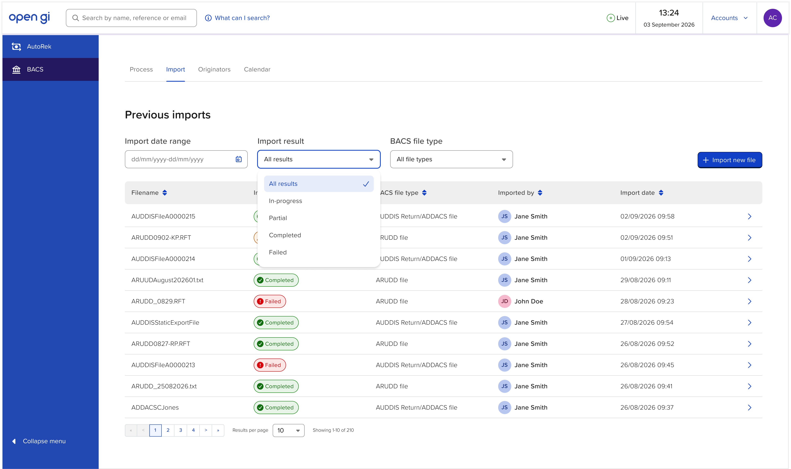

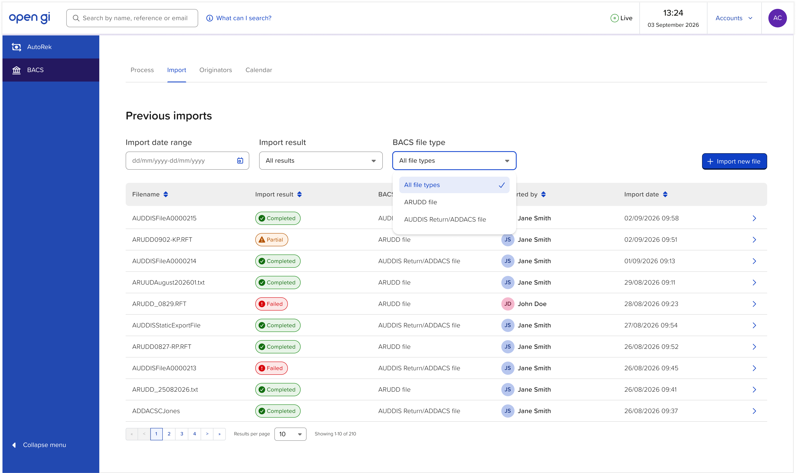

| Filter | Options | Default |
|---|---|---|
| Import result | All results, In-progress, Partial, Completed, Failed | All results |
| BACS file type | All file types, ARUDD file, AUDDIS Return/ADDACS file | All file types |

Both are single-select dropdowns. The selected option has a tick and a highlighted background, and the trigger shows the selected label.

---

## 7. IM-03 and IM-04 Import a file

### Steps: ARUDD (IM-03)

| Step | Screen | User action | System response |
|---|---|---|---|
| 1 | IM-00-01 | Selects "+ Import new file" | Opens the Import BACS file modal. |
| 2 | IM-03-01 | — | Modal with the file type dropdown showing "Select". Import is disabled. |
| 3 | IM-03-02 | Opens the dropdown | Options: ARUDD file, AUDDIS Return / ADDACS file. No option is ticked until one is chosen. |
| 4 | IM-03-03 | Chooses ARUDD file | Shows the hint and drop zone. Import stays disabled. |
| 5 | IM-03-04 | Selects the drop zone, or drags a file onto it | Opens the operating system file picker. Drag and drop is also supported. |
| 6 | IM-03-05 | Chooses a file | Replaces the drop zone with a file card (filename and bin icon). Import is enabled. |
| 7 | IM-03-06 | Selects Import | The button shows a spinner and "Importing…". Cancel, the close button and the bin are disabled. *(Not in Figma — confirmed.)* |
| 8 | IM-03-07 | — | The modal closes. A toast says "File submitted for import". A new row appears at the top as In-progress, and the count becomes "Showing 1–10 of 211". |
| 9 | IM-03-08 | — | When processing finishes, the row updates in place to its result. For a Completed import, a toast says "File import completed". |

### Steps: AUDDIS Return/ADDACS (IM-04)

| Step | Screen | Difference from IM-03 |
|---|---|---|
| 1–2 | IM-00-01, IM-03-01 | Same as IM-03 |
| 3 | IM-04-01 | The user hovers AUDDIS Return / ADDACS file |
| 4 | IM-04-02 | Shows the AUDDIS hint |
| 5–9 | IM-03-04 to IM-03-08 | Same as IM-03 |

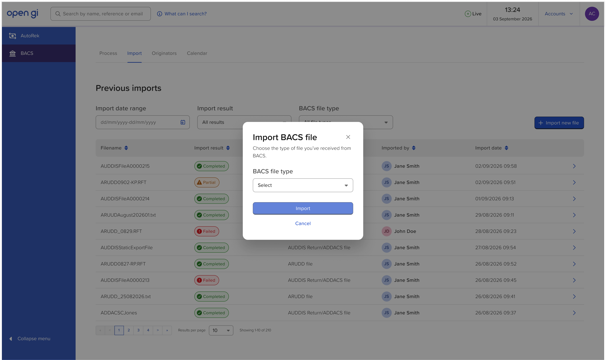
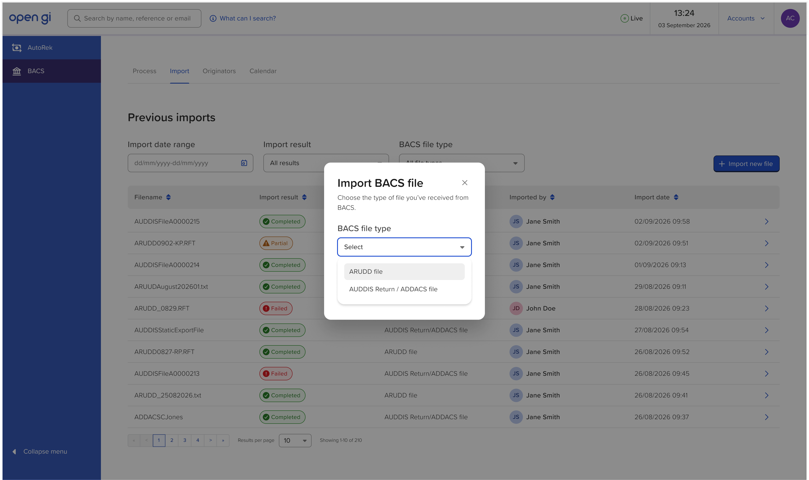
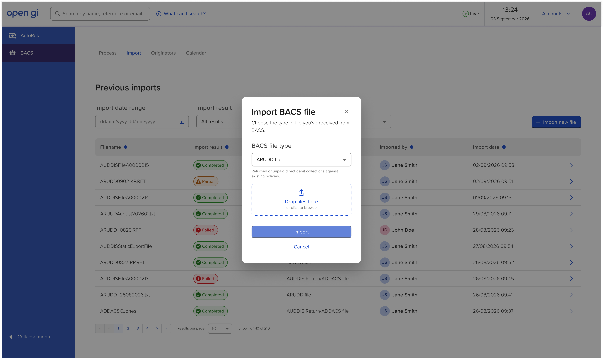
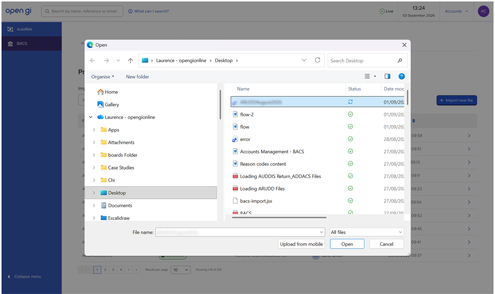

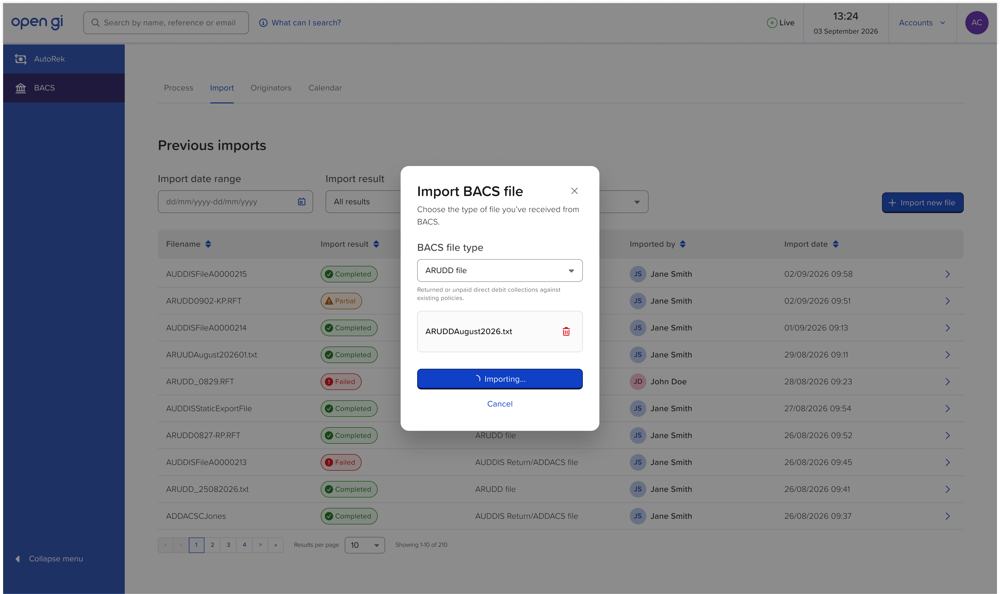
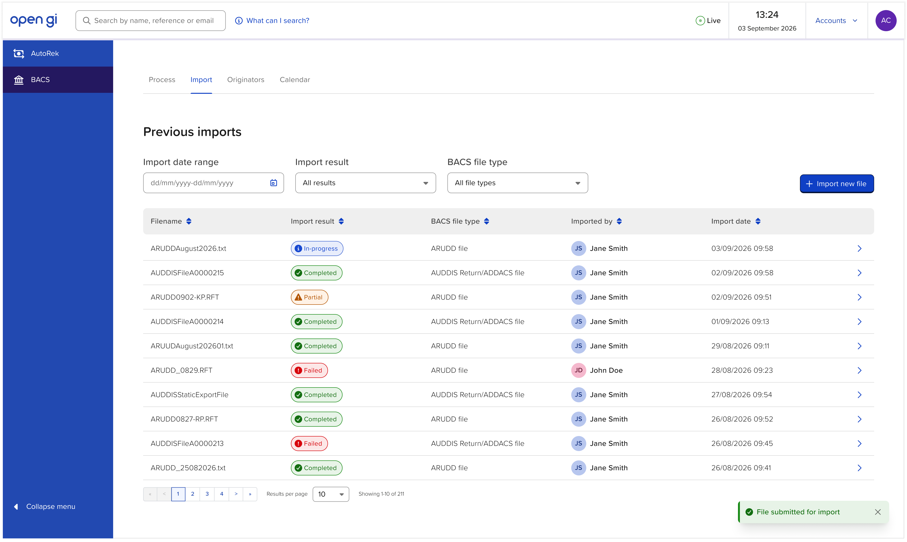

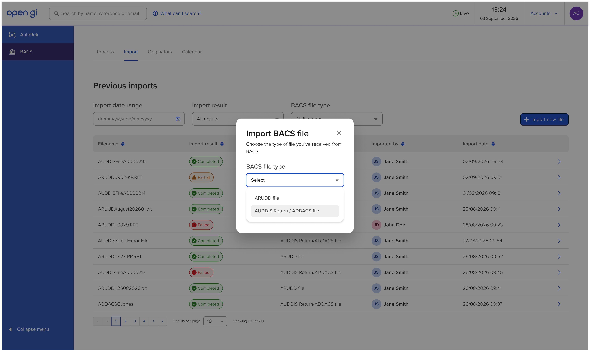
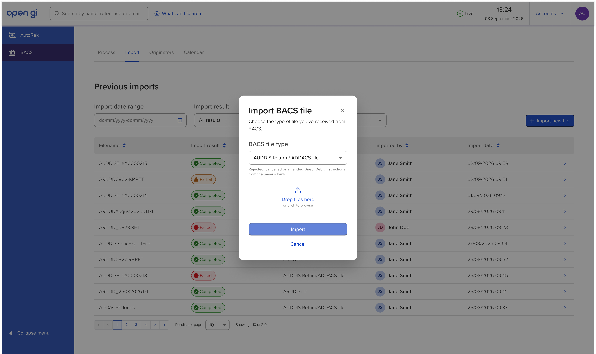

### Rules

- **One file per import.** Dropping several files keeps only the first. Selecting the bin removes the file and brings back the drop zone.
- **Import is enabled only when** a file type is chosen and a valid file is attached.
- **Changing the file type after attaching a file** keeps the file, but re-validates it against the new type.
- **New rows:**
  - The import timestamp is the time of submission. In the IM-03-07 and IM-03-08 frames it should read 13:24, to match the header clock; Figma shows 09:58.
  - The importer is the signed-in user.
- **The row updates live** when processing finishes, without a page refresh.
- **Partial and Failed results.** The row shows the pill and its tooltip, and a toast appears. Use Buckholt's **warning** toast for Partial and its **error** toast for Failed, with the short wording from the copy table below. *(Not in Figma — confirmed.)*
- **Closing the modal** with Cancel or the close button, before Import is selected, discards the choices and closes. Nothing is imported.

### Copy

| Element | Copy |
|---|---|
| Modal title | Import BACS file |
| Modal body | Choose the type of file you've received from BACS. |
| Field label | BACS file type |
| Placeholder | Select |
| ARUDD hint | Returned or unpaid direct debit collections against existing policies. |
| AUDDIS/ADDACS hint | Rejected, cancelled or amended Direct Debit Instructions from the payer's bank. |
| Drop zone | Drop files here / or click to browse |
| Bin button (accessible label) | Remove {filename} |
| Primary button | Import / Importing… |
| Secondary | Cancel |
| Toast, submitted (success) | File submitted for import |
| Toast, Completed (success) | File import completed |
| Toast, Partial (warning) | Some records weren't applied |
| Toast, Failed (error) | File import failed |

---

## 8. IM-05 File format error

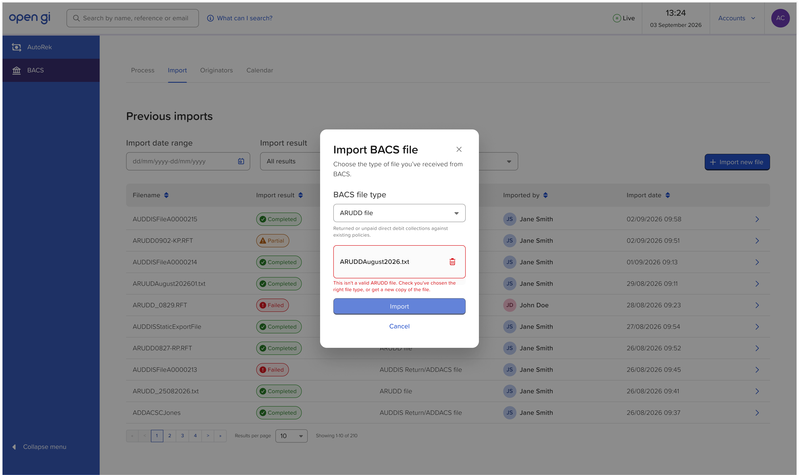

- **When the check runs:** the file is validated against the chosen type as soon as it's attached, before Import is selected.
- **What an invalid file shows:**
  - The file card gets a red border.
  - The error message appears below the card, linked with `aria-describedby`.
  - Import stays disabled.
- **Clearing the error:** removing the file, or attaching a different one, clears the error.

| Type | Error message |
|---|---|
| ARUDD file | This isn't a valid ARUDD file. Check you've chosen the right file type, or get a new copy of the file. |
| AUDDIS Return / ADDACS file | This isn't a valid AUDDIS Return/ADDACS file. Check you've chosen the right file type, or get a new copy of the file. |

---

## 9. Detail pages (IM-08, IM-09)

### 9.1 ARUDD import (Partial)


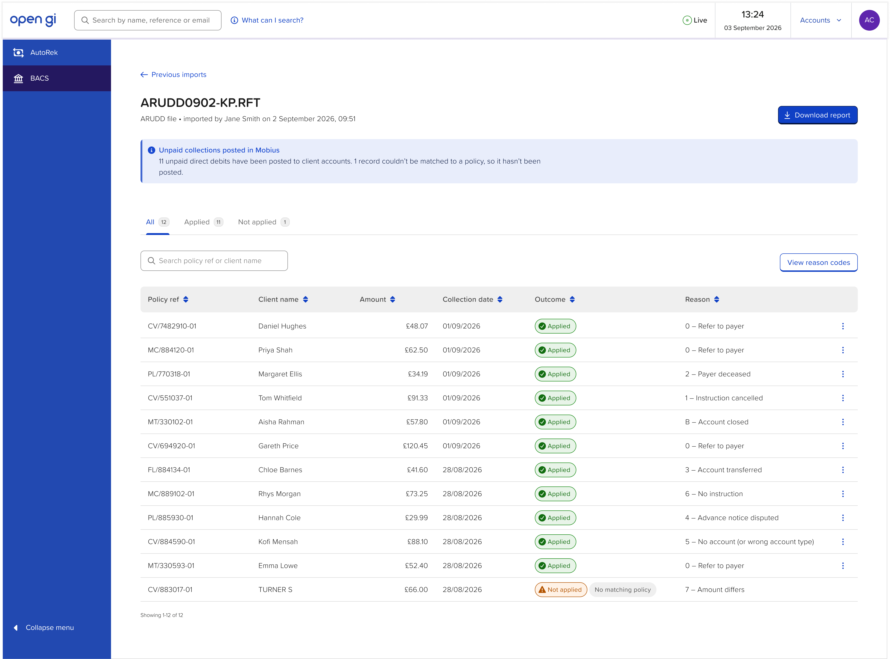

### 9.2 AUDDIS Return/ADDACS import (Completed)

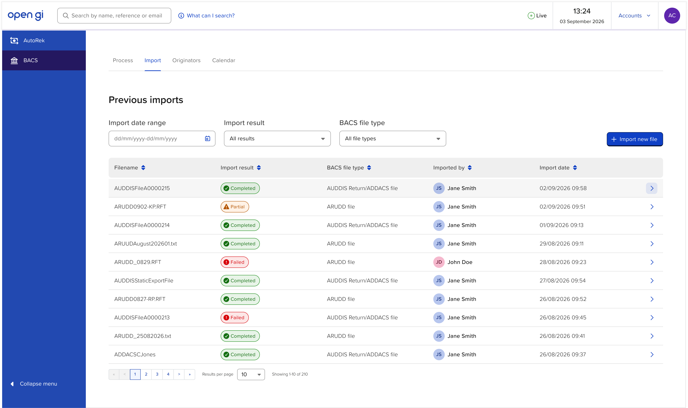
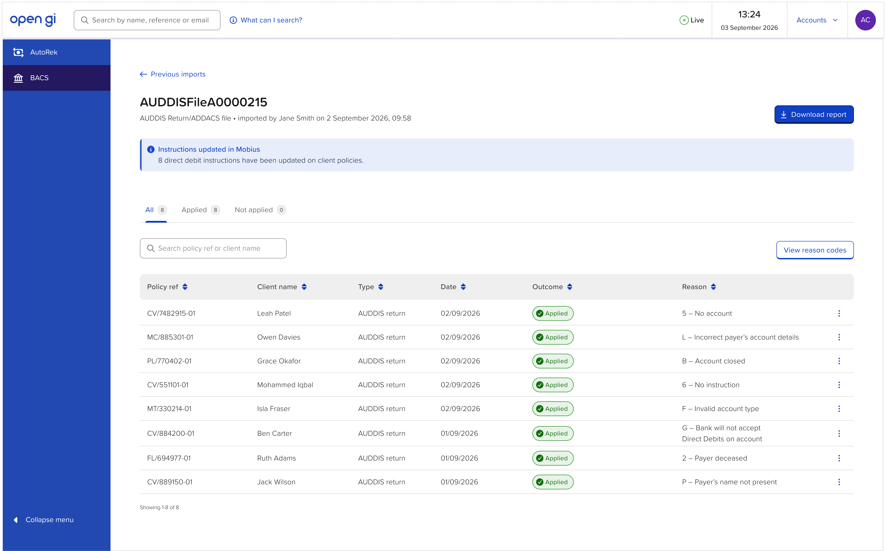

### Layout

1. **Back link:** "← Previous imports". It returns to the list with the filters, sort and page the user left.
2. **Title and subtitle:** filename as the title, then the subtitle (section 4.2).
3. **Download report:** primary button, right-aligned. It downloads a CSV of every record: policy ref, client name, amount or type, date, outcome, reason code, reason title.
4. **Info alert:** not dismissible.
5. **Tabs:** All / Applied / Not applied, each with a count. When every record in the file is applied, only **All** is shown: Applied would be a copy of it and Not applied would be empty. The three tabs appear together only on a Partial import. *(Changed 30 September 2026. The IM-09-02 frame still draws all three with "Not applied 0".)*
6. **Search box and button:** search box ("Search policy ref or client name") on the left, and a secondary "View reason codes" button on the right.
7. **Records table**, with columns by file type:

| ARUDD columns | AUDDIS Return/ADDACS columns |
|---|---|
| Policy ref | Policy ref |
| Client name | Client name |
| Amount (right-aligned) | Type |
| Collection date | Date |
| Outcome | Outcome |
| Reason | Reason |
| Row menu | Row menu |

8. **Footer:** "Showing 1–{n} of {n}". Use the standard pagination when there are more than 25 records. *(Not in Figma — confirmed.)*

### Rules

- **Search and tabs.** Search is case-insensitive, trims spaces, and matches policy ref or client name. It applies together with the active tab.
- **Sorting.** All columns can be sorted. The default order is the order in the file.
- **Not applied rows:**
  - The Outcome cell shows the Not applied pill, then a "No matching policy" chip.
  - The client name comes from the file.
  - **There's no row menu**, because there's no policy to open (IM-08-02).
- **Applied rows** have a row menu with a single item, **Open policy**, which opens the policy record (IM-08-04, IM-08-05).
- **No search results:** "No records match “{search text}”" and "Check the policy ref or client name and try again."
- **Empty Not applied tab:** cannot occur. The Not applied tab is only shown when at least one record is unmatched, so the earlier "All records in this file have been applied." copy is no longer needed. A search that filters the tab to nothing shows the no-search-results state instead. *(Changed 30 September 2026.)*

### Alert copy

| File type | Title | Body |
|---|---|---|
| ARUDD | Unpaid collections posted in Mobius | {A} unpaid direct debits have been posted to client accounts. |
| AUDDIS/ADDACS | Instructions updated in Mobius | {A} direct debit instructions have been updated on client policies. |

When at least one record is Not applied, add a second sentence:

- **ARUDD, one record:** "1 record couldn't be matched to a policy, so it hasn't been posted."
- **ARUDD, several records:** "{N} records couldn't be matched to a policy, so they haven't been posted."
- **AUDDIS/ADDACS:** the same sentences, ending "updated" instead of "posted".

---

## 10. IM-06 Failed import

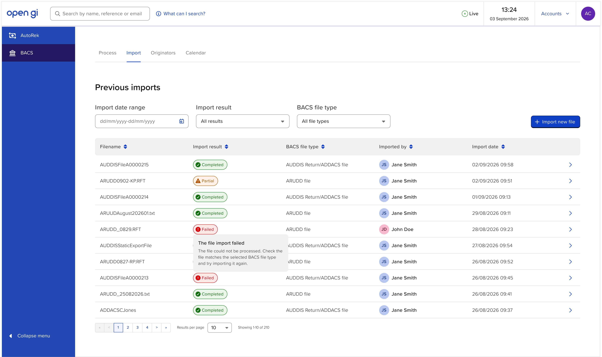
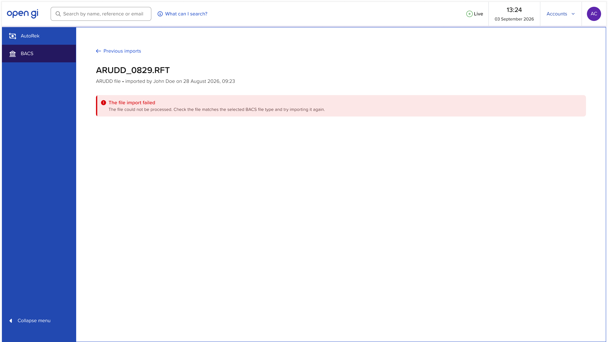

- **Page contents:** back link, title and subtitle, then an error alert (not dismissible).
- **Not shown:** there are no tabs, table or Download report button.
- **Alert:** the title is "The file import failed". The body is "The file could not be processed. Check the file matches the selected BACS file type and try importing it again."

---

## 11. IM-07 Partial import

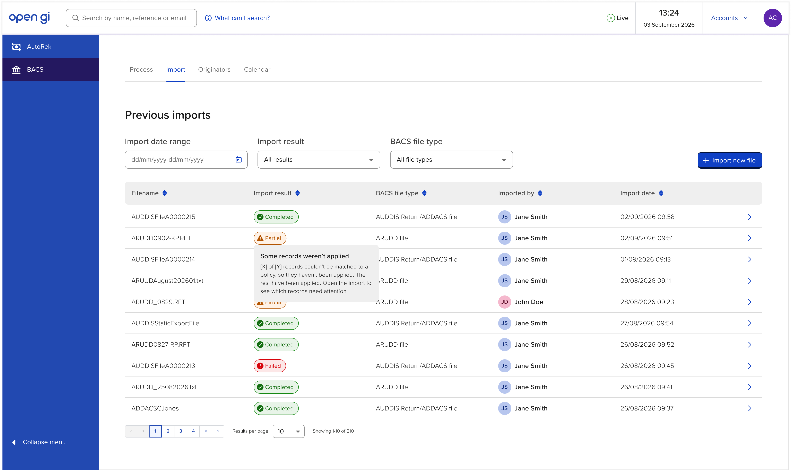

- **In the list:** the pill and its tooltip are described in section 5.
- **Detail page:** opening the row shows the detail page (section 9) with the Not applied count.

---

## 12. IM-10 No permission

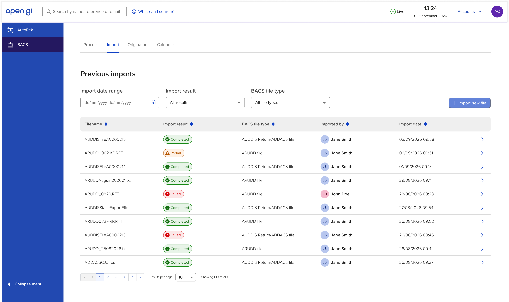
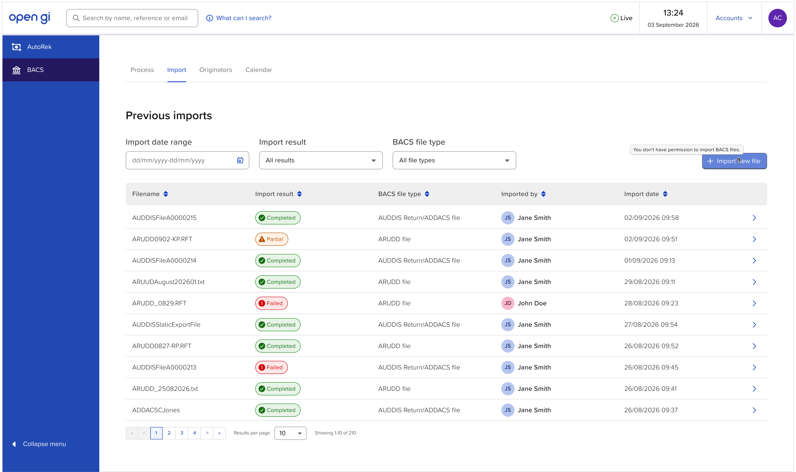

- **Button state:** users without import permission see "+ Import new file" in its disabled style, with `aria-disabled="true"`.
- **Tooltip:** on hover and on keyboard focus, it reads "You don't have permission to import BACS files."
- **What still works:** viewing imports, filters, detail pages and the blade.

---

## 13. Reason codes blade (new component)

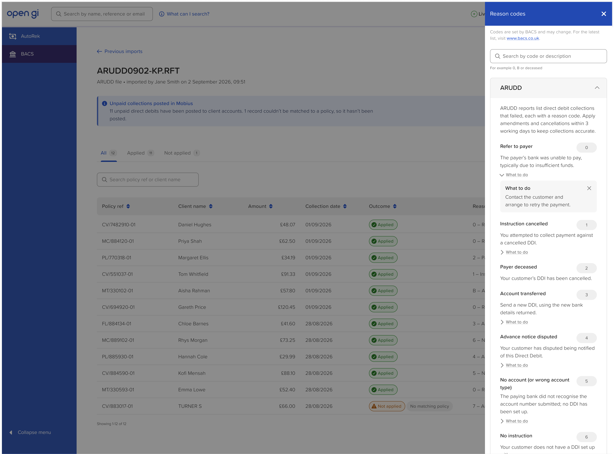

Buckholt has no blade, so build one as a reusable component. If Buckholt is Bootstrap-based, start from Bootstrap 5 Offcanvas (`.offcanvas.offcanvas-end`) and restyle it with Buckholt tokens. Otherwise, build it to this spec.

### 13.1 Generic blade component

| Property | Specification |
|---|---|
| Position | Fixed to the right edge, full viewport height, above everything else |
| Width | 600 px. Full width below 768 px. *(Changed 1 October 2026 from 400 px / 576 px: the reason codes blade carries a lot of content. The full-width threshold moves with it — at 600 px wide, a 576–768 px viewport would leave only a sliver of page beside the blade.)* |
| Overlay | Dims the page with a mid-grey scrim. Clicking the scrim closes the blade. |
| Header | Height about 72 px, background `#2249b1`. Title in white, 20 px. A white close (×) button with a 44 × 44 px target and accessible label "Close {title}". |
| Body | White, 24 px side padding, scrolls on its own. The header stays fixed. |
| Footer | Optional slot. The reason codes blade doesn't use one. |
| Open | Slides in from the right in about 200 ms. Honour `prefers-reduced-motion` with no slide. |
| Focus | On open, focus moves to the first input, or to the close button if there isn't one. Focus is trapped inside the blade. Esc closes it. On close, focus returns to the button that opened it. |
| Semantics | `role="dialog"`, `aria-modal="true"`, `aria-labelledby` pointing at the title |
| Scroll | The page behind doesn't scroll while the blade is open. |
| Props (suggested) | `open`, `title`, `onClose`, `width`, `initialFocusRef`, `children`, `footer` |

### 13.2 Reason codes content and behaviour

**Order from top to bottom:**

1. **Header:** "Reason codes".
2. **Disclaimer:** "Codes are set by BACS and may change. For the latest list, visit www.bacs.co.uk." The link opens in a new tab (`https://www.bacs.co.uk`, `rel="noopener"`).
3. **Search input:** placeholder "Search by code or description", with a search icon. A clear (×) button appears once there's text, labelled "Clear search".
4. **Hint:** "For example 0, B or deceased".
5. **Results line:** only while searching, and inside a polite live region. It reads "1 result for “{q}”" or "{n} results for “{q}”". *(Not in Figma — required for screen reader feedback.)*
6. **Accordion sections**, one per group (section 13.4).

**Section order and default expansion depend on the page the blade opens from:**

| Opened from | Order | Expanded by default |
|---|---|---|
| ARUDD import | ARUDD, AUDDIS, ADDACS, BACS transaction codes | ARUDD |
| AUDDIS Return/ADDACS import | AUDDIS, ADDACS, ARUDD, BACS transaction codes | AUDDIS and ADDACS |

**Section header:**

- A full-width button with background `#f6f6f6`. It shows the section title and a chevron that rotates when open.
- It has `aria-expanded` and `aria-controls`.
- Any number of sections can be open at once.
- While searching, the header also shows the number of matches.

**Section body:**

- When not searching, an intro paragraph comes first.
- Then comes each code item.

**Code item:**

- **Title row:** the title in semibold on the left. The code on the right, in a grey pill chip (`#efefef`).
- **Description:** below the title row.
- **"What to do" disclosure:** a chevron followed by underlined link text. It uses the Buckholt collapse component to toggle a grey (`#f6f6f6`) box headed "What to do", containing the guidance.
- **Items without guidance** have no disclosure.
- **The × inside the box** is part of the Buckholt collapse component (IM-08-03). It collapses the box, exactly like selecting the "What to do" toggle again. Label it "Close what to do for {code}". After closing, focus returns to the toggle, which shows `aria-expanded="false"`.

**BACS transaction codes section:**

- It has two subheadings: "Value items" and "Direct Debit Instructions (DDIs)".
- Its codes have no guidance, so they have no disclosures.

### 13.3 Search rules

1. **Normalise the query:** trim it, lowercase it, and collapse repeated spaces. Debounce by 150 ms.
2. **Empty query:** show the default state, with default expansion and intros shown.
3. **One-character query:** match the **code only**, exactly. Otherwise "B" would match almost every description.
4. **Two or more characters:** a code matches if the code is exactly the query, **or** the query appears in the title, description or "What to do" text.
5. **Order:** within each section, exact code matches come first, then the rest in their original order.
6. **Sections:**
   - Sections with no matches are hidden.
   - Sections with matches expand automatically.
   - Intros are hidden while searching.
7. **Highlighting:**
   - Matched text in the title, description and guidance is wrapped in `<mark>`, with a yellow background such as `#ffe58a`.
   - On an exact code match, the chip is highlighted too.
   - When a match is in the guidance, that item's "What to do" box opens automatically.
8. **No results:** show "No reason codes match “{q}”" and "Check the spelling, or search by code, for example 0 or B."
9. **Clearing the search** restores the default state.
10. **Closing and reopening** the blade resets the search and the expansion.

The interactive mockup behaves this way: https://claude.ai/artifact/EEPUg3xKVPVi4TAURnNoci

### 13.4 Reason code data

Use this data as-is. Descriptions end with full stops, to match Figma. An empty `todo` means the item has no "What to do" disclosure.

```json
{
  "arudd": {
    "title": "ARUDD",
    "intro": "ARUDD reports list direct debit collections that failed, each with a reason code. Apply amendments and cancellations within 3 working days to keep collections accurate.",
    "codes": [
      {"code":"0","title":"Refer to payer","description":"The payer’s bank was unable to pay, typically due to insufficient funds.","todo":"Contact the customer and arrange to retry the payment."},
      {"code":"1","title":"Instruction cancelled","description":"You attempted to collect payment against a cancelled DDI.","todo":"Agree another way to pay any outstanding amount."},
      {"code":"2","title":"Payer deceased","description":"Your customer’s DDI has been cancelled.","todo":""},
      {"code":"3","title":"Account transferred","description":"Send a new DDI, using the new bank details returned.","todo":"If no new bank details were returned, get a new DDI from the customer."},
      {"code":"4","title":"Advance notice disputed","description":"Your customer has disputed being notified of this Direct Debit.","todo":"Don’t collect again until the dispute is resolved with the customer."},
      {"code":"5","title":"No account (or wrong account type)","description":"The paying bank did not recognise the account number submitted; no DDI has been set up.","todo":"Check the DDI details and contact the customer."},
      {"code":"6","title":"No instruction","description":"Your customer does not have a DDI set up with your company.","todo":"Check the DDI details and get a new instruction from the customer."},
      {"code":"7","title":"Amount differs","description":"Your customer reports that the amount taken differs from the amount they were notified of.","todo":"Don’t collect again until the dispute is resolved with the customer."},
      {"code":"8","title":"Amount not yet due","description":"Typically the result of submitting a payment before a DDI is fully set up (less than 2 working days).","todo":"Check the DDI is set up and the advance notice date has passed before collecting again."},
      {"code":"9","title":"Presentation overdue","description":"You tried to collect payment more than 3 working days after the date given to your customer.","todo":"Send a new advance notice before collecting again."},
      {"code":"A","title":"Originator differs","description":"Your details do not match the details on the customer’s DDI.","todo":""},
      {"code":"B","title":"Account closed","description":"Your customer has closed their bank account, cancelling your DDI as a result.","todo":"Get a DDI for a new account if the customer wants to keep paying by Direct Debit."}
    ]
  },
  "auddis": {
    "title": "AUDDIS",
    "intro": "AUDDIS codes relate to setting up and cancelling Direct Debit Instructions (DDIs). They usually arrive 3 working days after a DDI is submitted, but BACS can return one straight away if it finds a problem first.",
    "codes": [
      {"code":"1","title":"Instruction cancelled by payer","description":"Typically received when cancelling a DDI that has already been cancelled.","todo":"Agree another way to pay any outstanding amount."},
      {"code":"2","title":"Payer deceased","description":"Your customer’s DDI has been cancelled.","todo":""},
      {"code":"3","title":"Account transferred to an unknown bank/building society","description":"Resubmit DDI with correct details.","todo":"If no new bank details were returned, get a new DDI from the customer."},
      {"code":"5","title":"No account","description":"The payer account number does not match any bank accounts at the branch for the sort code.","todo":"Check the DDI details and contact the customer."},
      {"code":"6","title":"No instruction","description":"No Direct Debit Instruction matching the details you submitted could be found.","todo":"Check the DDI details and contact the customer."},
      {"code":"7","title":"DDI amount not zero","description":"The amount on all DDI submissions should be nil, indicating an unlimited amount.","todo":"Set the amount to zero and resubmit."},
      {"code":"B","title":"Account closed","description":"Your customer has closed their bank account, cancelling your DDI as a result.","todo":"Get a DDI for a different account."},
      {"code":"C","title":"Account/instruction transferred to a known branch of a bank/building society","description":"Update your DDI only.","todo":"Update the bank details and carry on collecting. Don’t send a 0C/0N pair."},
      {"code":"F","title":"Invalid account type","description":"The customer’s type of bank account is unsuitable for DDIs.","todo":"Get new account details from the customer."},
      {"code":"G","title":"Bank will not accept Direct Debits on account","description":"Direct Debits are disabled for the customer’s bank account.","todo":"Get a DDI for a different account."},
      {"code":"H","title":"Instruction expired","description":"The DDI to cancel has already expired.","todo":"To restart collections, send a new 0N DDI with the customer’s authority."},
      {"code":"I","title":"Payer reference is not unique","description":"The reference on the DDI submitted is already in use for another DDI with this customer.","todo":"Give the DDI a different reference and resubmit it as 0N."},
      {"code":"K","title":"Instruction cancelled by the paying bank","description":"Typically received when cancelling a DDI that has already been cancelled by the paying bank.","todo":"Get a DDI for a new account to keep collecting by Direct Debit."},
      {"code":"L","title":"Incorrect payer’s account details","description":"The customer sort code and account number failed the modulus check to test if these are valid.","todo":"Check the sort code and account number with the customer."},
      {"code":"M","title":"Transaction code/user status incompatible","description":"May apply when converting from a standing order to a DDI.","todo":"Resubmit with transaction code 0N."},
      {"code":"N","title":"Transaction disallowed at payer’s branch","description":"Direct Debits cannot be collected from the sort code specified.","todo":"Get a DDI for a different account."},
      {"code":"O","title":"Invalid reference","description":"Reference does not meet AUDDIS submission rules, for example by using special characters.","todo":"Correct the reference so it meets AUDDIS rules, then resubmit."},
      {"code":"P","title":"Payer’s name not present","description":"The name of the payer is not included in the DDI.","todo":"Add the payer’s name and resubmit."},
      {"code":"Q","title":"Originator’s name blank","description":"The name of your business is not included in the DDI.","todo":"Add the originator’s name and resubmit."}
    ]
  },
  "addacs": {
    "title": "ADDACS",
    "intro": "ADDACS messages report amendments or cancellations to DDIs made by your customers. Deal with them as early as possible.",
    "codes": [
      {"code":"0","title":"Instruction cancelled – refer to payer","description":"This is a general message for cancelled instructions.","todo":"Get a DDI for a new account to keep collecting by Direct Debit."},
      {"code":"1","title":"Instruction cancelled by payer","description":"Your customer has instructed their bank to cancel the DDI.","todo":"Agree another way to pay any outstanding amount."},
      {"code":"2","title":"Payer deceased","description":"Your customer’s DDI has been cancelled.","todo":""},
      {"code":"3","title":"Instruction transferred to another bank/building society","description":"Update your records with the new details provided and send a new DDI.","todo":"If no new bank details were supplied, get a new DDI from the customer."},
      {"code":"B","title":"Account closed","description":"Your customer has closed their bank account, cancelling your DDI as a result.","todo":"Get a DDI for a different account."},
      {"code":"C","title":"Account/instruction transferred to a different branch of a bank/building society","description":"Update DDI details only.","todo":"Update the bank details and carry on collecting. Don’t send a 0C/0N pair."},
      {"code":"D","title":"Advance notice disputed","description":"Your customer is disputing the details of the advance notice with their bank.","todo":"Don’t collect again until the dispute is resolved with the customer."},
      {"code":"E","title":"Instruction amended","description":"Your customer has changed their name or other details on their DDI; update your records only.","todo":"Collect using the updated details. Don’t send a 0C/0N pair."},
      {"code":"R","title":"Instruction re-instated","description":"The paying bank has re-instated a cancelled DDI within 2 months of its cancellation.","todo":"[Confirm: resume collections under the reinstated DDI, or get a new DDI?]"}
    ]
  },
  "txn": {
    "title": "BACS transaction codes",
    "intro": "Codes used in BACS files to identify the type of each transaction.",
    "groups": [
      {"heading":"Value items","codes":[
        {"code":"01","title":"Direct Debit first collection","description":"Processes the first collection on a new DDI."},
        {"code":"17","title":"Direct Debit regular collection, or credit contra (debit record to balance credit records)","description":"This is a standard payment on an existing DDI."},
        {"code":"18","title":"Direct Debit re-presentation","description":"Re-attempt to take payment where a previous payment could not be processed by BACS."},
        {"code":"19","title":"Direct Debit final collection","description":"Processes the last collection on an existing DDI and cancels this DDI immediately after."},
        {"code":"99","title":"Direct Credit, or debit contra","description":"Credit record to balance debit records."}
      ]},
      {"heading":"Direct Debit Instructions (DDIs)","codes":[
        {"code":"0N","title":"New instruction","description":"Creates a new customer DDI or re-instates a cancelled DDI."},
        {"code":"0C","title":"Cancellation instruction","description":"Cancels an existing AUDDIS DDI."},
        {"code":"0S","title":"Conversion instruction","description":"Converts an existing manual DDI to an AUDDIS DDI."}
      ]}
    ]
  }
}
```

---

## 14. Seed data

### 14.1 Previous imports, page 1 (IM-00-01)

The signed-in user is **Jane Smith** (JS). The header clock reads 13:24, 03 September 2026. The total is 210 imports; generate rows 11–210 as older records with a realistic mix of statuses, file types and filenames.

| Filename | Result | Type | Imported by | Import date |
|---|---|---|---|---|
| AUDDISFileA0000215 | Completed | AUDDIS Return/ADDACS file | Jane Smith | 02/09/2026 09:58 |
| ARUDD0902-KP.RFT | Partial | ARUDD file | Jane Smith | 02/09/2026 09:51 |
| AUDDISFileA0000214 | Completed | AUDDIS Return/ADDACS file | Jane Smith | 01/09/2026 09:13 |
| ARUDDAugust202601.txt | Completed | ARUDD file | Jane Smith | 29/08/2026 09:11 |
| ARUDD_0829.RFT | Failed | ARUDD file | John Doe | 28/08/2026 09:23 |
| AUDDISStaticExportFile | Completed | AUDDIS Return/ADDACS file | Jane Smith | 27/08/2026 09:54 |
| ARUDD0827-RP.RFT | Completed | ARUDD file | Jane Smith | 26/08/2026 09:52 |
| AUDDISFileA0000213 | Failed | AUDDIS Return/ADDACS file | Jane Smith | 26/08/2026 09:45 |
| ARUDD_25082026.txt | Completed | ARUDD file | Jane Smith | 26/08/2026 09:41 |
| ADDACSCJones | Completed | AUDDIS Return/ADDACS file | Jane Smith | 26/08/2026 09:37 |

The Figma frames show "ARUUDAugust202601.txt". The seed data corrects this to ARUDDAugust202601.txt.

### 14.2 ARUDD0902-KP.RFT records (Partial)

| Policy ref | Client name | Amount | Collection date | Outcome | Reason |
|---|---|---|---|---|---|
| CV/7482910-01 | Daniel Hughes | £48.07 | 01/09/2026 | Applied | 0 |
| MC/884120-01 | Priya Shah | £62.50 | 01/09/2026 | Applied | 0 |
| PL/770318-01 | Margaret Ellis | £34.19 | 01/09/2026 | Applied | 2 |
| CV/551037-01 | Tom Whitfield | £91.33 | 01/09/2026 | Applied | 1 |
| MT/330102-01 | Aisha Rahman | £57.80 | 01/09/2026 | Applied | B |
| CV/694920-01 | Gareth Price | £120.45 | 01/09/2026 | Applied | 0 |
| FL/884134-01 | Chloe Barnes | £41.60 | 28/08/2026 | Applied | 3 |
| MC/889102-01 | Rhys Morgan | £73.25 | 28/08/2026 | Applied | 6 |
| PL/885930-01 | Hannah Cole | £29.99 | 28/08/2026 | Applied | 4 |
| CV/884590-01 | Kofi Mensah | £88.10 | 28/08/2026 | Applied | 5 |
| MT/330593-01 | Emma Lowe | £52.40 | 28/08/2026 | Applied | 0 |
| CV/883017-01 | TURNER S | £66.00 | 28/08/2026 | Not applied (No matching policy) | 7 |

### 14.3 AUDDISFileA0000215 records (Completed)

| Policy ref | Client name | Type | Date | Outcome | Reason |
|---|---|---|---|---|---|
| CV/7482915-01 | Leah Patel | AUDDIS return | 02/09/2026 | Applied | 5 |
| MC/885301-01 | Owen Davies | AUDDIS return | 02/09/2026 | Applied | L |
| PL/770402-01 | Grace Okafor | AUDDIS return | 02/09/2026 | Applied | B |
| CV/551101-01 | Mohammed Iqbal | AUDDIS return | 02/09/2026 | Applied | 6 |
| MT/330214-01 | Isla Fraser | AUDDIS return | 02/09/2026 | Applied | F |
| CV/884200-01 | Ben Carter | AUDDIS return | 01/09/2026 | Applied | G |
| FL/694977-01 | Ruth Adams | AUDDIS return | 01/09/2026 | Applied | 2 |
| CV/889150-01 | Jack Wilson | AUDDIS return | 01/09/2026 | Applied | P |

### 14.4 Other imports

- **Other Completed files:** generate 5–15 Applied records each, deterministically seeded from the filename.
  - ARUDD files use ARUDD codes and amounts between £25 and £150.
  - AUDDIS/ADDACS files use AUDDIS codes. Files whose names start with "ADDACS" use ADDACS codes and the ADDACS type.
- **Failed files:** no records; use the IM-06-02 alert.
- **New import from the flow:** uses the filename the user chose, and resolves as set out in section 15. A Completed result has 6 Applied records.

---

## 15. Prototype notes (Claude Code)

- **Stack:** static HTML, CSS and JS with Bootstrap 5. No backend. All data lives in memory and is seeded on load.
- **Routes (hash):** `#/import` (list) and `#/import/{id}` (detail). The BACS tabs link to `#/process`, `#/import`, `#/originators` and `#/calendar`. Only Import is built here; Originators comes from its own spec.
- **Simulated timings:**
  - Import button: 1500 ms, then the modal closes and the first toast shows.
  - In-progress row: 4000 ms, then the row resolves and the second toast shows.
- **Simulated outcomes, based on the chosen filename:**

| Filename contains | Result |
|---|---|
| "invalid" | Format error in the modal (IM-05) |
| "fail" | Failed |
| "partial" | Partial, with 1 Not applied record |
| Anything else | Completed |

- **Permission toggle:** `?permission=none` shows the IM-10 state.
- **Download report:** generate the CSV on the client.
- **Open policy:** link to `#/policy/{ref}` with a placeholder page.
- **Blade:** build it as a standalone component (section 13.1). Also check it against the mockup behaviour.
- **Accessibility checks:**
  - Keyboard-only walkthrough of every flow.
  - Visible focus on every interactive element.
  - Tooltips reachable on focus.
  - Blade focus trap works, and focus returns to the trigger on close.
  - Live region announces blade search results.

---

## 16. Open questions

1. **Legacy reject reasons.** Can "V – Validity Check Failed" or "DD Import Rejection" come out of an import? If so, Not applied needs more reasons than "No matching policy".
2. **ADDACS R guidance.** Resume collections, or get a new DDI? The placeholder is in the data.
3. **Automatic steps.** Which "What to do" steps does Mobius do itself, such as updating bank details for ADDACS C and E? Those lines should then say so.
4. **Failure reasons.** Should Failed imports give specific reasons, such as already imported, originator not set up, or unreadable file? The copy currently gives one generic message.
5. **ADDACS type.** Split it into "ADDACS cancellation" and "ADDACS amendment"? Show the ARUDD collection type (first, regular, re-presented or final)?
6. **Last reviewed date.** Add a "Last reviewed" date to the blade disclaimer, to show the content is maintained?
7. **Modal label spacing.** The option reads "AUDDIS Return / ADDACS file", with spaces, while tables use "AUDDIS Return/ADDACS file". Standardise?
8. **Avatar and importer.** The header avatar shows "AC", but new imports are attributed to Jane Smith. Confirm the seed user.

---

## 17. Changes from legacy (RD app)

| Legacy | Mobius |
|---|---|
| Two menu items, Load ARUDD file and Load AUDDIS Return / ADDACS file, open the operating system file dialog directly | One Import tab with an Import new file modal. The user chooses the file type first, then attaches the file. |
| "File Successfully uploaded" message, then a printed report (Crystal Reports) | Toasts, a live status row, and a detail page with every record. A CSV report can be downloaded. |
| No import history | Previous imports table, with filters, sorting and pagination |
| Outcome not visible per record | Applied / Not applied per record, with Partial status at file level |
| Report columns: Date, Reason, Policy Number, Client Name, Type | File-type-specific columns. ARUDD adds Amount; AUDDIS/ADDACS shows Type. |
| Reason codes only in a dropdown (e.g. "BACS Reject – 0 – Refer to Payer") | Reason shown on every row, plus a searchable reason codes blade with guidance |
| No format check before loading | File validated against the chosen type before import |
