# Originators — Feature Specification

## About this document

This document specifies the Originators feature in the BACS section of the Mobius PAS Accounts module, screen by screen. It is written for three readers: developers building the feature, product people validating behaviour, and Claude Code building a clickable prototype from the screens.

**Screen IDs.** Every screen has an ID in the form `OR-FF-SS`: `OR` for Originators, `FF` for the flow number and `SS` for the step. Flow `00` is the base page. Screenshots in `screenshots/` are named by screen ID; the Screen index at the end maps each ID to its Figma file name.

**Structure.** The body describes the new experience only. Every comparison with the legacy RD app sits in the final section.

**Revision.** This revision applies the design review feedback: no warning alerts in modals, toasts without a close button, explicit product assignment (the default no longer "catches" products), always-active delete that moves products to the default, a sticky action bar and table header, clickable rows, and new guidance copy. See "What changed in this revision".

## What changed in this revision

| Area | Change |
| --- | --- |
| Assignment model | Every product has an explicit originator. Changing the default never moves existing products; the default is only the originator new products are given. |
| Page copy | New page intro and Product assignments subtitle (OR-00). |
| Action bar | Idle text "Select products to reassign"; "Clear selection" is always shown, disabled until something is selected; the header checkbox also clears a selection. |
| Table | Rows are clickable; the action bar and table header are sticky. |
| Filter | No visible label; default option "All originators". |
| Modals | No warning alerts. Edit originator gains an intro line with the product count; the bulk, all-products, change and default change warnings are removed. |
| Default | Helper line "New products will use this originator. Existing products stay as they are." wherever a new default is chosen. |
| Delete | No bin on the default card. Other bins are red and always active; deleting moves the originator's products to the default. OR-10 is now three screens. |
| Toasts | No close button; they hide on Bootstrap's native timing. |

## Feature overview

An originator is a bank account plus the BACS identity that direct debit payments are collected into and paid out of. At least one originator must exist before any BACS files can be created, so every other BACS tab depends on this one.

Each product collects through exactly one originator, chosen explicitly. One originator is the **default**: new products are assigned to it when they are created.

**Location.** Accounts module → BACS in the left navigation → Originators tab.

| Tab | What it does |
| --- | --- |
| Process | Creates AUDDIS and payment files for a collection date |
| Import | Loads ARUDD, AUDDIS return and ADDACS files from the bank |
| Originators | Manages originators and which products collect through each |
| Calendar | Sets BACS processing dates and collection-date passwords |

**Dependencies.** The Process tab uses each product's originator to decide which account a policy's direct debit collects into.

## Glossary

| Term | Meaning |
| --- | --- |
| BACS | The UK payment scheme used to collect direct debits. |
| Originator | The account and BACS identity a product's direct debits collect into or pay out of. |
| Default originator | The originator new products are assigned to when they are created. Exactly one exists at a time. |
| Account holder | The name on the originator's bank account. Used as the originator's display name. |
| User No. | The BACS Service User Number (SUN) identifying the originator to BACS. |
| Bureau No. | Identifies a bureau submitting BACS files on the originator's behalf. |
| Product | An insurance product and payment plan, e.g. "Krypton - Open Market Motor-11 Months". |
| Assignment | The link between a product and the originator it collects through. Every assignment is explicit. |
| AUDDIS | Automated Direct Debit Instruction Service: sends new direct debit instructions to BACS. |
| ARUDD | Automated Return of Unpaid Direct Debits: reports collections that failed. |
| ADDACS | Automated Direct Debit Amendment and Cancellation Service: reports changes to instructions. |

## Data model

An originator has six fields.

| Field | Format | Shown on card | Notes |
| --- | --- | --- | --- |
| Account holder | Free text, max 18 characters | Yes, as the name | Also shown on product table chips |
| Sort code | 6 digits, displayed 00-00-00 | Yes |  |
| Account No. | 8 digits | Yes |  |
| User No. | 6 digits | No |  |
| Bureau No. | 6 letters or numbers, e.g. ABC123 | No |  |
| Default | On or off | Yes, as a "Default" badge | Exactly one originator is default |

**Assignment rules**

- Every product is assigned to exactly one originator, explicitly.
- Products only change originator through Reassign originator (OR-06 to OR-09) or when their originator is deleted (OR-10), which moves them to the default.
- Changing the default never moves existing products; it only decides the originator for products created afterwards.
- An originator's product count is the number of products assigned to it.
- A new originator starts with 0 products, including when it is saved as the default.

## Seed data

The starting state behind OR-00-01, for the prototype and for test data. Every flow starts from this state unless its Starts from line says otherwise.

**Originators**

| Account holder | Sort code | Account No. | User No. | Bureau No. | Default |
| --- | --- | --- | --- | --- | --- |
| Assurant Inter LTD | 88-77-66 | 61366789 | 504965 | ABCDEF | Yes |
| Real Insure LTD | 11-23-45 | 32899602 | 758392 | DEFGHI | No |

Crimson Inter LTD (88-66-94, 66372838, 489392, ABL123) is not in the starting state; it is the originator added in OR-01.

**Products**, in table order. 32 are assigned to Assurant Inter LTD and 2 to Real Insure LTD.

| # | Product | Originator |
| --- | --- | --- |
| 1 | Krypton - Goods in Transit-Pay Monthly | Assurant Inter LTD |
| 2 | Krypton - Goods in Transit-Vitruvius Instalments | Assurant Inter LTD |
| 3 | Krypton - Open Market Motor-11 Months | Assurant Inter LTD |
| 4 | Krypton - Open Market Motor-3 Months Plan | Assurant Inter LTD |
| 5 | Krypton - Open Market Motor-6 Months instalments PP STP | Assurant Inter LTD |
| 6 | Krypton - Open Market Motor-7 Months Instalments | Real Insure LTD |
| 7 | Krypton - Open Market Motor-DailyPP | Assurant Inter LTD |
| 8 | Krypton - Open Market Motor-Pay Monthly | Assurant Inter LTD |
| 9 | Krypton - Open Market Motor-Payment Plan No Links | Assurant Inter LTD |
| 10 | Krypton - Open Market Motor-Sazdo Test 2 Instalment | Assurant Inter LTD |
| 11 | Krypton - Open Market Motor-Sazdo Test PP with 2 instalment | Assurant Inter LTD |
| 12 | Krypton - Commercial Combined-Monthly instalment | Real Insure LTD |
| 13 | Krypton - Open Market Commercial Vehicle-11 Months | Assurant Inter LTD |
| 14 | Krypton - Open Market Commercial Vehicle-3 Months Plan | Assurant Inter LTD |
| 15 | Krypton - Open Market Commercial Vehicle-7 Months Instalments | Assurant Inter LTD |
| 16 | Krypton - Open Market Commercial Vehicle-Daily Payment Plan | Assurant Inter LTD |
| 17 | Krypton - Open Market Commercial Vehicle-DailyPP | Assurant Inter LTD |
| 18 | Krypton - Open Market Commercial Vehicle-Pay Monthly | Assurant Inter LTD |
| 19 | Krypton - Open Market Commercial Vehicle-Payment Plan No Links | Assurant Inter LTD |
| 20 | Krypton - Shop-Monthly instalment | Assurant Inter LTD |
| 21 | Krypton - Shop-Pay Monthly | Assurant Inter LTD |
| 22 | Krypton - Shop-Vitruvius Instalments | Assurant Inter LTD |
| 23 | Krypton - Equine-3 Months Plan | Assurant Inter LTD |
| 24 | Krypton - Equine-Monthly instalment | Assurant Inter LTD |
| 25 | Krypton - Equine-Pay Monthly | Assurant Inter LTD |
| 26 | Krypton - Equine-Payment Plan No Links | Assurant Inter LTD |
| 27 | Krypton - Equine-Vitruvius Instalments | Assurant Inter LTD |
| 28 | Krypton - Professional Combined-Monthly instalment | Assurant Inter LTD |
| 29 | Krypton - Professional Combined-Pay Monthly | Assurant Inter LTD |
| 30 | Krypton - Professional Combined-Vitruvius Instalments | Assurant Inter LTD |
| 31 | Krypton - Travel-Monthly instalment | Assurant Inter LTD |
| 32 | Krypton - Office-Monthly instalment | Assurant Inter LTD |
| 33 | Krypton - Office-Pay Monthly | Assurant Inter LTD |
| 34 | Krypton - Office-Vitruvius Instalments | Assurant Inter LTD |

## Prototype notes

- **Sources of truth:** the screenshots for layout, this spec for behaviour and copy, and the design system for styling tokens and component behaviour, including how modals close.
- **Where they disagree:** this spec wins; see "Known screenshot differences" near the end.
- **Scope:** the top bar, left navigation and the Process, Import and Calendar tabs are static.
- **State:** held in memory; reloading the prototype resets it to the seed data.
- **Design system conventions:** every button sits in a Buckholt Button set, and every disabled control uses the native `disabled` attribute.

## OR-00-01 · Originators page, populated state

The Originators page shows every configured originator as a card, then a table of every product and the originator it collects through.

*OR-00-01 · Originators page with two originators*

### Page header

- **Tab bar:** Process, Import, Originators, Calendar. Originators is active, shown with an underline.
- **Heading:** "Originators".
- **Helper text:** "Multiple originators can be configured. New products are assigned to the default originator."
- **Action:** outlined "+ Add originator" button, top right. Opens flow OR-01.

### Originator cards

One card per originator, with the default originator's card first and the others in the order they were added. Cards sit on the Bootstrap grid (see Layout in OR-01).

- **Body:** bank icon on a dark tile, account holder name, then sort code and account number separated by a bullet, e.g. "88-77-66 • 61366789".
- **Footer:** a "Default" status badge with an info icon (default originator only; static, with no tooltip), a product count chip such as "32 products" ("1 product" for one), then icon buttons on the right.
- **Icon buttons:** edit (blue pencil) on every card, opening OR-03. Delete (red bin, danger style) on every card except the default, which has no bin; it is always active and opens OR-10. Icon buttons show a light blue square background on hover. Each carries a tooltip and a matching accessible name: "Edit originator" and "Delete originator". Buckholt requires a tooltip on every icon-only button.

### Product assignments

- **Heading:** "Product assignments".
- **Helper text:** "Every product is shown with the originator it collects through. To change one, select it and choose Reassign originator."
- **Action bar, left:** "Search products" text input with a search icon (OR-04), then the originator filter: a dropdown with no visible label, default value "All originators" (OR-05). Its accessible name is "Filter by originator".
- **Action bar, right:** the selection text, the "Reassign originator" primary button and the "Clear selection" text link. Both are always shown and disabled while nothing is selected.
- **Table:** header row with a select-all checkbox and the columns Product and Originator. Each row has a checkbox, the product name and the originator shown as a neutral chip. Below the table, left-aligned with it and about 24px below its last row, a row count in 12px regular primary text colour reads "Showing 1-34 of 34". There are no pagination controls.

### Selection text

| Selection | Text | Reassign originator and Clear selection |
| --- | --- | --- |
| Nothing selected | Select products to reassign | Disabled |
| 1 product | 1 product selected | Enabled |
| 2 or more | {count} products selected | Enabled |
| Every product | All products selected | Enabled |

**Clear selection** clears the whole selection, including rows hidden by a search or filter, the same as clicking the header checkbox when anything is selected.

### Rows and header checkbox

- **Clickable rows:** clicking anywhere on a row toggles its checkbox. Rows show a hover background. A selected row has its checkbox ticked and a light blue background. The checkbox stays the keyboard focus target; Space toggles it.
- **Header checkbox, nothing selected:** empty. Clicking it selects every visible row.
- **Header checkbox, some selected:** partial state, a blue box with a white dash. Clicking it clears the whole selection.
- **Header checkbox, every visible row selected:** ticked. Clicking it clears the whole selection.
- **Selections hidden by search or filter:** they stay selected and are counted. While anything is selected anywhere, the header checkbox shows at least its partial state, and clicking it clears everything, including hidden rows.
- **Accessible name:** "Select all visible products" when empty; "Clear selection" when partial or ticked.

### Sticky action bar and table header

As the page scrolls, the action bar and the table header row stick together just below the top app bar, so search, filter, selection text, "Reassign originator", "Clear selection" and the select-all checkbox stay in view while the user ticks rows further down. The section heading and helper text scroll away; the action bar's own text ("Select products to reassign") carries the guidance once they have gone.

How to build it:

- **Two sticky layers.** The action bar is `position: sticky` with `top: var(--app-header-height)`. The table header cells (`thead th`) are `position: sticky` with `top: calc(var(--app-header-height) + var(--action-bar-height))`, so the header sits directly under the bar. Bootstrap's `.sticky-top` uses `top: 0`, so set the offsets yourself rather than relying on it.
- **Measure, don't hard-code.** Set `--app-header-height` from the top bar and `--action-bar-height` from the action bar with a `ResizeObserver`, because the bar can wrap onto two lines at narrow widths.
- **Solid backgrounds.** Both sticky layers need the page or header background colour so rows don't show through as they scroll underneath.
- **Stacking.** The action bar sits above the table header, and the header above the rows. The originator filter's open menu must overlay the table header and rows. Modals, the modal backdrop and toasts stay above both sticky layers.
- **No clipping ancestors.** Sticky positioning stops working if any ancestor between the sticky element and the page's scroll container has `overflow: hidden`, `auto` or `scroll`. Don't wrap the table in an overflow container; if the table ever needs horizontal scrolling, make that container the vertical scroll container too, and set the offsets relative to it.
- **Stays within the section.** Stickiness is limited to the Product assignments section: once the table has scrolled past, the bar and header scroll away with it.
- **Shadow when stuck.** Place a 1px sentinel element just above the action bar and watch it with an `IntersectionObserver`. When it leaves the viewport, add an `is-stuck` class that shows the design system's low elevation shadow under the table header. Remove it when the sentinel returns.
- **Keyboard focus.** Set `scroll-padding-top` on the scroll container to the combined height of the top bar, action bar and table header, so a row that receives focus is never hidden underneath them.
- **Empty states.** When the no results or no products assigned state replaces the table, the action bar still sticks; there is no header row to stick.

### Behaviour

- Every product appears in the table.
- The row count counts the rows currently shown, so it follows any search or filter: "Showing 1-9 of 9" in OR-04-02 and "Showing 1-2 of 2" in OR-05-04. It is hidden when the no results or no products assigned state replaces the table.
- Selecting rows updates the selection text and enables "Reassign originator".

### Toasts

Every success toast in this feature uses the same pattern: bottom right of the page, a green check icon and the message, on a light green background with a green left edge. There is no close button; toasts hide themselves on Bootstrap's native timing.

## OR-01 · Add an originator

The user adds a new originator through a modal; on save it appears as a new card with 0 products.

**Starts from:** OR-00-01. **Ends at:** OR-01-04, the Originators page with the new card.

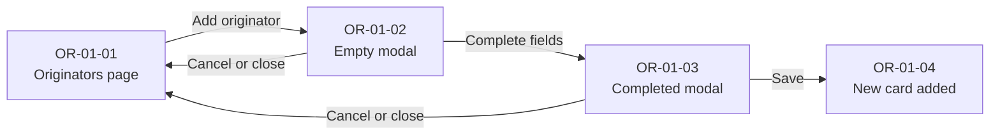

Cancel or close from either modal state returns to the page with nothing saved.

### Steps

| Screen | User action | System response |
| --- | --- | --- |
| OR-01-01 | Clicks "+ Add originator" | Opens the Add originator modal over a dimmed page. The button shows its active state. |
| OR-01-02 | Views the empty form | All fields show placeholders. "Make default" is off. Save is disabled. |
| OR-01-03 | Completes the fields, clicks Save | Saves the originator and closes the modal. |
| OR-01-04 | Returns to the page | The new card appears after the existing cards with "0 products". Product table unchanged. Success toast "New originator added" appears bottom right. |

*OR-01-01 · Originators page, user about to click "+ Add originator"*

*OR-01-02 · Add originator modal, empty*

*OR-01-03 · Add originator modal, completed*

*OR-01-04 · Originators page with the new Crimson Inter LTD card and success toast*

### Add originator modal

A modal dialog titled "Add originator" with a close (×) icon button top right. Sort code and Account No. share a row, as do User No. and Bureau No.

| Field | Control | Placeholder | Example value |
| --- | --- | --- | --- |
| Account holder | Text input, full width | e.g. Assurant Inter LTD | Crimson Inter LTD |
| Sort code | Text input | 00-00-00 | 88-66-94 |
| Account No. | Text input | 00000000 | 66372838 |
| User No. | Text input | 123456 | 489392 |
| Bureau No. | Text input | ABC123 | ABL123 |
| Make default | Toggle switch with state label | Off | Off |

**Actions**, bottom right: Cancel (text button) and Save (primary button).

**Default helper line.** When Make default is switched on, a line of small grey helper text appears under the toggle: "New products will use this originator. Existing products stay as they are." It disappears when the toggle is switched off.

### Rules

- A new originator starts with 0 products, including when it is saved as the default.
- With "Make default" off, the existing default is unchanged.
- With "Make default" on, saving makes the new originator the default and the previous default loses its badge. No products move. No warning is shown.
- The new card shows account holder, sort code and account number. User No. and Bureau No. are stored but not shown.

### Layout

- Cards sit on the Bootstrap grid, `.row > .col-12.col-md-6.col-xxl-4 > .card`: one card per row on narrow screens, two per row from the md breakpoint, and three per row from xxl (1400px and wider).
- Further cards wrap onto a new row below.
- Four per row is not reachable at the drawn card width (506px) on a 1920px screen, so three is the maximum.
- At some mid-width viewports the card footer can wrap onto two lines; this is expected.

## OR-02 · Add an originator with an input error

Form validation happens in two ways. Invalid values, such as an account holder over 18 characters, show an inline error as soon as they are entered, and Save stays disabled (OR-02-03). Blank fields are only flagged when Save is clicked (OR-02-04 to OR-02-05): each blank field shows an inline error and an error summary alert appears. The user corrects the fields in place.

**Starts from:** OR-00-01. **Ends at:** OR-02-03 for an inline error, or OR-02-05 for blank fields found on Save.

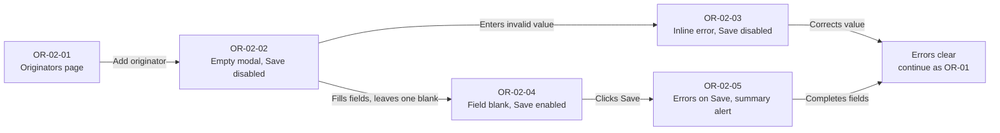

Once corrected, the flow continues as OR-01 from OR-01-03.

### Steps

| Screen | User action | System response |
| --- | --- | --- |
| OR-02-01 | Clicks "+ Add originator" | Opens the Add originator modal, as OR-01-01. |
| OR-02-02 | Views the empty form | All fields show placeholders. "Make default" is off. Save is disabled. |
| OR-02-03 | Completes the form, entering an account holder longer than 18 characters, e.g. "Crimson International LTD" | Account holder field shows its error state with the message "Max 18 characters". Other fields are unaffected. Save stays disabled. |
| OR-02-04 | Completes every field except Sort code | Sort code shows its placeholder with no error. Save is enabled, because blank fields are only checked when Save is clicked. |
| OR-02-05 | Clicks Save | Nothing is saved and the modal stays open. The blank Sort code shows its error state with the message "Enter a valid sort code in the format 00-00-00". The error summary alert appears between the Make default toggle and the buttons. Save shows its disabled style until the error is corrected. |

*OR-02-01 · Originators page, user about to click "+ Add originator"*

*OR-02-02 · Add originator modal, empty*

*OR-02-03 · Add originator modal with an inline error on Account holder*

*OR-02-04 · Add originator modal with Sort code left blank and Save enabled*

*OR-02-05 · Add originator modal after Save, with an inline error on the blank Sort code and the error summary alert*

### Inline error pattern

- **Input:** red border replaces the default grey border.
- **Icon:** a red circled exclamation icon sits inside the input, before the value.
- **Message:** short red text directly below the input, e.g. "Max 18 characters" or "Enter a valid sort code in the format 00-00-00". A longer message wraps onto a second line.
- **Layout:** the message adds height to the field, so fields below it and the modal itself grow downwards.

### Field messages

Each field has one message, shown with the inline error pattern above. Values that are too long or contain characters the field doesn't allow show their error as the user types; values that are too short show theirs when the user leaves the field. Blank fields show the same message when Save is clicked (OR-02-05). Make default is a toggle and cannot be in error.

| Field | Rule | Message |
| --- | --- | --- |
| Account holder, blank | Required | Enter the account holder name |
| Account holder, too long | Max 18 characters | Max 18 characters |
| Sort code | 6 digits, format 00-00-00 | Enter a valid sort code in the format 00-00-00 |
| Account No. | 8 digits | Enter a valid 8-digit account number |
| User No. | 6 digits | Enter a valid 6-digit user number |
| Bureau No. | 6 letters or numbers | Enter a valid bureau number, e.g. ABC123 |

### Error summary alert

The only alert used in this feature's modals. Shown between the Make default toggle and the buttons when Save is clicked with any field blank (OR-02-05), and cleared once the errors are corrected.

- **Style:** light red background, red left edge and a red circled exclamation icon.
- **Title:** "There's a problem with the information entered".
- **Body:** "Please check the highlighted fields and correct any errors before saving."
- **Layout:** the modal grows downwards to fit the alert.

### Rules

- Errors appear inline as soon as a value is known to be invalid; the user does not need to press Save first.
- Account holder is limited to 18 characters.
- Only the invalid field shows an error; valid fields keep their normal state.
- Save is disabled while the form is empty (OR-02-02) or any field shows an inline error (OR-02-03). Once fields are filled, Save is enabled even if some are still blank (OR-02-04).
- Every field is required. Blank fields are only checked when Save is clicked (OR-02-05): nothing is saved, the modal stays open, each blank field shows its inline error, the error summary alert appears, and Save is disabled until the errors are corrected.
- The error summary alert and inline errors clear once the fields are corrected.
- Account details are checked for format only; the system does not confirm that the sort code and account number are correct.

## OR-03 · Edit an originator

The user edits an originator's details from the pencil icon on its card; on confirming, the card updates and a success toast appears.

**Starts from:** OR-00-01. **Ends at:** OR-03-05, the Originators page with the updated card.

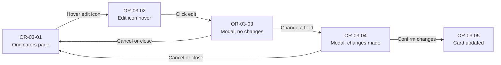

Cancel or close discards any unsaved changes and returns to the page.

### Steps

| Screen | User action | System response |
| --- | --- | --- |
| OR-03-01 | Views the Originators page | Each card shows its edit icon, and a red delete icon unless it is the default. |
| OR-03-02 | Hovers over the edit (pencil) icon on the Assurant Inter LTD card | The icon button shows a light blue square background. |
| OR-03-03 | Clicks the edit icon | Opens the Edit originator modal, pre-filled with the originator's current details, with the intro line "Changes to this originator apply to the **32** products that use it." "Confirm changes" is disabled. |
| OR-03-04 | Changes the sort code to 88-77-44 and the account number to 61366788 | "Confirm changes" becomes enabled. No alert is shown. |
| OR-03-05 | Clicks "Confirm changes" | Saves the changes and closes the modal. The card shows "88-77-44 • 61366788". Success toast "Originator changes made" appears bottom right. |

*OR-03-01 · Originators page before editing*

*OR-03-02 · Edit icon hover state on the Assurant Inter LTD card*

*OR-03-03 · Edit originator modal, pre-filled, no changes*

*OR-03-04 · Edit originator modal with changed sort code and account number*

*OR-03-05 · Originators page with the updated card and success toast*

### Edit originator modal

The same layout and fields as the Add originator modal (OR-01), with four differences.

| Element | Add originator | Edit originator |
| --- | --- | --- |
| Title | Add originator | Edit originator |
| Intro line | None | "Changes to this originator apply to the **{count}** products that use it." |
| Fields | Empty, showing placeholders | Pre-filled with current values, including User No. and Bureau No. |
| Primary button | Save | Confirm changes: disabled until a field changes |

**Intro line.** Plain text directly under the title, with the count in bold. For one product it reads "Changes to this originator apply to the **1** product that uses it." It is hidden for an originator with 0 products.

**Make default toggle.** When editing the default originator, the toggle shows its on state: a green track with an "On" state label. Switching it off opens Choose new default (OR-11). Switching it on for another originator shows the default helper line (OR-11-07).

### Rules

- "Confirm changes" is disabled while the form matches the saved values, and enabled once any field changes.
- Editing an originator's name or bank details does not change product assignments; the originator keeps its products.
- No alert is shown for any edit; the intro line tells the user how many products the originator covers.
- The same inline error pattern and field rules as OR-02 apply.

## OR-04 · Search products

The product search filters the Product assignments table as the user types; there is no search button.

**Starts from:** OR-00-01. **Ends at:** OR-04-02 when products match, or OR-04-03 when none do.

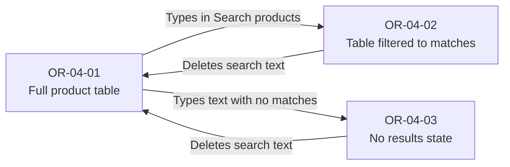

### Steps

| Screen | User action | System response |
| --- | --- | --- |
| OR-04-01 | Views the Product assignments table | All 34 products are listed. |
| OR-04-02 | Types "Krypton - Open Market Motor" into Search products | The input shows its focused state. The table updates with each keystroke to show the 9 products whose names contain the text. The row count reads "Showing 1-9 of 9". |
| OR-04-03 | Types text that matches no product names, e.g. "Th" | The input keeps its focused state. The table, including its header row and row count, is replaced by the no results state: "No search results found" and "No products match “Th”. Try another search." |

*OR-04-01 · Product assignments table, unfiltered*

*OR-04-02 · Product assignments table filtered by "Krypton - Open Market Motor"*

*OR-04-03 · No results state for the search "Th"*

### Search input

- **Default:** grey border, search icon and the placeholder "Search products".
- **Focused:** blue border; the typed text replaces the placeholder.

### No results state

Shown in place of the table when the search text matches no products. The table header row with its select-all checkbox is hidden too.

- **Heading:** "No search results found", left-aligned with the page content.
- **Body:** "No products match “{search text}”. Try another search." The user's search text is shown in curly quotes, e.g. “Th”.
- **Action bar:** stays visible, so the user can edit the search or change the originator filter.

### Rules

- Filtering starts as the user types and updates on every keystroke.
- A product matches when its name contains the search text anywhere, ignoring case, so "Open Market Motor" does not match "Open Market Commercial Vehicle" products.
- Leading and trailing spaces in the search text are trimmed before matching.
- Matching rows keep their original order and their originator chips.
- Search affects only the table: originator cards, the originator filter and the selection text are unchanged.
- Selected products stay selected when a search or filter hides them (see Rows and header checkbox in OR-00).
- Search and the originator filter (OR-05) apply together: the table shows products matching the search text within the chosen originator.
- There is no clear control. To start again, the user deletes the search text, which restores the full table.

## OR-05 · Filter products by originator

The originator filter narrows the Product assignments table to the products collecting through one originator.

**Starts from:** OR-00-01. **Ends at:** OR-05-04 when the originator has products, or OR-05-05 when it has none.

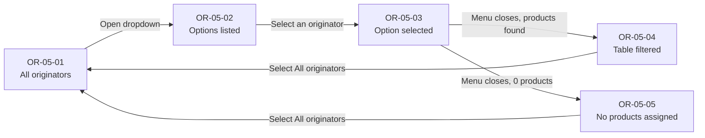

### Steps

| Screen | User action | System response |
| --- | --- | --- |
| OR-05-01 | Views the Product assignments table | The filter shows "All originators"; all 34 products are listed. |
| OR-05-02 | Clicks the filter, hovers over "Real Insure LTD" | The field shows its focused state and a menu opens below it with All originators, Assurant Inter LTD and Real Insure LTD. "All originators", the current value, shows its selected state. The hovered option has a grey background. |
| OR-05-03 | Clicks "Real Insure LTD" | The option shows its selected state: blue text, light blue background and a check icon. |
| OR-05-04 | — | The menu closes and the field shows "Real Insure LTD". The table shows only its 2 products; the row count reads "Showing 1-2 of 2". |
| OR-05-05 | Selects an originator with 0 products, e.g. Real Insure LTD after its products have been reassigned | The table, including its header row and row count, is replaced by the no products assigned state. |

*OR-05-01 · Originator filter set to "All originators"*

*OR-05-02 · Originator filter open, hovering over "Real Insure LTD"*

*OR-05-03 · "Real Insure LTD" selected*

*OR-05-04 · Table filtered to Real Insure LTD's 2 products*

*OR-05-05 · No products assigned state*

### Originator filter

- **Label:** none visible. Accessible name "Filter by originator".
- **Closed:** grey border, current value and a down-arrow icon. Default value "All originators".
- **Open:** blue border; a menu below the field lists "All originators", then every originator in card order.
- **Option, hover:** grey background.
- **Option, selected:** blue text, light blue background and a check icon on the right. The current value is marked this way whenever the menu opens.

### No products assigned state

Shown in place of the table when the chosen originator has 0 products. It uses the same layout as the no results state in OR-04, and the table header row is hidden.

- **Heading:** "No products assigned".
- **Body:** "No products are assigned to {originator name} yet. Set the filter to All originators, then select products and use Reassign originator to assign them."
- **Action bar:** stays visible, showing the chosen originator in the filter.

### Rules

- Selecting an originator shows only the products assigned to it.
- Selecting "All originators" shows every product.
- Every originator appears as an option, including one with 0 products.
- The menu closes as soon as an option is chosen; there is no Apply button.
- Filtering affects only the table: originator cards and the selection text are unchanged.

## OR-06 · Reassign a single product

The user selects one product in the table and moves it to a different originator through the Reassign originator modal.

**Starts from:** OR-00-01. **Ends at:** OR-06-06, the table showing the product's new originator.

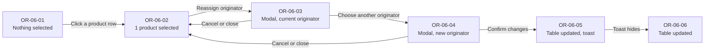

Cancel or close returns to the table with the product still selected and nothing changed.

### Steps

| Screen | User action | System response |
| --- | --- | --- |
| OR-06-01 | Views the Product assignments table | Nothing is selected. The action bar reads "Select products to reassign"; "Reassign originator" and "Clear selection" are disabled. |
| OR-06-02 | Clicks the row (or its checkbox) for "Krypton - Open Market Motor-6 Months instalments PP STP" | The checkbox is ticked and the row gets a light blue background. The action bar reads "1 product selected"; "Reassign originator" and "Clear selection" become enabled. The header checkbox shows its partial state. |
| OR-06-03 | Clicks "Reassign originator" | Opens the Reassign originator modal. The product's current originator, Assurant Inter LTD, is preselected. "Confirm changes" is disabled. |
| OR-06-04 | Selects Real Insure LTD | "Confirm changes" becomes enabled. |
| OR-06-05 | Clicks "Confirm changes" | The modal closes. The product's chip changes to Real Insure LTD, the selection clears, and card counts update to 31 and 3 products. Success toast "Originator changed" appears bottom right. |
| OR-06-06 | — | The toast has gone; the table and cards keep their updated state. |

*OR-06-01 · Nothing selected*

*OR-06-02 · 1 product selected*

*OR-06-03 · Reassign originator modal with the current originator preselected*

*OR-06-04 · Reassign originator modal with Real Insure LTD chosen*

*OR-06-05 · Table updated with success toast*

*OR-06-06 · Table updated*

### Reassign originator modal

- **Title:** "Reassign originator", with a close (×) icon button top right.
- **Subtitle:** "You're assigning a new originator to 1 product." The count follows the selection. This line, not an alert, tells the user what they are changing.
- **Selected products panel:** grey panel headed "Selected products" with a bulleted list of the selected product names.
- **Choose originator:** heading, helper text "Selected products will use this originator once you confirm your changes.", then one radio button per originator in card order.
- **Actions:** Cancel (text button) and Confirm changes (primary button).

### Rules

- The radio group opens with the selected product's current originator chosen.
- "Confirm changes" is disabled until a different originator is chosen.
- After confirming, the selection clears, originator chips and card counts update, and a success toast "Originator changed" appears.

## OR-07 · Reassign multiple products

The user selects several products and moves them to one originator in a single change. The modal summarises the selection; there is no warning alert.

**Starts from:** OR-00-01. **Ends at:** OR-07-06, the table showing the products' new originator.

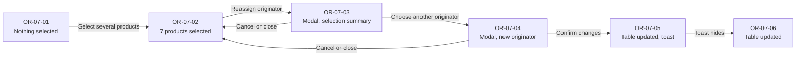

### Steps

| Screen | User action | System response |
| --- | --- | --- |
| OR-07-01 | Views the Product assignments table | Nothing is selected. The action bar reads "Select products to reassign". |
| OR-07-02 | Selects 7 products, all currently on Assurant Inter LTD | Each selected row has a light blue background. The header checkbox shows its partial state. The action bar reads "7 products selected". |
| OR-07-03 | Clicks "Reassign originator" | Opens the modal with the subtitle "You're assigning a new originator to 7 products.", a summary of the selection and Assurant Inter LTD preselected. "Confirm changes" is disabled. |
| OR-07-04 | Selects Real Insure LTD | "Confirm changes" becomes enabled. |
| OR-07-05 | Clicks "Confirm changes" | The modal closes. All 7 chips change to Real Insure LTD, the selection clears, and card counts update to 25 and 9 products. Success toast "Originator changed" appears bottom right. |
| OR-07-06 | — | The toast has gone; the table and cards keep their updated state. |

*OR-07-01 · Nothing selected*

*OR-07-02 · 7 products selected, header checkbox in its partial state*

*OR-07-03 · Reassign originator modal summarising 7 products*

*OR-07-04 · Real Insure LTD chosen*

*OR-07-05 · Table updated with success toast*

*OR-07-06 · Table updated*

### Selected products panel

| Products selected | Panel | Shown in |
| --- | --- | --- |
| 1 to 5 | Every product name listed as a bullet | OR-06, OR-09 |
| 6 or more, not all | First 5 names, then a static line "+ {N} more products" | OR-07 |
| All products | List icon with "All {count} products are selected" (OR-08) | OR-08 |

### Rules

- No warning alert is shown for any selection size; the subtitle states how many products are changing.
- When all selected products share an originator, that originator is preselected.
- One confirmation reassigns every selected product; the selection then clears and counts, chips and toast update as in OR-06.

## OR-08 · Reassign all products

The user selects every product with the header checkbox and moves them all to one originator. The modal switches to an all-products variant with a count in place of the product list.

**Starts from:** OR-00-01. **Ends at:** OR-08-06, every product on the chosen originator.

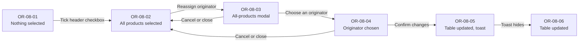

### Steps

| Screen | User action | System response |
| --- | --- | --- |
| OR-08-01 | Views the Product assignments table | Nothing is selected. Products are split across Assurant Inter LTD (32) and Real Insure LTD (2). |
| OR-08-02 | Ticks the header checkbox | Every row is ticked with a light blue background. The header checkbox is ticked. The action bar reads "All products selected". |
| OR-08-03 | Clicks "Reassign originator" | Opens the all-products variant of the modal. No originator is preselected because the products use different originators. "Confirm changes" is disabled. |
| OR-08-04 | Selects Assurant Inter LTD | "Confirm changes" becomes enabled. |
| OR-08-05 | Clicks "Confirm changes" | The modal closes and every product moves to Assurant Inter LTD. Card counts update to 34 and 0 products, the selection clears, and success toast "Originator changed" appears. |
| OR-08-06 | — | The toast has gone; the table and cards keep their updated state. |

*OR-08-01 · Nothing selected*

*OR-08-02 · All products selected with the header checkbox*

*OR-08-03 · All-products variant of the Reassign originator modal*

*OR-08-04 · Assurant Inter LTD chosen*

*OR-08-05 · Every product on Assurant Inter LTD, with success toast*

*OR-08-06 · Table updated*

### All-products modal

Used when every product is selected. It differs from the OR-07 modal in two places.

| Element | Some products (OR-07) | All products (OR-08) |
| --- | --- | --- |
| Subtitle | You're assigning a new originator to {count} products. | You're reassigning all products. |
| Selection panel | Up to 5 product names, then "+ {N} more products" | List icon with "All {count} products are selected" and the line "If you only want to update specific products, please clear your selection and choose again." |

### Mixed originators

When the selected products use more than one originator:

- No radio button is preselected.
- The Choose originator helper text reads: "These products currently use different originators. Choosing an originator will reassign all {count} selected products to the same one." when every product is selected (OR-08), and "…will reassign all selected products to the same one.", without the count, for a partial selection (OR-09).
- "Confirm changes" stays disabled until an originator is chosen.

### Rules

- Ticking the header checkbox selects every visible product; with no search or filter active that is every product, and the action bar reads "All products selected".
- With a search or filter active, the header checkbox selects only the visible rows and the action bar shows the count.
- The all-products modal variant appears only when every product is selected.
- Confirming moves every product to the chosen originator; the other originators' counts drop to 0.

## OR-09 · Reassign products with mixed originators

The user selects products that currently sit on different originators and moves them all to a third one. With three originators configured, the modal lists all three and preselects none.

**Starts from:** OR-00-01 with three originators, Crimson Inter LTD having 0 products. **Ends at:** OR-09-06, both products on Crimson Inter LTD.

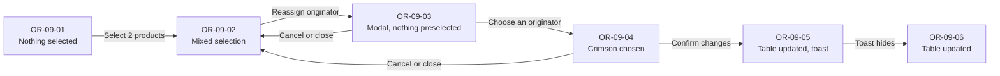

### Steps

| Screen | User action | System response |
| --- | --- | --- |
| OR-09-01 | Views the page with three originators | Cards show Assurant Inter LTD (32), Real Insure LTD (2) and Crimson Inter LTD (0). Nothing is selected. |
| OR-09-02 | Selects "Krypton - Open Market Motor-6 Months instalments PP STP" (Assurant Inter LTD) and "Krypton - Commercial Combined-Monthly instalment" (Real Insure LTD) | Both rows are highlighted. The header checkbox shows its partial state. The action bar reads "2 products selected". |
| OR-09-03 | Clicks "Reassign originator" | The modal lists both products and all three originators. None is preselected because the products use different originators. "Confirm changes" is disabled. |
| OR-09-04 | Selects Crimson Inter LTD | "Confirm changes" becomes enabled. |
| OR-09-05 | Clicks "Confirm changes" | Both chips change to Crimson Inter LTD and the selection clears. Card counts update to Assurant Inter LTD 31, Real Insure LTD 1 product and Crimson Inter LTD 2 products. Success toast "Originator changed" appears. |
| OR-09-06 | — | The toast has gone; the table and cards keep their updated state. |

*OR-09-01 · Three originators, nothing selected*

*OR-09-02 · Two products on different originators selected*

*OR-09-03 · Reassign originator modal with nothing preselected*

*OR-09-04 · Crimson Inter LTD chosen*

*OR-09-05 · Table updated with success toast*

*OR-09-06 · Table updated*

### Rules

- The radio group lists every originator, in card order, including one with 0 products.
- A mixed selection follows the Mixed originators rules in OR-08: nothing preselected, explanatory helper text, "Confirm changes" disabled until a choice is made.
- Card counts update for every originator affected: each source loses the products that moved and the target gains them all.
- Card product counts use the singular for one product: "1 product".

## OR-10 · Delete an originator

The user deletes any originator except the default from the red bin icon on its card. The bin is always active. After a confirmation modal, the card is removed and any products it had move to the default originator.

**Starts from:** OR-00-01. **Ends at:** OR-10-03, the page without the deleted card.

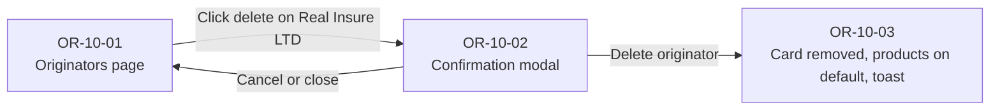

### Steps

| Screen | User action | System response |
| --- | --- | --- |
| OR-10-01 | Views the Originators page | Assurant Inter LTD, the default, has no bin. Real Insure LTD shows a red bin next to its edit icon. |
| OR-10-02 | Clicks the bin on Real Insure LTD, which has 2 products | The Delete this originator? modal opens. |
| OR-10-03 | Clicks "Delete originator" | The modal closes and the Real Insure LTD card is removed. Its 2 products move to Assurant Inter LTD: their chips change and the default's count updates to 34 products. The originator disappears from the filter and the reassign options. Success toast "Originator deleted" appears. |

*OR-10-01 · Originators page: no bin on the default, a red bin on Real Insure LTD*

*OR-10-02 · Delete this originator? modal*

*OR-10-03 · Real Insure LTD removed, its products on Assurant Inter LTD, success toast*

### Delete this originator? modal

- **Title:** "Delete this originator?", with a close (×) icon button top right.
- **Body:** "This will permanently remove this originator. Any products assigned to it will be moved to the default originator. You cannot undo this action." The same text is used whether or not the originator has products.
- **Actions:** Cancel (text button) and "Delete originator" (red destructive button with a bin icon).

### Rules

- The default originator has no delete control. To remove it, make another originator the default first (OR-11).
- Every other originator's bin is red (danger style) and always active, whatever its product count. It shows the light blue square background on hover, like the edit icon.
- Confirming deletes the originator and moves any of its products to the default originator, as explicit assignments.
- After deletion the card is removed, counts and chips update, the originator disappears from the filter and reassign options, and the toast "Originator deleted" appears.
- Cancel or close leaves the originator in place.

## OR-11 · Change the default originator

The user changes the default originator in one of two ways: by editing the current default, switching Make default off and choosing a new default, or by editing another originator and switching Make default on. A helper line explains that only new products are affected. On confirming, the Default badge moves; no products move.

**Starts from:** OR-00-01. **Ends at:** OR-11-06, Real Insure LTD as the default.

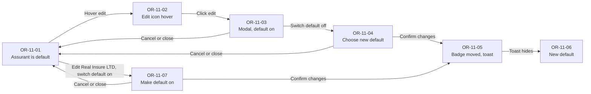

### Steps

| Screen | User action | System response |
| --- | --- | --- |
| OR-11-01 | Views the page | Assurant Inter LTD carries the Default badge. |
| OR-11-02 | Hovers over the edit icon on Assurant Inter LTD | The icon button shows its light blue hover background. |
| OR-11-03 | Clicks the edit icon | The Edit originator modal opens with its intro line for 32 products and Make default on. "Confirm changes" is disabled. |
| OR-11-04 | Switches Make default off | The toggle shows "Off". A Choose new default section appears with the helper line and every originator listed: Assurant Inter LTD is disabled and Real Insure LTD, the only other option, is selected. "Confirm changes" becomes enabled. |
| OR-11-05 | Clicks "Confirm changes" | The modal closes. The Default badge moves to Real Insure LTD, whose card moves to the first position. No products move: every chip is unchanged and card counts stay at 2 for Real Insure LTD and 32 for Assurant Inter LTD. Assurant Inter LTD now shows a red bin. Success toast "Default originator changed" appears. |
| OR-11-06 | — | The toast has gone; Real Insure LTD remains the default. |
| OR-11-07 | Alternative route from OR-11-01: clicks edit on Real Insure LTD and switches Make default on | The modal shows the intro line for 2 products. The toggle shows "On" and the default helper line appears under it. "Confirm changes" becomes enabled. Confirming leads to OR-11-05. |

*OR-11-01 · Assurant Inter LTD is the default*

*OR-11-02 · Edit icon hover on Assurant Inter LTD*

*OR-11-03 · Edit originator modal with Make default on*

*OR-11-04 · Make default switched off, Choose new default with helper line*

*OR-11-05 · Default badge on Real Insure LTD, products unchanged, success toast*

*OR-11-06 · Real Insure LTD is the default*

*OR-11-07 · Edit originator modal for Real Insure LTD with Make default switched on and the helper line*

### Choose new default

Shown between the Make default toggle and the buttons when Make default is switched off on the current default.

- **Heading:** "Choose new default".
- **Helper text:** "New products will use this originator. Existing products stay as they are."
- **Options:** one radio button per originator, in card order. The current default is listed but disabled and greyed out. With two originators, the only other originator is preselected. With three or more, none is preselected and "Confirm changes" stays disabled until one is picked.

### Default helper line

Wherever a new default is being chosen, the same small grey helper text explains the effect: "New products will use this originator. Existing products stay as they are."

| Where | Position |
| --- | --- |
| Choose new default (OR-11-04) | Under the section heading |
| Make default switched on for another originator (OR-11-07) | Under the toggle, while it is on |
| Make default switched on in Add originator (OR-01) | Under the toggle, while it is on |

It is not shown when the Edit modal opens on the current default with the toggle already on (OR-11-03).

### Rules

- Exactly one originator is always the default.
- Changing the default never moves products. Only products created afterwards are assigned to the new default.
- No warning alert is shown; the helper line explains the effect.
- The current default cannot be chosen as its own replacement. On confirming, the Default badge moves to the originator chosen and the previous default loses its badge.
- The default card is always shown first, so the new default's card moves to the first position.
- The new default loses its bin; the previous default gains its red bin and can now be deleted (OR-10).

## Known screenshot differences

The screenshots were revised for this version, but a few still differ from the spec. Build to the spec.

| Screens | Screenshot shows | Build this instead |
| --- | --- | --- |
| OR-09-05, OR-09-06, OR-10-02, OR-10-03, OR-11-05, OR-11-06 | The top bar date reads "03 September 2026"; the other frames read "07 August 2023" | The top bar is static; use one date throughout |
| All except OR-00-01 | No sticky behaviour (static frames) and, on some, no row count | Sticky action bar and header, and the row count, as in OR-00 |
| Frames showing cards | No tooltips on the edit and delete icon buttons | "Edit originator" and "Delete originator" tooltips, as in OR-00 |
| All frames | "Accounts" in the top bar drawn in regular weight | Semi-bold (600) |

## Changes from legacy

The legacy RD app managed originators through a single "BACS Configuration – Originator Details" window, reached from Setup Originator Details on the BACS tab.

| Area | Legacy RD app | Mobius PAS |
| --- | --- | --- |
| Navigation | BACS menu of five links | BACS section with four tabs |
| Originator list | Grid of User No, Bureau No, Sort Code, Account No, Account Holder | Cards showing account holder, sort code and account number |
| Default originator | None; every product associated manually | One default, given to new products; existing products are always explicitly assigned |
| Product association | Two lists (Associated, Available) moved with `<` and `>` | One searchable, filterable table with clickable rows and bulk reassignment |
| Adding | Five-field modal, then OK in the modal and again on the main window | Five-field modal plus a Make default toggle; one Save |
| Sort code display | Typed 10-10-10, shown 101010 in the grid | Shown hyphenated, 00-00-00, throughout |
| Validation | None documented | Inline errors as soon as a value is invalid, and on Save for blank fields with an error summary alert; Account holder limited to 18 characters |
| Editing | Highlight a grid row, click Edit, change fields, then OK in the modal and again on the main window | Edit icon on the card opens a pre-filled modal that states how many products the originator covers; Confirm changes is enabled only once something changes; one save |
| Finding products | Scroll the Available and Associated Products lists | Type-ahead search that filters the product table on every keystroke |
| Products per originator | Highlight an originator in the grid to see its Associated Products list | Originator filter narrows the single product table; each card also shows its product count |
| Reassigning a product | Disassociate from one originator with >, then highlight another and associate with < | Select the product, choose the new originator in one modal and confirm; counts update immediately |
| Bulk changes | Ctrl-click to highlight several products, then move them between lists | Checkboxes and clickable rows with a select-all header; the action bar and header stay in view while scrolling; the modal lists the products affected |
| Removing | Highlight a grid row, Remove, then Yes to "Are you sure you want to remove this originator?"; blocked while products are associated | Red bin on every card except the default; red destructive confirmation; any products move to the default originator |

## Screen index

| Screen ID | Figma file |
| --- | --- |
| OR-00-01 | Originators-base.png |
| OR-01-01 to 04 | 1–4-originators-add-originator.png |
| OR-02-01 to 03 | 1–3-originators-add-originator-error.png |
| OR-02-04 | 3.5-originators-add-originator-error.png |
| OR-02-05 | 4-originators-add-originator-error.png |
| OR-03-01 to 05 | 1–5-originators-originator-make-changes.png |
| OR-04-01 to 03 | 1–3-originators-originator-search.png |
| OR-05-01 | 1-originators-originator-single-select.png |
| OR-05-02 to 05 | 2–5-originators-originator-select-1.png |
| OR-06-01 to 06 | 1–6-originators-originator-select.png |
| OR-07-01 to 06 | 1–6-originators-originator-multi-select.png |
| OR-08-01 to 06 | 1–6-originators-originator-all-select.png |
| OR-09-01 to 06 | 1–6-originators-originator-mixed-select.png |
| OR-10-01 to 03 | 1–3-originators-originator-delete.png |
| OR-11-01 to 06 | 1–6-originators-change-default.png |
| OR-11-07 | 7-originators-change-default-make-default.png |
