# Originators — Feature Specification

Sep 25, 2026 · @Laurence Abbott

## About this document

This document specifies the Originators feature in the BACS section of the Mobius PAS Accounts module, screen by screen. It is written for three readers: developers building the feature, product people validating behaviour, and Claude Code building a clickable prototype from the screens.

**Screen IDs.** Every screen has an ID in the form `OR-FF-SS`: `OR` for Originators, `FF` for the flow number and `SS` for the step. Flow `00` is the base page. Figma frames and screenshot exports use the same IDs, so text, images and prototype states stay linked.

**Screenshots.** Each step has a screenshot of the matching Figma frame, captioned with its screen ID.

**Structure.** The body describes the new experience only. Unresolved questions are collected near the end, and every comparison with the legacy RD app sits in the final section.

## Feature overview

An originator is a bank account plus the BACS identity that direct debit payments are collected into and paid out of. At least one originator must exist before any BACS files can be created, so every other BACS tab depends on this one.

Each product collects through exactly one originator. One originator is the **default**: any product not explicitly assigned elsewhere uses it.

**Location.** Accounts module → BACS in the left navigation → Originators tab.

| Tab | What it does |
| --- | --- |
| Process | Creates AUDDIS and payment files for a collection date |
| Import | Loads ARUDD, AUDDIS return and ADDACS files from the bank |
| Originators | Manages originators and which products collect through each |
| Calendar | Sets BACS processing dates and collection-date passwords |

**Dependencies.** The Process tab uses each product's originator to decide which account a policy's direct debit collects into.

## Glossary

| Term | Meaning |
| --- | --- |
| BACS | The UK payment scheme used to collect direct debits. |
| Originator | The account and BACS identity a product's direct debits collect into or pay out of. |
| Default originator | The originator used by any product without an explicit assignment. Exactly one exists at a time. |
| Account holder | The name on the originator's bank account. Used as the originator's display name. |
| User No. | The BACS Service User Number (SUN) identifying the originator to BACS. |
| Bureau No. | Identifies a bureau submitting BACS files on the originator's behalf. |
| Product | An insurance product and payment plan, e.g. "Krypton - Open Market Motor-11 Months". |
| Assignment | The link between a product and the originator it collects through. |
| Override | An explicit assignment to a named originator, rather than falling back to the default. |
| AUDDIS | Automated Direct Debit Instruction Service: sends new direct debit instructions to BACS. |
| ARUDD | Automated Return of Unpaid Direct Debits: reports collections that failed. |
| ADDACS | Automated Direct Debit Amendment and Cancellation Service: reports changes to instructions. |

## Data model

An originator has six fields. Account holder is limited to 18 characters (see OR-02). Other formats are implied by the design's placeholders.

| Field | Format | Shown on card | Notes |
| --- | --- | --- | --- |
| Account holder | Free text, max 18 characters | Yes, as the name | Also shown on product table chips |
| Sort code | 6 digits, displayed 00-00-00 | Yes |  |
| Account No. | 8 digits | Yes |  |
| User No. | 6 digits | No |  |
| Bureau No. | 6 letters or numbers, e.g. ABC123 | No |  |
| Default | On or off | Yes, as a "Default" badge | Exactly one originator is default |

**Assignment rules**

- Every product resolves to exactly one originator.
- A product with an override uses its assigned originator; any other product uses the default.
- Assigning a product to the current default removes its override, so it inherits the default again. The product table shows inherited and explicitly assigned products the same way.
- An originator's product count is the number of products currently resolving to it.
- A new originator starts with 0 products until products are reassigned to it, or until it becomes the default and inherited products move to it.

## Seed data

The starting state behind OR-00-01, for the prototype and for test data. Every flow starts from this state unless its Starts from line says otherwise.

**Originators**

| Account holder | Sort code | Account No. | User No. | Bureau No. | Default |
| --- | --- | --- | --- | --- | --- |
| Assurant Inter LTD | 88-77-66 | 61366789 | 504965 | ABCDEF | Yes |
| Real Insure LTD | 11-23-45 | 32899602 | 758392 | DEFGHI | No |

Crimson Inter LTD (88-66-94, 66372838, 489392, ABL123) is not in the starting state; it is the originator added in OR-01.

**Products**, in table order. 32 inherit the default; 2 are explicitly assigned to Real Insure LTD.

| # | Product | Originator | Assignment |
| --- | --- | --- | --- |
| 1 | Krypton - Goods in Transit-Pay Monthly | Assurant Inter LTD | Inherited |
| 2 | Krypton - Goods in Transit-Vitruvius Instalments | Assurant Inter LTD | Inherited |
| 3 | Krypton - Open Market Motor-11 Months | Assurant Inter LTD | Inherited |
| 4 | Krypton - Open Market Motor-3 Months Plan | Assurant Inter LTD | Inherited |
| 5 | Krypton - Open Market Motor-6 Months instalments PP STP | Assurant Inter LTD | Inherited |
| 6 | Krypton - Open Market Motor-7 Months Instalments | Real Insure LTD | Explicit |
| 7 | Krypton - Open Market Motor-DailyPP | Assurant Inter LTD | Inherited |
| 8 | Krypton - Open Market Motor-Pay Monthly | Assurant Inter LTD | Inherited |
| 9 | Krypton - Open Market Motor-Payment Plan No Links | Assurant Inter LTD | Inherited |
| 10 | Krypton - Open Market Motor-Sazdo Test 2 Instalment | Assurant Inter LTD | Inherited |
| 11 | Krypton - Open Market Motor-Sazdo Test PP with 2 instalment | Assurant Inter LTD | Inherited |
| 12 | Krypton - Commercial Combined-Monthly instalment | Real Insure LTD | Explicit |
| 13 | Krypton - Open Market Commercial Vehicle-11 Months | Assurant Inter LTD | Inherited |
| 14 | Krypton - Open Market Commercial Vehicle-3 Months Plan | Assurant Inter LTD | Inherited |
| 15 | Krypton - Open Market Commercial Vehicle-7 Months Instalments | Assurant Inter LTD | Inherited |
| 16 | Krypton - Open Market Commercial Vehicle-Daily Payment Plan | Assurant Inter LTD | Inherited |
| 17 | Krypton - Open Market Commercial Vehicle-DailyPP | Assurant Inter LTD | Inherited |
| 18 | Krypton - Open Market Commercial Vehicle-Pay Monthly | Assurant Inter LTD | Inherited |
| 19 | Krypton - Open Market Commercial Vehicle-Payment Plan No Links | Assurant Inter LTD | Inherited |
| 20 | Krypton - Shop-Monthly instalment | Assurant Inter LTD | Inherited |
| 21 | Krypton - Shop-Pay Monthly | Assurant Inter LTD | Inherited |
| 22 | Krypton - Shop-Vitruvius Instalments | Assurant Inter LTD | Inherited |
| 23 | Krypton - Equine-3 Months Plan | Assurant Inter LTD | Inherited |
| 24 | Krypton - Equine-Monthly instalment | Assurant Inter LTD | Inherited |
| 25 | Krypton - Equine-Pay Monthly | Assurant Inter LTD | Inherited |
| 26 | Krypton - Equine-Payment Plan No Links | Assurant Inter LTD | Inherited |
| 27 | Krypton - Equine-Vitruvius Instalments | Assurant Inter LTD | Inherited |
| 28 | Krypton - Professional Combined-Monthly instalment | Assurant Inter LTD | Inherited |
| 29 | Krypton - Professional Combined-Pay Monthly | Assurant Inter LTD | Inherited |
| 30 | Krypton - Professional Combined-Vitruvius Instalments | Assurant Inter LTD | Inherited |
| 31 | Krypton - Travel-Monthly instalment | Assurant Inter LTD | Inherited |
| 32 | Krypton - Office-Monthly instalment | Assurant Inter LTD | Inherited |
| 33 | Krypton - Office-Pay Monthly | Assurant Inter LTD | Inherited |
| 34 | Krypton - Office-Vitruvius Instalments | Assurant Inter LTD | Inherited |

## Prototype notes

- **Sources of truth:** the screenshots for layout, this spec for behaviour and copy, and the design system for styling tokens and component behaviour, including how modals close.
- **Scope:** the top bar, left navigation and the Process, Import and Calendar tabs are static.
- **State:** held in memory; reloading the prototype resets it to the seed data.

## OR-00-01 · Originators page, populated state

The Originators page shows every configured originator as a card, then a table of every product and the originator it collects through.

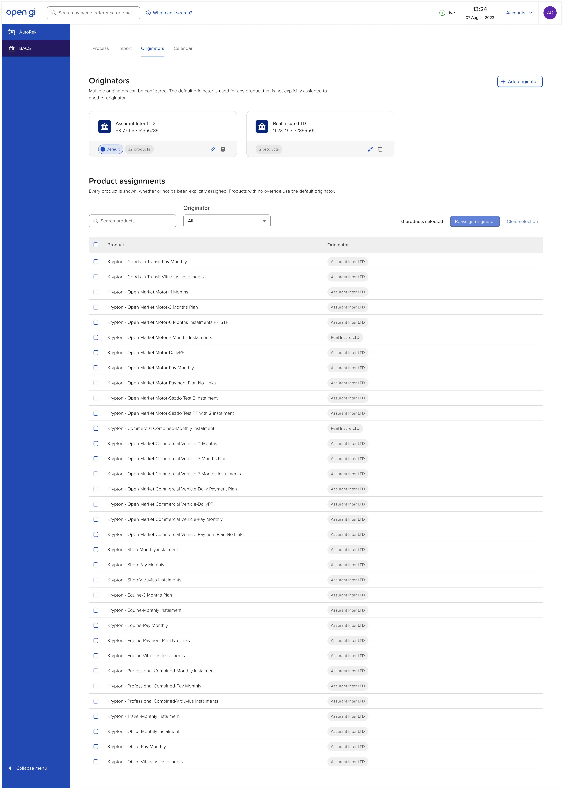

*OR-00-01 · Originators page with two originators*

### Page header

- **Tab bar:** Process, Import, Originators, Calendar. Originators is active, shown with an underline.
- **Heading:** "Originators".
- **Helper text:** "Multiple originators can be configured. The default originator is used for any product that is not explicitly assigned to another originator."
- **Action:** outlined "+ Add originator" button, top right. Opens flow OR-01.

### Originator cards

Cards sit in a row, one per originator. Each card has two parts.

- **Body:** bank icon on a dark tile, account holder name, then sort code and account number separated by a bullet, e.g. "88-77-66 • 61366789".
- **Footer:** a "Default" status badge with an info icon (default originator only; static, with no tooltip), a product count chip such as "32 products", and edit (pencil) and delete (bin) icon buttons on the right. Icon buttons show a light blue square background on hover. Edit opens OR-03.

### Product assignments

- **Heading:** "Product assignments".
- **Helper text:** "Every product is shown, whether or not it's been explicitly assigned. Products with no override use the default originator."
- **Toolbar, left:** "Search products" text input with a search icon, filtering the table as the user types (OR-04); "Originator" dropdown filter, default value "All" (OR-05).
- **Toolbar, right:** selection counter ("0 products selected"), "Reassign originator" primary button and "Clear selection" text link, both disabled while nothing is selected (OR-06).
- **Table:** header row with a select-all checkbox and the columns Product and Originator. Each row has a checkbox, the product name and the originator shown as a neutral chip.

### Behaviour

- Every product appears in the table, including those using the default.
- Selecting rows updates the counter and enables "Reassign originator".

## OR-01 · Add an originator

The user adds a new originator through a modal; on save it appears as a new card with 0 products.

**Starts from:** OR-00-01. **Ends at:** OR-01-04, the Originators page with the new card.

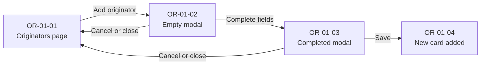
```mermaid
flowchart LR
  A[OR-01-01<br/>Originators page] -->|Add originator| B[OR-01-02<br/>Empty modal]
  B -->|Complete fields| C[OR-01-03<br/>Completed modal]
  C -->|Save| D[OR-01-04<br/>New card added]
  B -->|Cancel or close| A
  C -->|Cancel or close| A
```

Cancel or close from either modal state returns to the page with nothing saved.

### Steps

| Screen | User action | System response |
| --- | --- | --- |
| OR-01-01 | Clicks "+ Add originator" | Opens the Add originator modal over a dimmed page. The button shows its active state. |
| OR-01-02 | Views the empty form | All fields show placeholders. "Make default" is off. Save is disabled. |
| OR-01-03 | Completes the fields, clicks Save | Saves the originator and closes the modal. |
| OR-01-04 | Returns to the page | New card appears after existing cards with "0 products". Product table unchanged. Success toast "New originator added" appears bottom right. |

*OR-01-01 · Originators page, user about to click "+ Add originator"*

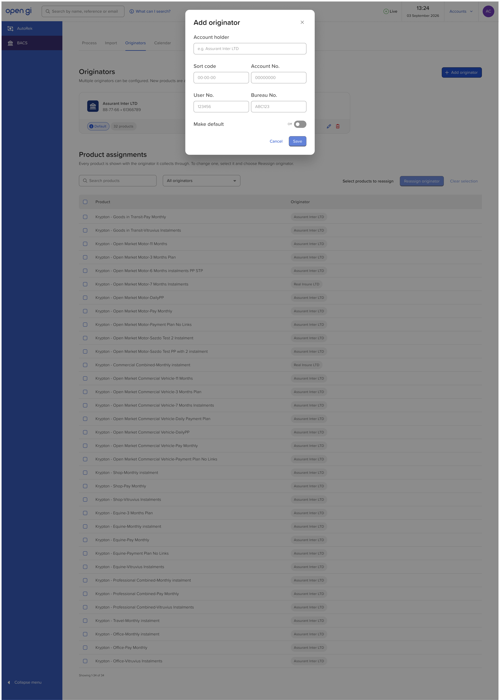

*OR-01-02 · Add originator modal, empty*

*OR-01-03 · Add originator modal, completed*

*OR-01-04 · Originators page with the new Crimson Inter LTD card and success toast*

### Add originator modal

A modal dialog titled "Add originator" with a close (×) icon button top right. Sort code and Account No. share a row, as do User No. and Bureau No.

| Field | Control | Placeholder | Example value |
| --- | --- | --- | --- |
| Account holder | Text input, full width | e.g. Assurant Inter LTD | Crimson Inter LTD |
| Sort code | Text input | 00-00-00 | 88-66-94 |
| Account No. | Text input | 00000000 | 66372838 |
| User No. | Text input | 123456 | 489392 |
| Bureau No. | Text input | ABC123 | ABL123 |
| Make default | Toggle switch with state label | Off | Off |

**Actions**, bottom right: Cancel (text button) and Save (primary button).

### Success toast

After a successful save, a toast appears in the bottom-right corner of the page: a green check icon, the message "New originator added" and a close (×) icon button. It has a light green background with a green left edge.

### Rules

- A new originator starts with 0 products, unless it is saved as the default, when inherited products move to it. Otherwise products only move to it through reassignment.
- With "Make default" off, the existing default is unchanged.
- Switching Make default on uses the OR-11-07 pattern: the default change warning states how many products currently inherit the current default and will move to the new originator. On save, the new originator becomes the default, those products move to it, and the previous default loses its badge.
- The new card shows account holder, sort code and account number. User No. and Bureau No. are stored but not shown.

### Layout

- With two originators, cards sit at a fixed width, left-aligned.
- With three, cards stretch to share the row equally.
- Up to four cards sit in a row; further cards wrap onto a new row below.

## OR-02 · Add an originator with an input error

Form validation happens in two ways. Invalid values, such as an account holder over 18 characters, show an inline error as soon as they are entered, and Save stays disabled (OR-02-03). Blank fields are only flagged when Save is clicked (OR-02-04 to OR-02-05): each blank field shows an inline error and an error summary alert appears. The user corrects the fields in place.

**Starts from:** OR-00-01. **Ends at:** OR-02-03 for an inline error, or OR-02-05 for blank fields found on Save.

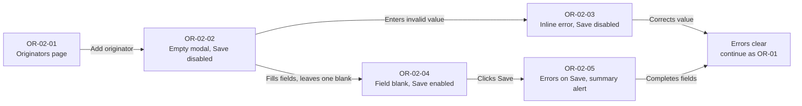
```mermaid
flowchart LR
  A[OR-02-01<br/>Originators page] -->|Add originator| B[OR-02-02<br/>Empty modal, Save disabled]
  B -->|Enters invalid value| C[OR-02-03<br/>Inline error, Save disabled]
  C -->|Corrects value| E[Errors clear<br/>continue as OR-01]
  B -->|Fills fields, leaves one blank| D[OR-02-04<br/>Field blank, Save enabled]
  D -->|Clicks Save| F[OR-02-05<br/>Errors on Save, summary alert]
  F -->|Completes fields| E
```

Once corrected, the flow continues as OR-01 from OR-01-03.

### Steps

| Screen | User action | System response |
| --- | --- | --- |
| OR-02-01 | Clicks "+ Add originator" | Opens the Add originator modal, as OR-01-01. |
| OR-02-02 | Views the empty form | All fields show placeholders. "Make default" is off. Save is disabled. |
| OR-02-03 | Completes the form, entering an account holder longer than 18 characters, e.g. "Crimson International LTD" | Account holder field shows its error state with the message "Max 18 characters". Other fields are unaffected. Save stays disabled. |
| OR-02-04 | Completes every field except Sort code | Sort code shows its placeholder with no error. Save is enabled, because blank fields are only checked when Save is clicked. |
| OR-02-05 | Clicks Save | Nothing is saved and the modal stays open. The blank Sort code shows its error state with the message "Enter a valid sort code in the format 00-00-00". The error summary alert appears between the Make default toggle and the buttons. Save shows its disabled style until the error is corrected. |

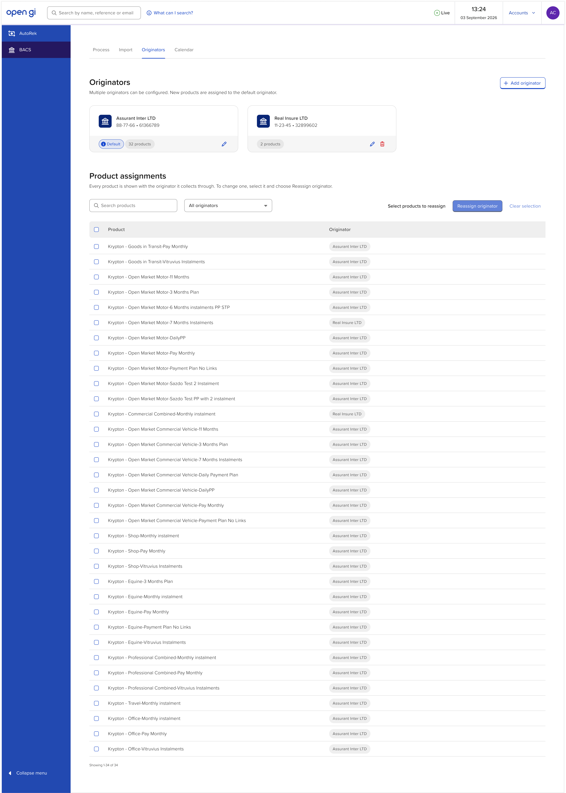

*OR-02-01 · Originators page, user about to click "+ Add originator"*

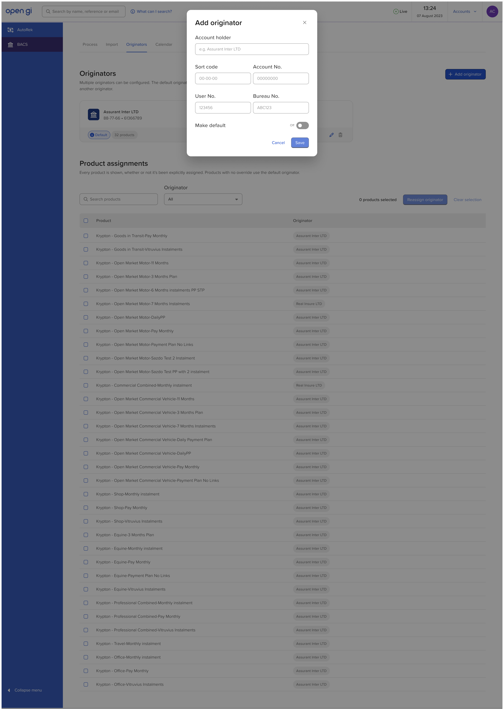

*OR-02-02 · Add originator modal, empty*

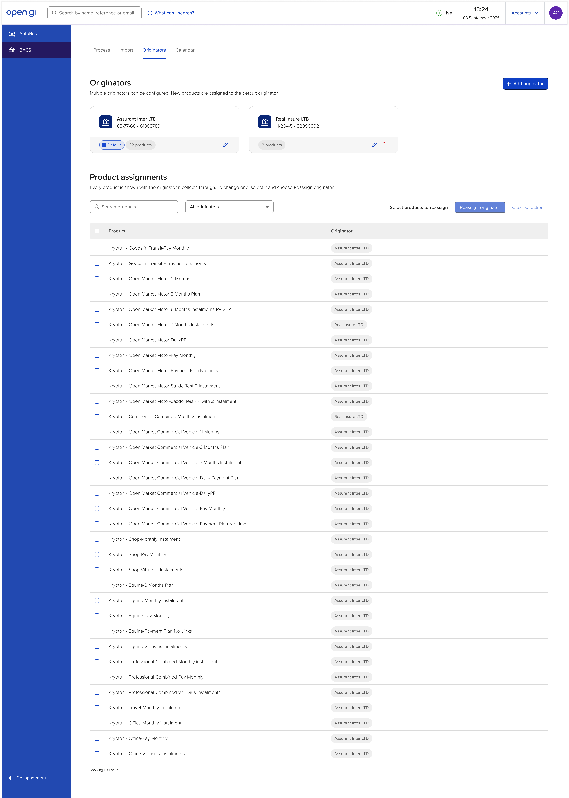

*OR-02-03 · Add originator modal with an inline error on Account holder*

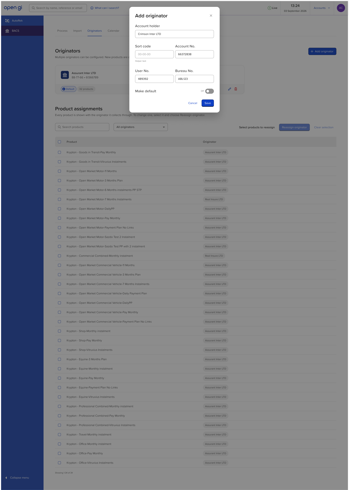

*OR-02-04 · Add originator modal with Sort code left blank and Save enabled*

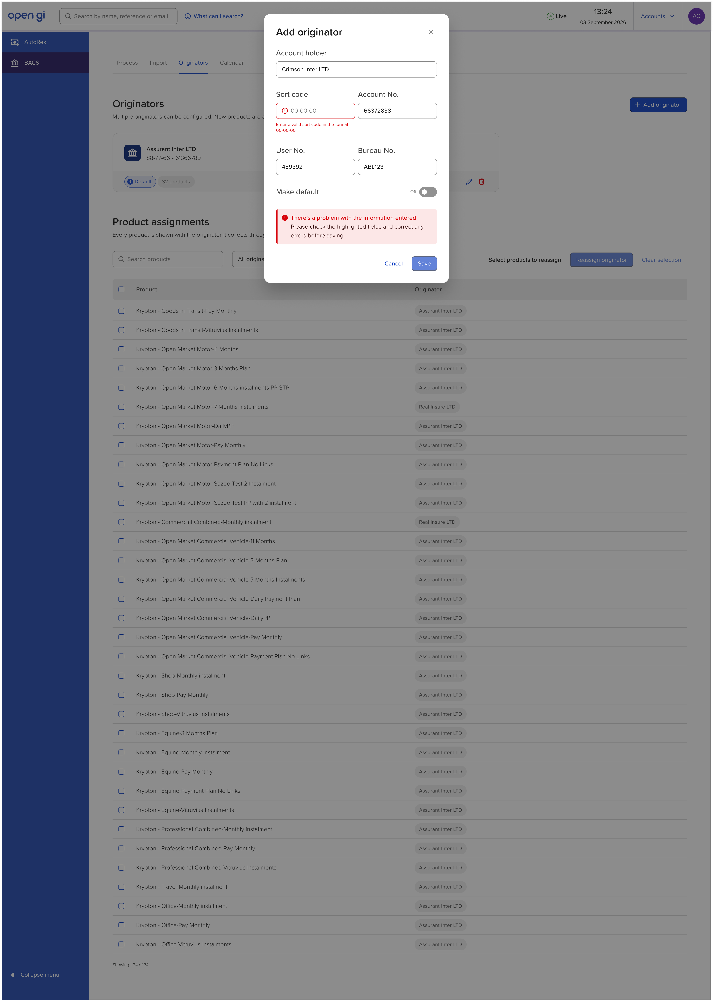

*OR-02-05 · Add originator modal after Save, with an inline error on the blank Sort code and the error summary alert*

### Inline error pattern

- **Input:** red border replaces the default grey border.
- **Icon:** a red circled exclamation icon sits inside the input, before the value.
- **Message:** short red text directly below the input, e.g. "Max 18 characters" or "Enter a valid sort code in the format 00-00-00". A longer message wraps onto a second line.
- **Layout:** the message adds height to the field, so fields below it and the modal itself grow downwards.

### Field messages

Each field has one message, shown with the inline error pattern above. Values that are too long or contain characters the field doesn't allow show their error as the user types; values that are too short show theirs when the user leaves the field. Blank fields show the same message when Save is clicked (OR-02-05). Make default is a toggle and cannot be in error.

| Field | Rule | Message |
| --- | --- | --- |
| Account holder, blank | Required | Enter the account holder name |
| Account holder, too long | Max 18 characters | Max 18 characters |
| Sort code | 6 digits, format 00-00-00 | Enter a valid sort code in the format 00-00-00 |
| Account No. | 8 digits | Enter a valid 8-digit account number |
| User No. | 6 digits | Enter a valid 6-digit user number |
| Bureau No. | 6 letters or numbers | Enter a valid bureau number, e.g. ABC123 |

The Bureau No. length is taken from the ABC123 placeholder. Messages under the half-width fields may wrap onto a second line, as the sort code message does in OR-02-05.

### Error summary alert

Shown between the Make default toggle and the buttons when Save is clicked with any field blank (OR-02-05). It uses the same alert layout as the OR-03 warning, in red, and clears once the errors are corrected.

- **Style:** light red background, red left edge and a red circled exclamation icon.
- **Title:** "There's a problem with the information entered".
- **Body:** "Please check the highlighted fields and correct any errors before saving."
- **Layout:** the modal grows downwards to fit the alert.

### Rules

- Errors appear inline as soon as a value is known to be invalid; the user does not need to press Save first.
- Account holder is limited to 18 characters.
- Only the invalid field shows an error; valid fields keep their normal state.
- Save is disabled while the form is empty (OR-02-02) or any field shows an inline error (OR-02-03). Once fields are filled, Save is enabled even if some are still blank (OR-02-04).
- Every field is required. Blank fields are only checked when Save is clicked (OR-02-05): nothing is saved, the modal stays open, each blank field shows its inline error, the error summary alert appears, and Save is disabled until the errors are corrected.
- An empty or badly formatted sort code shows "Enter a valid sort code in the format 00-00-00".
- The error summary alert and inline errors clear once the fields are corrected.
- Account details are checked for format only; the system does not confirm that the sort code and account number are correct.

## OR-03 · Edit an originator

The user edits an originator's details from the pencil icon on its card; on confirming, the card updates and a success toast appears.

**Starts from:** OR-00-01. **Ends at:** OR-03-05, the Originators page with the updated card.

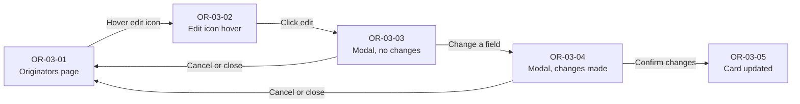
```mermaid
flowchart LR
  A[OR-03-01<br/>Originators page] -->|Hover edit icon| B[OR-03-02<br/>Edit icon hover]
  B -->|Click edit| C[OR-03-03<br/>Modal, no changes]
  C -->|Change a field| D[OR-03-04<br/>Modal, changes made]
  D -->|Confirm changes| E[OR-03-05<br/>Card updated]
  C -->|Cancel or close| A
  D -->|Cancel or close| A
```

Cancel or close discards any unsaved changes and returns to the page.

### Steps

| Screen | User action | System response |
| --- | --- | --- |
| OR-03-01 | Views the Originators page | Each card shows edit and delete icon buttons in its footer. |
| OR-03-02 | Hovers over the edit (pencil) icon on the Assurant Inter LTD card | The icon button shows a light blue square background. |
| OR-03-03 | Clicks the edit icon | Opens the Edit originator modal, pre-filled with the originator's current details. "Confirm changes" is disabled. |
| OR-03-04 | Changes the sort code to 88-77-44 and the account number to 61366788 | "Confirm changes" becomes enabled. A bank details warning appears above the buttons: "This change will affect 32 products". |
| OR-03-05 | Clicks "Confirm changes" | Saves the changes and closes the modal. The card shows "88-77-44 • 61366788". Success toast "Originator changes made" appears bottom right. |

*OR-03-01 · Originators page before editing*

*OR-03-02 · Edit icon hover state on the Assurant Inter LTD card*

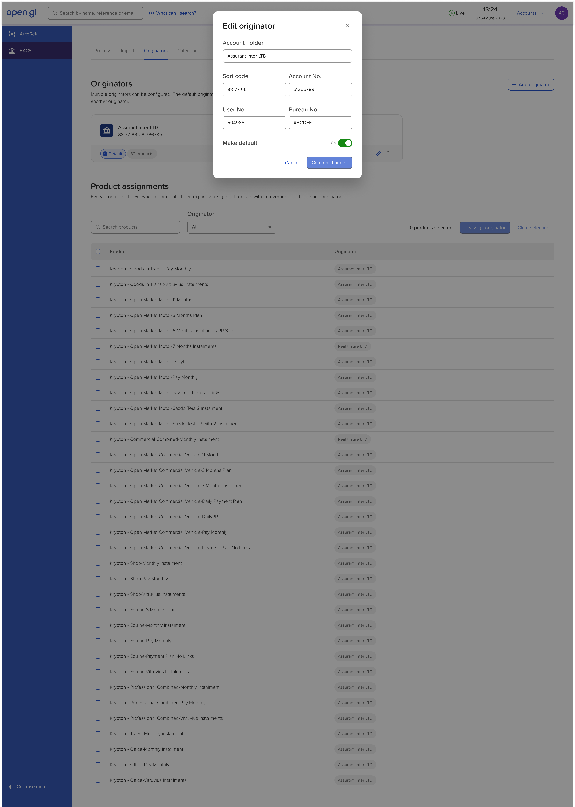

*OR-03-03 · Edit originator modal, pre-filled, no changes*

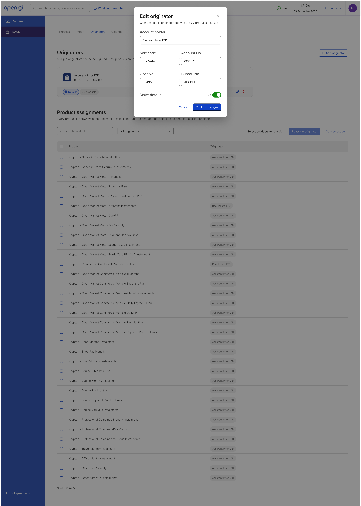

*OR-03-04 · Edit originator modal with changed sort code and account number, and bank details warning*

*OR-03-05 · Originators page with the updated card and success toast*

### Edit originator modal

The same layout and fields as the Add originator modal (OR-01), with three differences.

| Element | Add originator | Edit originator |
| --- | --- | --- |
| Title | Add originator | Edit originator |
| Fields | Empty, showing placeholders | Pre-filled with current values, including User No. and Bureau No. |
| Primary button | Save | Confirm changes: disabled until a field changes |

**Make default toggle.** When editing the default originator, the toggle shows its on state: a green track with an "On" state label.

### Bank details warning

A warning alert appears between the Make default toggle and the buttons when the sort code or account number is changed. It tells the user how many products the change affects before they confirm.

- **Style:** amber background, darker amber left edge and a warning triangle icon.
- **Title:** "This change will affect 32 products". The number is the originator's current product count; with one product it reads "1 product".
- **Body:** "Future collections for these products will go to the new account. Check the sort code and account number before confirming."
- **Layout:** the modal grows downwards to fit the alert.

The alert shows only when the sort code or account number differs from the saved value and the originator has at least one product. It disappears if the values are changed back. Changes to other fields never show it.

### Rules

- "Confirm changes" is disabled while the form matches the saved values, and enabled once any field changes.
- Editing bank details does not change product assignments; the originator keeps its products.
- The same inline error pattern and field rules as OR-02 apply.
- Changing the sort code or account number of an originator with products shows the bank details warning before confirming.

## OR-04 · Search products

The product search filters the Product assignments table as the user types; there is no search button.

**Starts from:** OR-00-01. **Ends at:** OR-04-02 when products match, or OR-04-03 when none do.

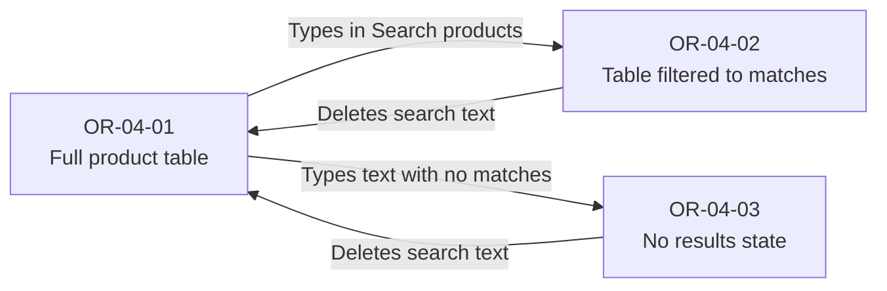
```mermaid
flowchart LR
  A[OR-04-01<br/>Full product table] -->|Types in Search products| B[OR-04-02<br/>Table filtered to matches]
  A -->|Types text with no matches| C[OR-04-03<br/>No results state]
  B -->|Deletes search text| A
  C -->|Deletes search text| A
```

### Steps

| Screen | User action | System response |
| --- | --- | --- |
| OR-04-01 | Views the Product assignments table | All 34 products are listed. |
| OR-04-02 | Types "Krypton - Open Market Motor" into Search products | The input shows its focused state. The table updates with each keystroke to show the 9 products whose names contain the text. |
| OR-04-03 | Types text that matches no product names, e.g. "Th" | The input keeps its focused state. The table, including its header row, is replaced by the no results state: "No search results found" and "No products match “Th”. Try another search." |

*OR-04-01 · Product assignments table, unfiltered*

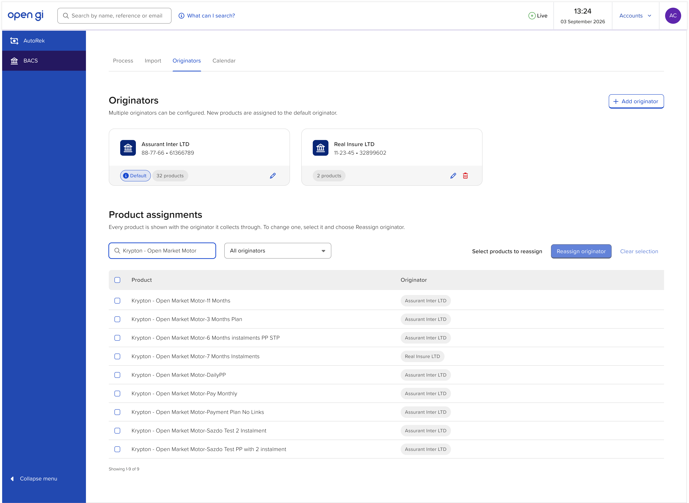

*OR-04-02 · Product assignments table filtered by "Krypton - Open Market Motor"*

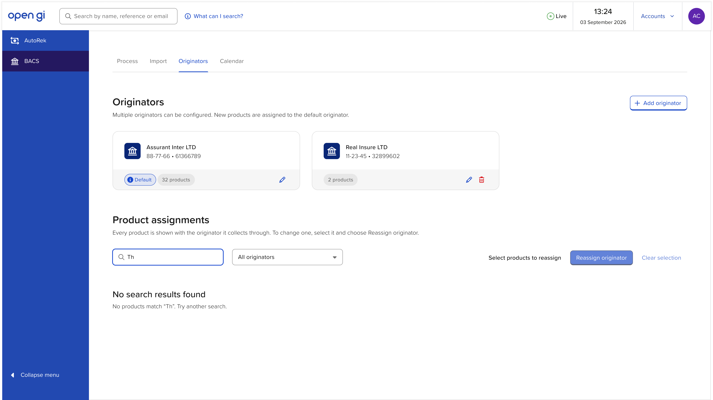

*OR-04-03 · No results state for the search "Th"*

### Search input

- **Default:** grey border, search icon and the placeholder "Search products".
- **Focused:** blue border; the typed text replaces the placeholder.

### No results state

Shown in place of the table when the search text matches no products. The table header row with its select-all checkbox is hidden too.

- **Heading:** "No search results found", left-aligned with the page content.
- **Body:** "No products match “{search text}”. Try another search." The user's search text is shown in curly quotes, e.g. “Th”.
- **Toolbar:** stays visible, so the user can edit the search or change the Originator filter.

### Rules

- Filtering starts as the user types and updates on every keystroke.
- A product matches when its name contains the search text anywhere, ignoring case, so "Open Market Motor" does not match "Open Market Commercial Vehicle" products.
- Leading and trailing spaces in the search text are trimmed before matching.
- Matching rows keep their original order and their originator chips.
- Search affects only the table: originator cards, the Originator filter and the selection counter are unchanged.
- Selected products stay selected when a search or filter hides them. The counter counts every selected product; the header checkbox reflects only the visible rows.
- Search and the Originator filter (OR-05) apply together: the table shows products matching the search text within the chosen originator.
- There is no clear control. To start again, the user deletes the search text, which restores the full table.
- When nothing matches, the no results state replaces the table and its header row.

## OR-05 · Filter products by originator

The Originator dropdown narrows the Product assignments table to the products collecting through one originator.

**Starts from:** OR-00-01. **Ends at:** OR-05-04 when the originator has products, or OR-05-05 when it has none.

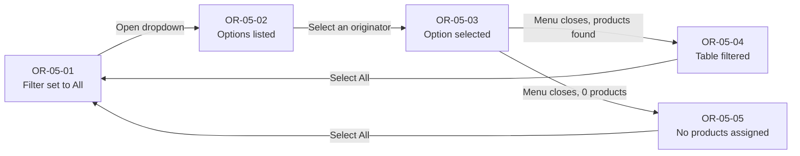
```mermaid
flowchart LR
  A[OR-05-01<br/>Filter set to All] -->|Open dropdown| B[OR-05-02<br/>Options listed]
  B -->|Select an originator| C[OR-05-03<br/>Option selected]
  C -->|Menu closes, products found| D[OR-05-04<br/>Table filtered]
  C -->|Menu closes, 0 products| E[OR-05-05<br/>No products assigned]
  D -->|Select All| A
  E -->|Select All| A
```

### Steps

| Screen | User action | System response |
| --- | --- | --- |
| OR-05-01 | Views the Product assignments table | The Originator filter shows "All"; all 34 products are listed. |
| OR-05-02 | Clicks the Originator dropdown, hovers over "Real Insure LTD" | The field shows its focused state and a menu opens below it with All, Assurant Inter LTD and Real Insure LTD. "All", the current value, shows its selected state. The hovered option has a grey background. |
| OR-05-03 | Clicks "Real Insure LTD" | The option shows its selected state: blue text, light blue background and a check icon. |
| OR-05-04 | — | The menu closes and the field shows "Real Insure LTD". The table shows only its 2 products. |
| OR-05-05 | Selects an originator with 0 products, e.g. Real Insure LTD after its products have moved back to the default | The table, including its header row, is replaced by the no products assigned state. |

*OR-05-01 · Product assignments table with the Originator filter set to All*

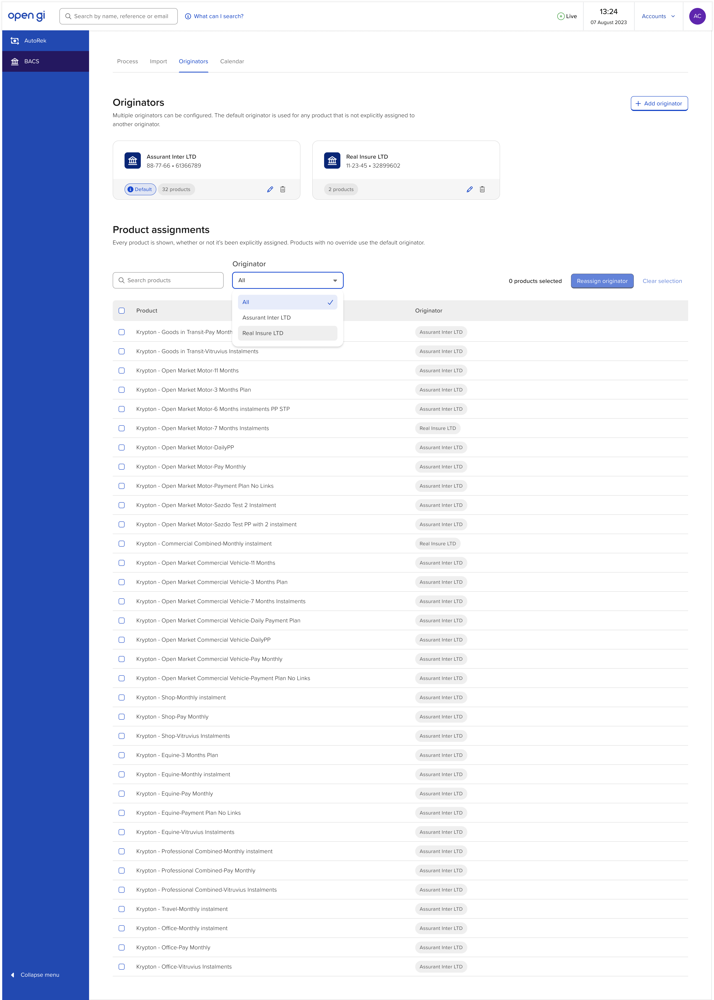

*OR-05-02 · Originator dropdown open, hovering over Real Insure LTD*

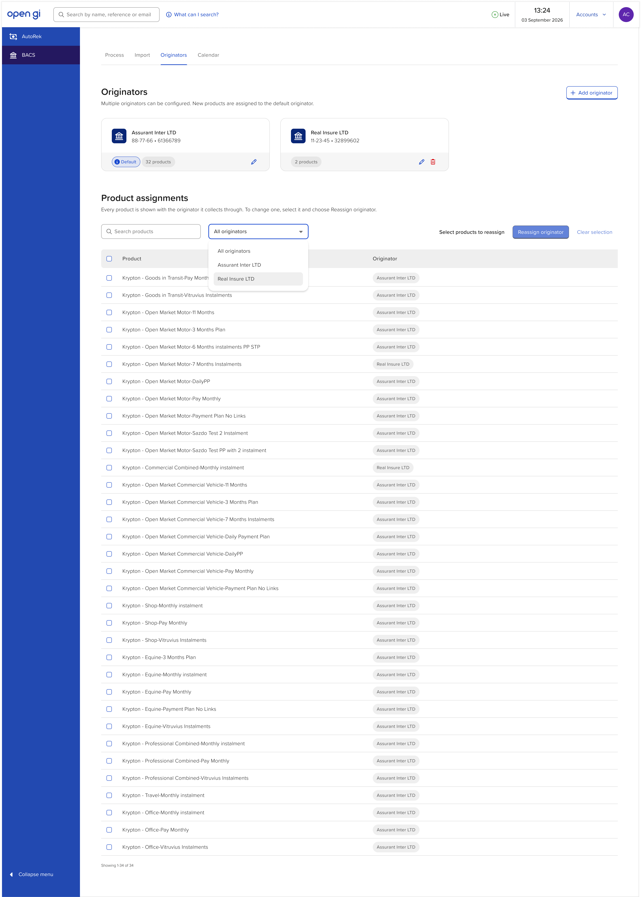

*OR-05-03 · Real Insure LTD selected in the menu*

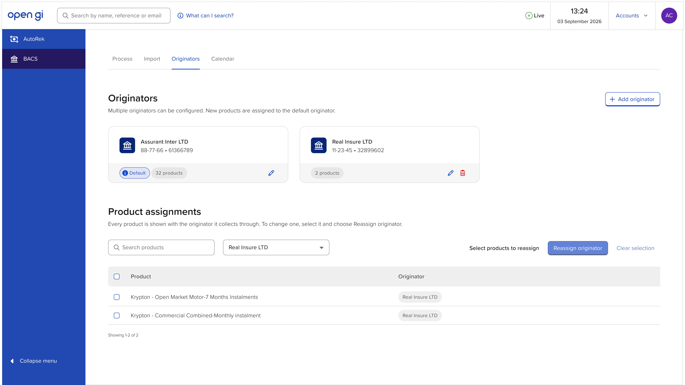

*OR-05-04 · Table filtered to Real Insure LTD's 2 products*

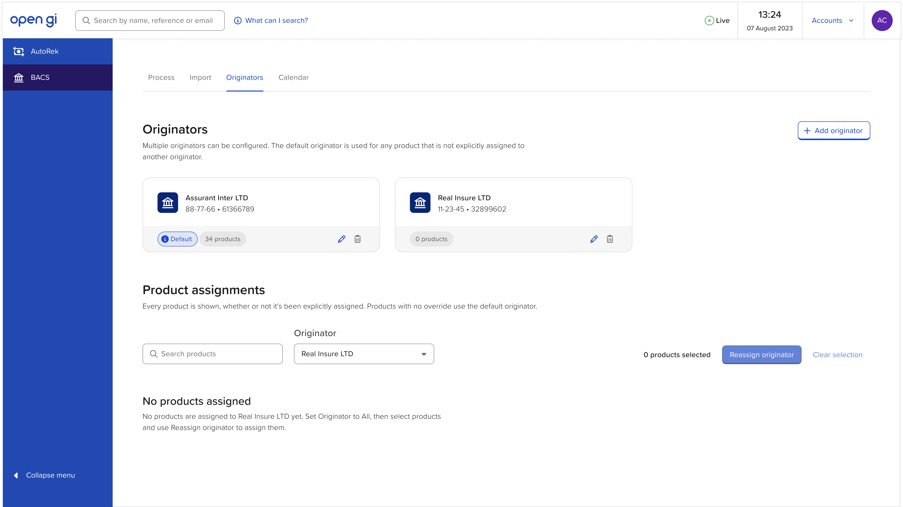

*OR-05-05 · Filter set to Real Insure LTD with 0 products assigned*

### Originator dropdown

- **Closed:** grey border, current value and a down-arrow icon. Default value "All".
- **Open:** blue border; a menu below the field lists "All", then every originator in the same order as the cards.
- **Option, hover:** grey background.
- **Option, selected:** blue text, light blue background and a check icon on the right. The current value is marked this way whenever the menu opens.

### No products assigned state

Shown in place of the table when the chosen originator has 0 products. It uses the same layout as the no results state in OR-04, and the table header row is hidden.

- **Heading:** "No products assigned".
- **Body:** "No products are assigned to {originator name} yet. Set Originator to All, then select products and use Reassign originator to assign them."
- **Toolbar:** stays visible, showing the chosen originator in the dropdown.

### Rules

- Selecting an originator shows only the products that currently resolve to it, including inherited products when the default is chosen.
- Selecting "All" shows every product.
- Every originator appears as an option, including one with 0 products.
- The menu closes as soon as an option is chosen; there is no Apply button.
- Filtering affects only the table: originator cards and the selection counter are unchanged.
- When the chosen originator has 0 products, the no products assigned state replaces the table and its header row.

## OR-06 · Reassign a single product

The user selects one product in the table and moves it to a different originator through the Reassign originator modal.

**Starts from:** OR-00-01. **Ends at:** OR-06-06, the table showing the product's new originator.

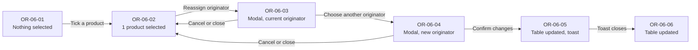
```mermaid
flowchart LR
  A[OR-06-01<br/>Nothing selected] -->|Tick a product| B[OR-06-02<br/>1 product selected]
  B -->|Reassign originator| C[OR-06-03<br/>Modal, current originator]
  C -->|Choose another originator| D[OR-06-04<br/>Modal, new originator]
  D -->|Confirm changes| E[OR-06-05<br/>Table updated, toast]
  E -->|Toast closes| F[OR-06-06<br/>Table updated]
  C -->|Cancel or close| B
  D -->|Cancel or close| B
```

Cancel or close returns to the table with the product still selected and nothing changed.

### Steps

| Screen | User action | System response |
| --- | --- | --- |
| OR-06-01 | Views the Product assignments table | Nothing is selected. "Reassign originator" and "Clear selection" are disabled. |
| OR-06-02 | Ticks the checkbox for "Krypton - Open Market Motor-6 Months instalments PP STP" | The row gets a light blue background. The counter reads "1 product selected". "Reassign originator" and "Clear selection" become enabled. |
| OR-06-03 | Clicks "Reassign originator" | Opens the Reassign originator modal. The product's current originator, Assurant Inter LTD, is preselected. "Confirm changes" is disabled. |
| OR-06-04 | Selects Real Insure LTD | "Confirm changes" becomes enabled. |
| OR-06-05 | Clicks "Confirm changes" | The modal closes. The product's chip changes to Real Insure LTD, the selection clears, and card counts update to 31 and 3 products. Success toast "Originator changed" appears bottom right. |
| OR-06-06 | — | The toast has gone; the table and cards keep their updated state. |

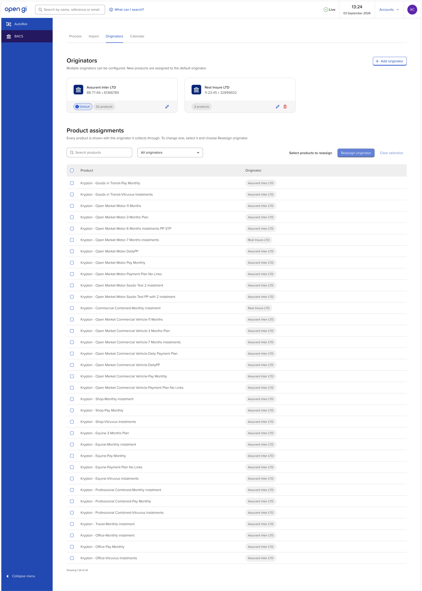

*OR-06-01 · Product assignments table with nothing selected*

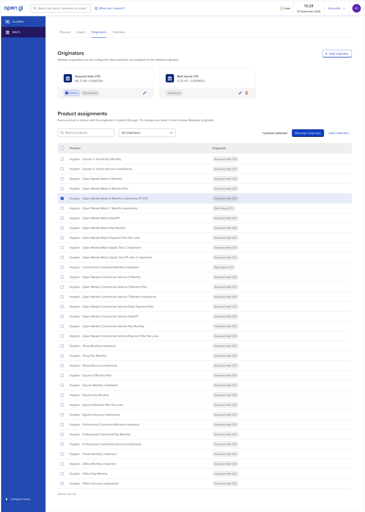

*OR-06-02 · One product selected in the table*

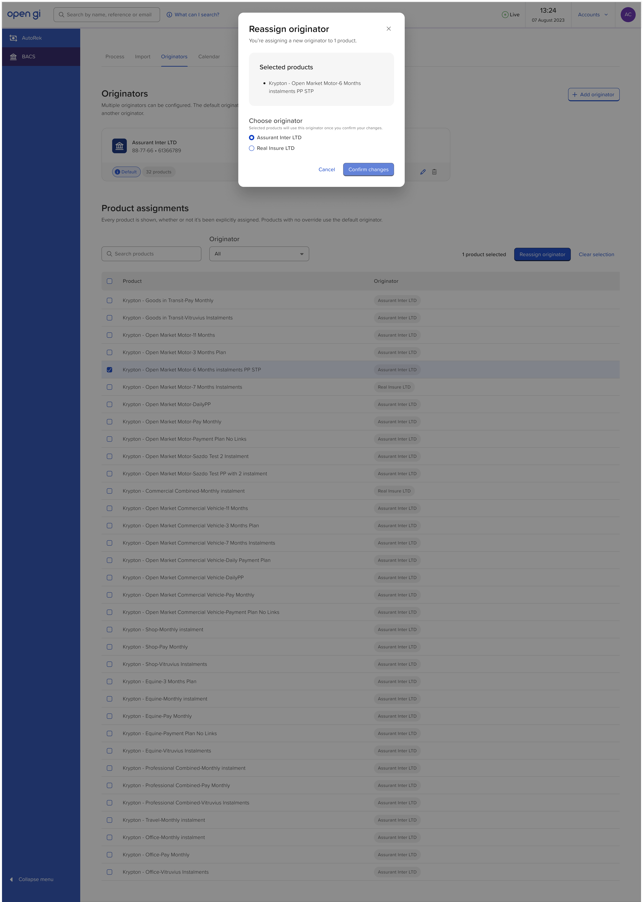

*OR-06-03 · Reassign originator modal with the current originator preselected*

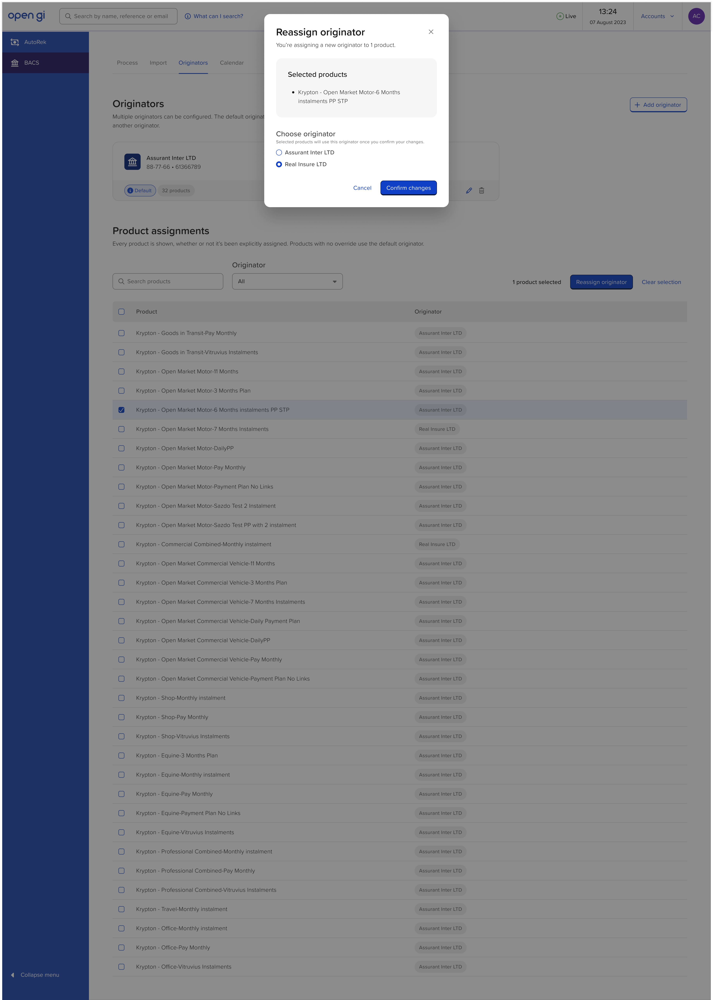

*OR-06-04 · Real Insure LTD chosen, Confirm changes enabled*

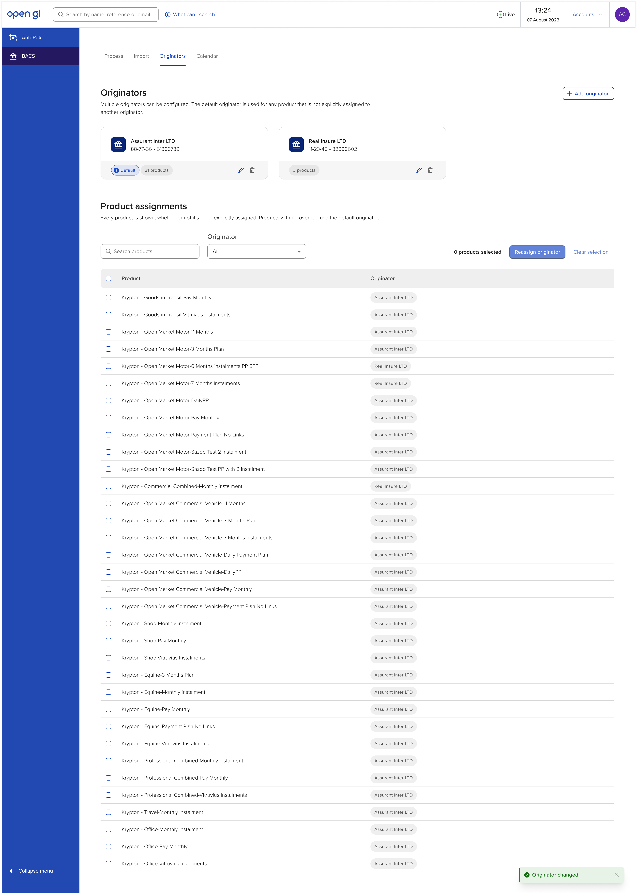

*OR-06-05 · Product moved to Real Insure LTD, card counts updated, success toast*

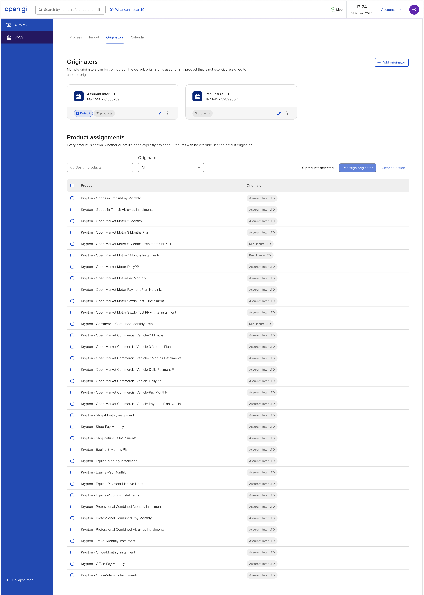

*OR-06-06 · Updated table after the toast has gone*

### Row selection

- **Selected row:** checkbox ticked and a light blue row background.
- **Counter:** "1 product selected", singular for one product.
- **Toolbar actions:** "Reassign originator" changes from its disabled pale blue to its enabled solid blue; "Clear selection" changes from pale to full blue.

### Reassign originator modal

- **Title:** "Reassign originator", with a close (×) icon button top right.
- **Subtitle:** "You're assigning a new originator to 1 product." The count follows the selection.
- **Selected products panel:** grey panel headed "Selected products" with a bulleted list of the selected product names.
- **Choose originator:** heading, helper text "Selected products will use this originator once you confirm your changes.", then one radio button per originator in the same order as the cards.
- **Actions:** Cancel (text button) and Confirm changes (primary button).

### Rules

- The radio group opens with the selected product's current originator chosen.
- "Confirm changes" is disabled until a different originator is chosen.
- After confirming, the selection clears, originator chips and card counts update, and a success toast "Originator changed" appears.
- Reassigning a product to the current default removes its override: the product inherits the default again and follows it at the next default change (OR-11).
- The toast uses the same pattern as OR-01 and hides itself using Bootstrap's native toast timing; its close (×) button dismisses it sooner.

## OR-07 · Reassign multiple products

The user selects several products and moves them to one originator in a single change. The modal adds a bulk change warning and summarises the selection.

**Starts from:** OR-00-01. **Ends at:** OR-07-06, the table showing the products' new originator.

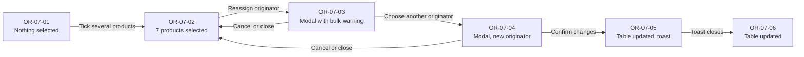
```mermaid
flowchart LR
  A[OR-07-01<br/>Nothing selected] -->|Tick several products| B[OR-07-02<br/>7 products selected]
  B -->|Reassign originator| C[OR-07-03<br/>Modal with bulk warning]
  C -->|Choose another originator| D[OR-07-04<br/>Modal, new originator]
  D -->|Confirm changes| E[OR-07-05<br/>Table updated, toast]
  E -->|Toast closes| F[OR-07-06<br/>Table updated]
  C -->|Cancel or close| B
  D -->|Cancel or close| B
```

### Steps

| Screen | User action | System response |
| --- | --- | --- |
| OR-07-01 | Views the Product assignments table | Nothing is selected. "Reassign originator" and "Clear selection" are disabled. |
| OR-07-02 | Ticks 7 products, all currently on Assurant Inter LTD | Each selected row has a light blue background. The header checkbox shows its partial state. The counter reads "7 products selected". |
| OR-07-03 | Clicks "Reassign originator" | Opens the modal with a bulk change warning, a summary of the selection and Assurant Inter LTD preselected. "Confirm changes" is disabled. |
| OR-07-04 | Selects Real Insure LTD | "Confirm changes" becomes enabled. |
| OR-07-05 | Clicks "Confirm changes" | The modal closes. All 7 chips change to Real Insure LTD, the selection clears, and card counts update to 25 and 9 products. Success toast "Originator changed" appears bottom right. |
| OR-07-06 | — | The toast has gone; the table and cards keep their updated state. |

*OR-07-01 · Product assignments table with nothing selected*

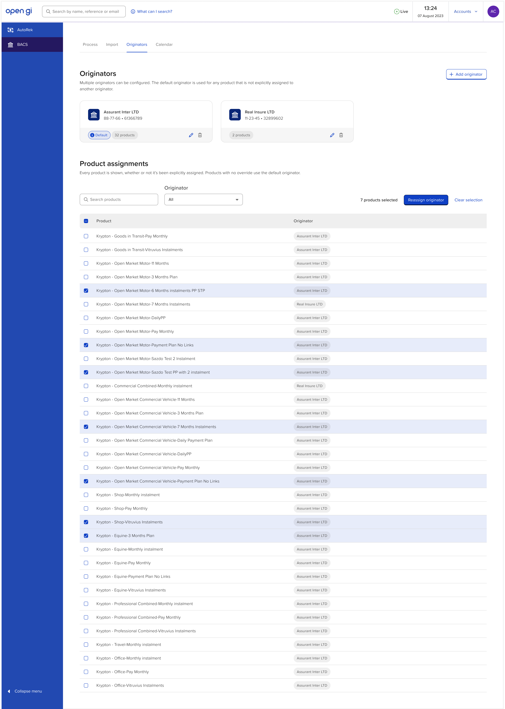

*OR-07-02 · Seven products selected, header checkbox in its partial state*

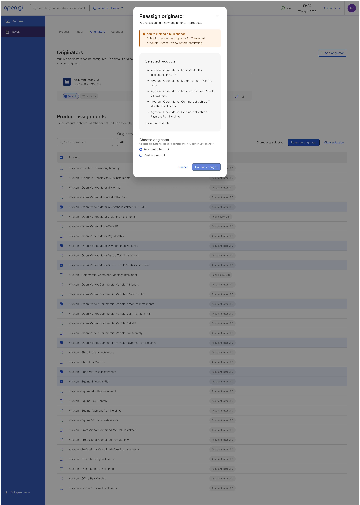

*OR-07-03 · Reassign originator modal with the bulk change warning and current originator preselected*

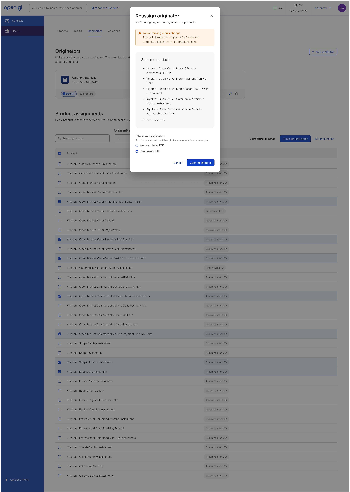

*OR-07-04 · Real Insure LTD chosen, Confirm changes enabled*

*OR-07-05 · Seven products moved to Real Insure LTD, card counts updated, success toast*

*OR-07-06 · Updated table after the toast has gone*

### Header checkbox

- **None selected:** empty.
- **Some selected:** partial state, a blue box with a white dash.
- **Clicking it** selects every product in the table, and the checkbox shows ticked (OR-08).

### Bulk change warning

Shown between the modal subtitle and the Selected products panel when 6 or more products are selected, but not all of them. It uses the same amber warning alert as OR-03.

- **Title:** "You're making a bulk change".
- **Body:** "This will change the originator for {count} selected products. Please review before confirming."

**Warning by selection size**

| Products selected | Warning | Selected products panel | Shown in |
| --- | --- | --- | --- |
| 1 to 5 | None | Every product name listed | OR-06, OR-09 |
| 6 or more, not all | Bulk change warning | First 5 names, then "+ N more products" | OR-07 |
| All products | All-products warning | Count only: "All {count} products are selected" | OR-08 |

### Selected products panel

- Lists up to 5 selected product names as bullets.
- Any further products are summarised on a final line, e.g. "+ 2 more products". This line is static text and cannot be expanded.

### Rules

- Selections of 1 to 5 products (OR-06, OR-09) show no warning; 6 or more show the bulk change warning; selecting every product shows the all-products variant (OR-08).
- When all selected products share an originator, that originator is preselected.
- One confirmation reassigns every selected product; the selection then clears and counts, chips and toast update as in OR-06.

## OR-08 · Reassign all products

The user selects every product with the header checkbox and moves them all to one originator. The modal switches to an all-products variant with a stronger warning and a count in place of the product list.

**Starts from:** OR-00-01. **Ends at:** OR-08-06, every product on the chosen originator.

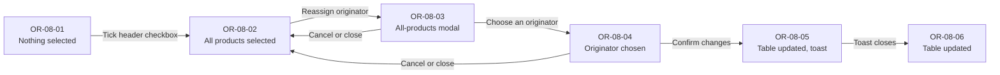
```mermaid
flowchart LR
  A[OR-08-01<br/>Nothing selected] -->|Tick header checkbox| B[OR-08-02<br/>All products selected]
  B -->|Reassign originator| C[OR-08-03<br/>All-products modal]
  C -->|Choose an originator| D[OR-08-04<br/>Originator chosen]
  D -->|Confirm changes| E[OR-08-05<br/>Table updated, toast]
  E -->|Toast closes| F[OR-08-06<br/>Table updated]
  C -->|Cancel or close| B
  D -->|Cancel or close| B
```

### Steps

| Screen | User action | System response |
| --- | --- | --- |
| OR-08-01 | Views the Product assignments table | Nothing is selected. Products are split across Assurant Inter LTD (32) and Real Insure LTD (2). |
| OR-08-02 | Ticks the header checkbox | Every row is ticked with a light blue background. The header checkbox is ticked. The counter reads "All products selected". |
| OR-08-03 | Clicks "Reassign originator" | Opens the all-products variant of the modal. No originator is preselected because the products use different originators. "Confirm changes" is disabled. |
| OR-08-04 | Selects Assurant Inter LTD | "Confirm changes" becomes enabled. |
| OR-08-05 | Clicks "Confirm changes" | The modal closes and every product moves to Assurant Inter LTD. Card counts update to 34 and 0 products, the selection clears, and success toast "Originator changed" appears. |
| OR-08-06 | — | The toast has gone; the table and cards keep their updated state. |

*OR-08-01 · Product assignments table with nothing selected*

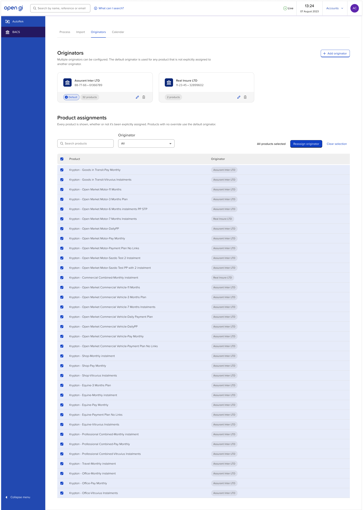

*OR-08-02 · All products selected with the header checkbox*

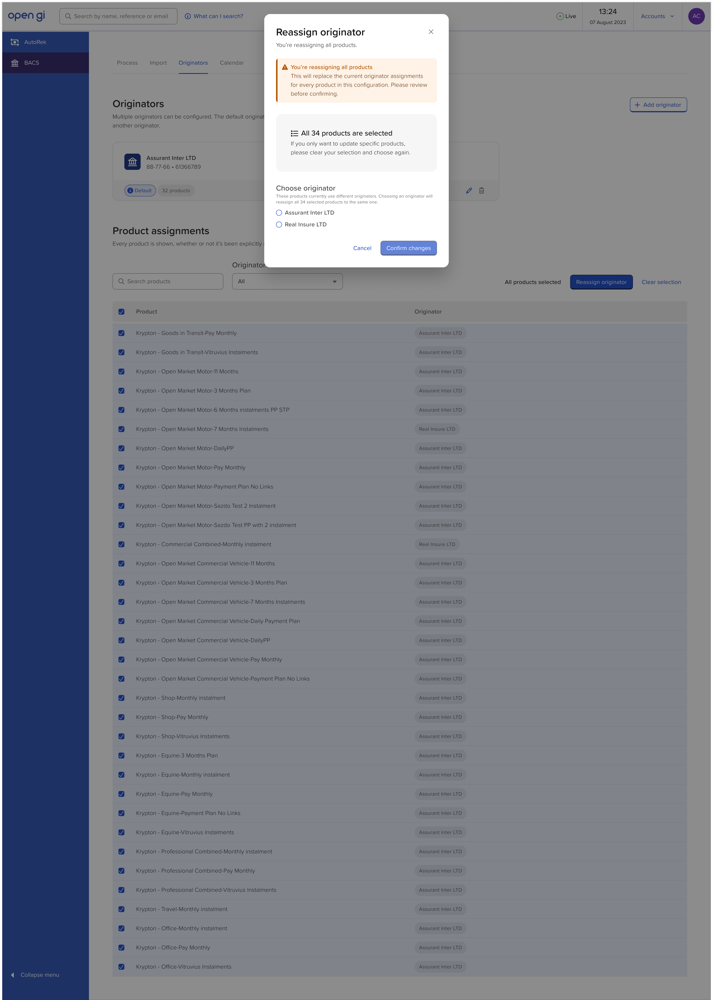

*OR-08-03 · Reassign originator modal, all-products variant, nothing preselected*

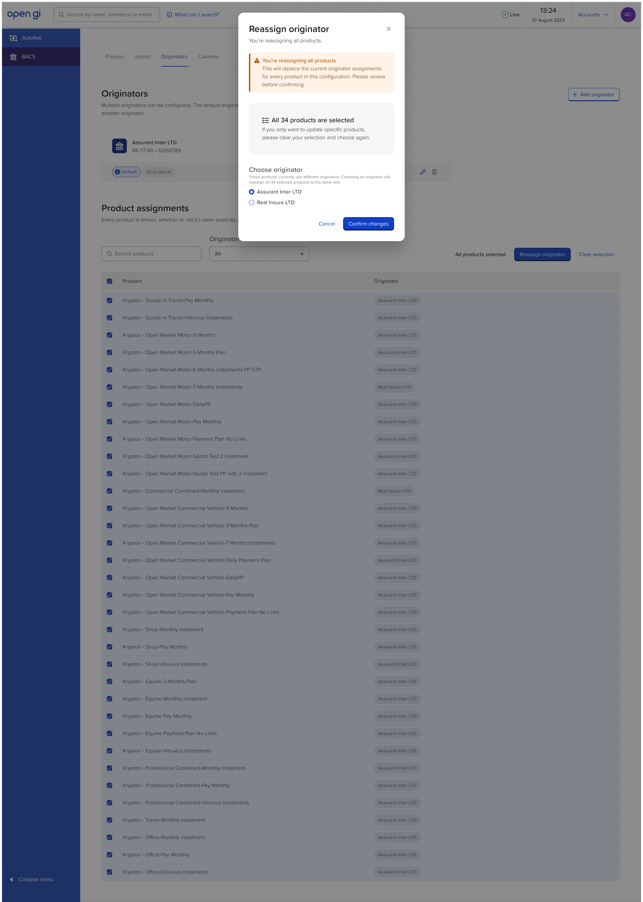

*OR-08-04 · Assurant Inter LTD chosen, Confirm changes enabled*

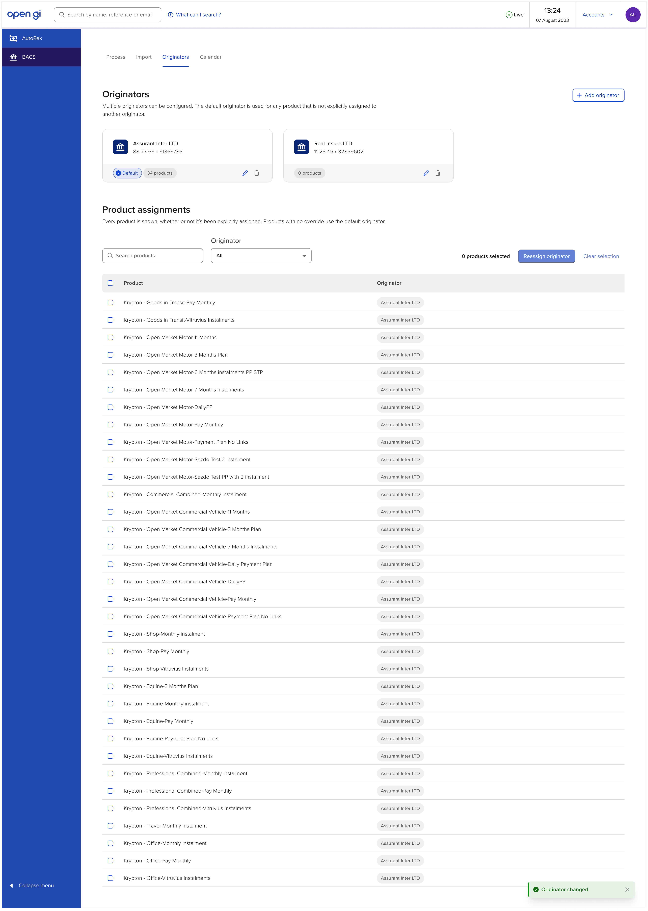

*OR-08-05 · All products moved to Assurant Inter LTD, success toast*

*OR-08-06 · Updated table after the toast has gone*

### All-products modal

Used when every product is selected. It differs from the OR-07 modal in four places.

| Element | Some products (OR-07) | All products (OR-08) |
| --- | --- | --- |
| Subtitle | You're assigning a new originator to {count} products. | You're reassigning all products. |
| Warning title | You're making a bulk change | You're reassigning all products |
| Warning body | This will change the originator for {count} selected products. Please review before confirming. | This will replace the current originator assignments for every product in this configuration. Please review before confirming. |
| Selection panel | Up to 5 product names, then "+ N more products" | List icon with "All {count} products are selected" and the line "If you only want to update specific products, please clear your selection and choose again." |

### Mixed originators

When the selected products use more than one originator:

- No radio button is preselected.
- The Choose originator helper text reads: "These products currently use different originators. Choosing an originator will reassign all {count} selected products to the same one." when every product is selected (OR-08), and "…will reassign all selected products to the same one.", without the count, for a partial selection (OR-09).
- "Confirm changes" stays disabled until an originator is chosen.

### Rules

- Ticking the header checkbox selects every product; the counter then reads "All products selected" instead of a number.
- With a search or filter active, the header checkbox selects only the visible rows.
- The all-products modal variant appears only when every product is selected.
- Confirming moves every product to the chosen originator; the other originators' counts drop to 0.

## OR-09 · Reassign products with mixed originators

The user selects products that currently sit on different originators and moves them all to a third one. With three originators configured, the modal lists all three and preselects none.

**Starts from:** OR-00-01 with three originators, Crimson Inter LTD having 0 products. **Ends at:** OR-09-06, both products on Crimson Inter LTD.

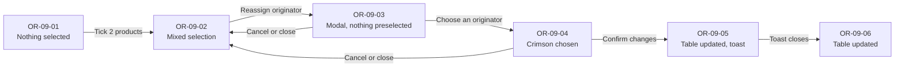
```mermaid
flowchart LR
  A[OR-09-01<br/>Nothing selected] -->|Tick 2 products| B[OR-09-02<br/>Mixed selection]
  B -->|Reassign originator| C[OR-09-03<br/>Modal, nothing preselected]
  C -->|Choose an originator| D[OR-09-04<br/>Crimson chosen]
  D -->|Confirm changes| E[OR-09-05<br/>Table updated, toast]
  E -->|Toast closes| F[OR-09-06<br/>Table updated]
  C -->|Cancel or close| B
  D -->|Cancel or close| B
```

### Steps

| Screen | User action | System response |
| --- | --- | --- |
| OR-09-01 | Views the page with three originators | Cards show Assurant Inter LTD (32), Real Insure LTD (2) and Crimson Inter LTD (0). Nothing is selected. |
| OR-09-02 | Ticks "Krypton - Open Market Motor-6 Months instalments PP STP" (Assurant Inter LTD) and "Krypton - Commercial Combined-Monthly instalment" (Real Insure LTD) | Both rows are highlighted. The header checkbox shows its partial state. The counter reads "2 products selected". |
| OR-09-03 | Clicks "Reassign originator" | The modal lists both products and all three originators. None is preselected because the products use different originators. "Confirm changes" is disabled. |
| OR-09-04 | Selects Crimson Inter LTD | "Confirm changes" becomes enabled. |
| OR-09-05 | Clicks "Confirm changes" | Both chips change to Crimson Inter LTD and the selection clears. Card counts update to Assurant Inter LTD 31, Real Insure LTD 1 and Crimson Inter LTD 2 products. Success toast "Originator changed" appears. |
| OR-09-06 | — | The toast has gone; the table and cards keep their updated state. |

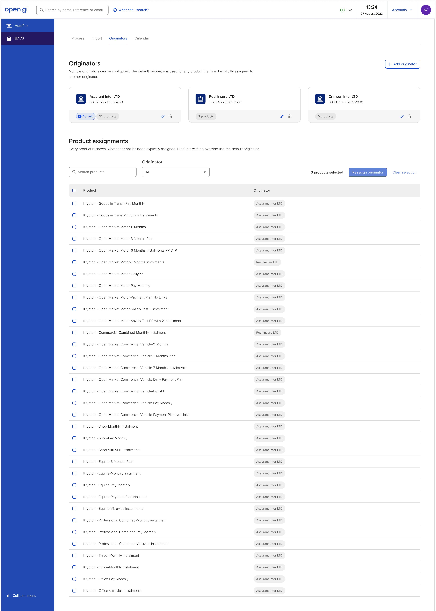

*OR-09-01 · Three originators configured, nothing selected*

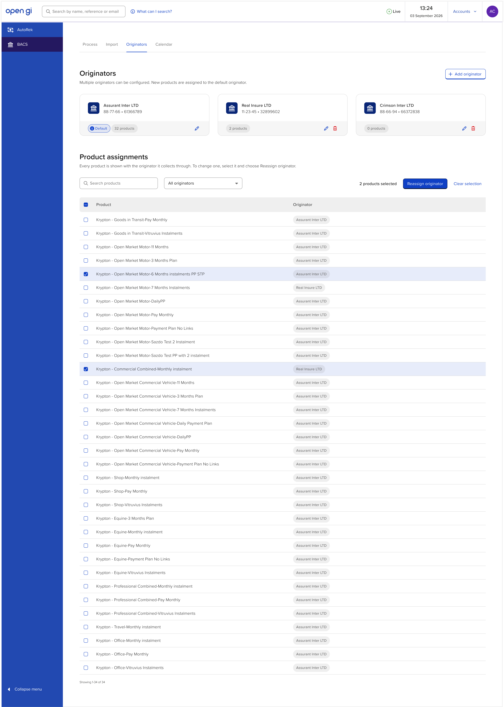

*OR-09-02 · Two products selected from different originators*

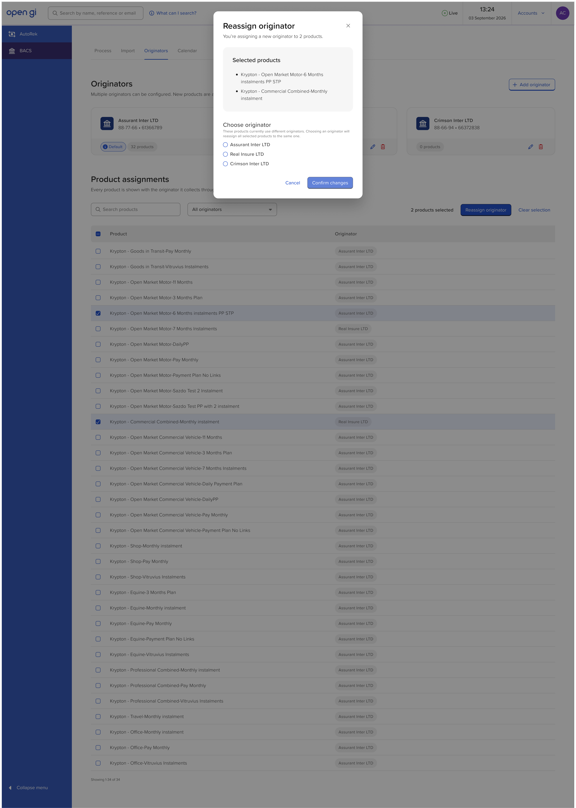

*OR-09-03 · Reassign originator modal with three options and nothing preselected*

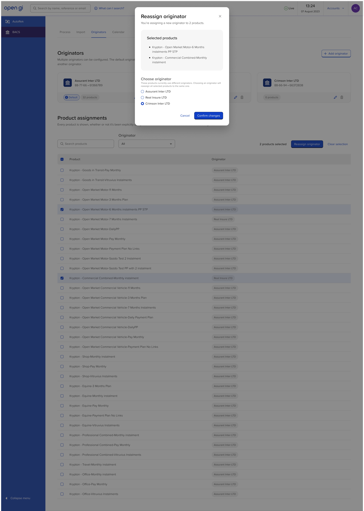

*OR-09-04 · Crimson Inter LTD chosen, Confirm changes enabled*

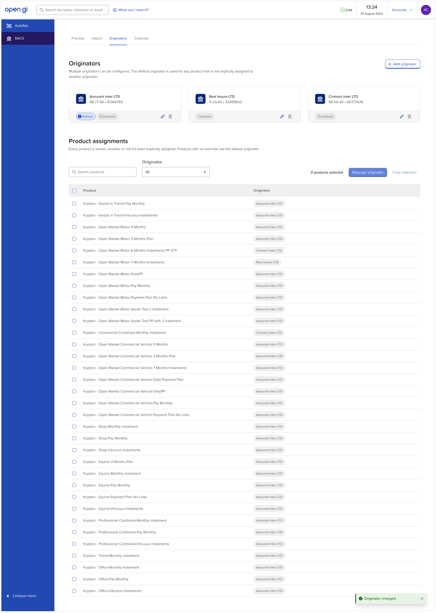

*OR-09-05 · Both products moved to Crimson Inter LTD, success toast*

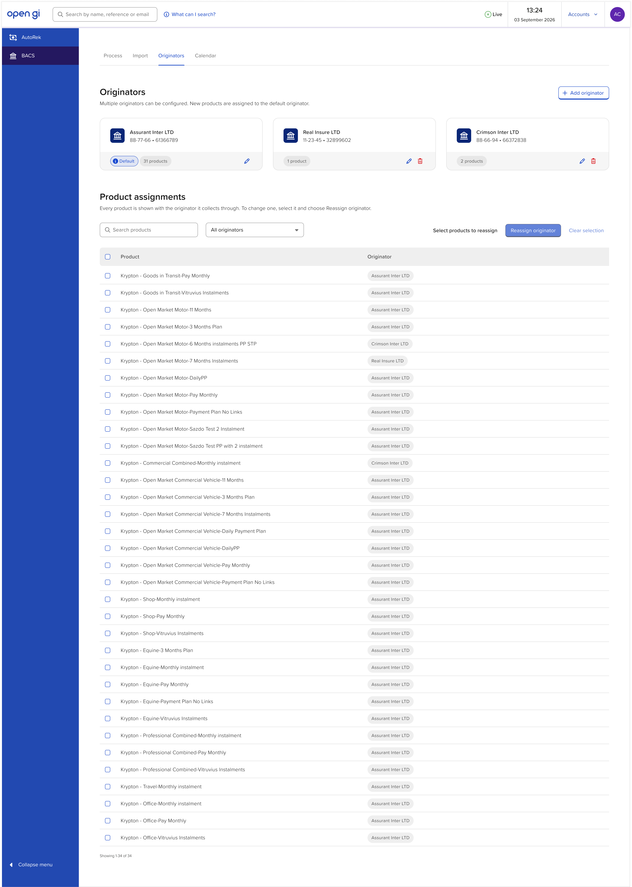

*OR-09-06 · Updated table after the toast has gone*

### Rules

- The radio group lists every originator, in card order, including one with 0 products.
- A mixed selection follows the Mixed originators rules in OR-08: nothing preselected, explanatory helper text, "Confirm changes" disabled until a choice is made.
- Card counts update for every originator affected: each source loses the products that moved and the target gains them all.
- Card product counts use the singular for one product: "1 product".

## OR-10 · Delete an originator

The user deletes an originator from the bin icon on its card. Deletion is blocked, with a tooltip explaining why, for the default originator and for any originator that still has products. Once it has no products, the user confirms the deletion in a destructive modal.

**Starts from:** OR-00-01. **Ends at:** OR-10-07, the page without the deleted card.

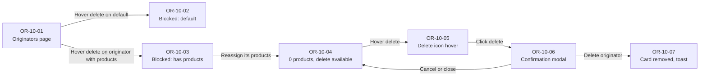
```mermaid
flowchart LR
  A[OR-10-01<br/>Originators page] -->|Hover delete on default| B[OR-10-02<br/>Blocked: default]
  A -->|Hover delete on originator with products| C[OR-10-03<br/>Blocked: has products]
  C -->|Reassign its products| D[OR-10-04<br/>0 products, delete available]
  D -->|Hover delete| E[OR-10-05<br/>Delete icon hover]
  E -->|Click delete| F[OR-10-06<br/>Confirmation modal]
  F -->|Delete originator| G[OR-10-07<br/>Card removed, toast]
  F -->|Cancel or close| D
```

### Steps

| Screen | User action | System response |
| --- | --- | --- |
| OR-10-01 | Views the Originators page | Both cards show a blue edit icon and a grey delete icon, because neither originator can be deleted yet. |
| OR-10-02 | Hovers over the delete icon on Assurant Inter LTD, the default | The bin icon changes to a red prohibited icon. A tooltip reads "Set another originator as default before deleting this one". Clicking does nothing. |
| OR-10-03 | Hovers over the delete icon on Real Insure LTD, which has 2 products | The bin icon changes to a red prohibited icon. A tooltip reads "Reassign this originator's products before deleting it". Clicking does nothing. |
| OR-10-04 | Reassigns Real Insure LTD's 2 products to Assurant Inter LTD (see OR-06 to OR-09) | Real Insure LTD shows "0 products" and every chip reads Assurant Inter LTD, now on 34 products. The delete icon on Real Insure LTD turns blue, showing it is available. |
| OR-10-05 | Hovers over the delete icon on Real Insure LTD | The icon button shows its light blue hover background. |
| OR-10-06 | Clicks the delete icon | The icon button shows its pressed state and the Delete this originator? modal opens. |
| OR-10-07 | Clicks "Delete originator" | The modal closes and the Real Insure LTD card is removed. Success toast "Originator deleted" appears. |

*OR-10-01 · Originators page before deleting*

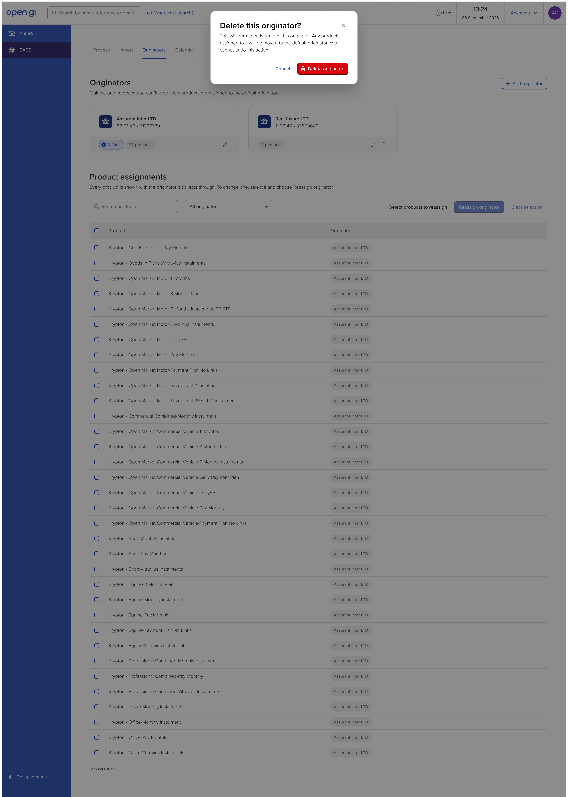

*OR-10-02 · Delete blocked on the default originator, with tooltip*

*OR-10-03 · Delete blocked on an originator with products, with tooltip*

*OR-10-04 · Real Insure LTD with 0 products after reassignment*

*OR-10-05 · Delete icon hover state on Real Insure LTD*

*OR-10-06 · Delete this originator? confirmation modal*

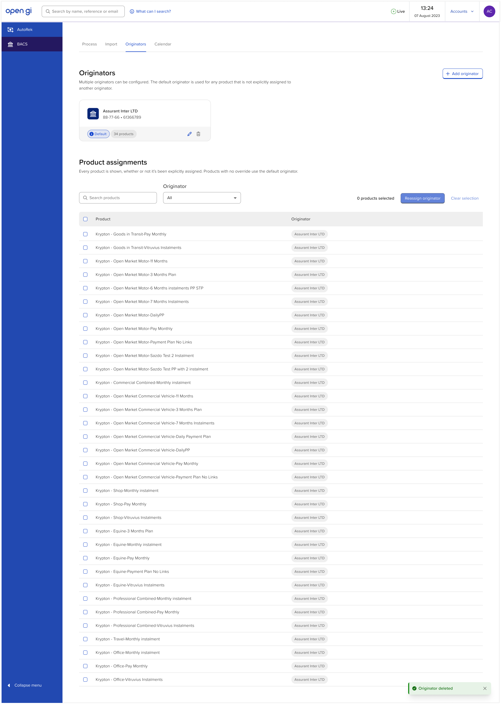

*OR-10-07 · Real Insure LTD removed, success toast*

### Blocked delete

- **Icon:** at rest a blocked bin is grey, showing it is disabled; an available bin is blue, like the edit icon. On hover or keyboard focus, a blocked bin is replaced by a red circle-with-a-line prohibited icon.
- **Tooltip:** a small tooltip above the icon explains what the user must do first. It appears on hover and on keyboard focus.

| Reason | Tooltip |
| --- | --- |
| Originator is the default | Set another originator as default before deleting this one |
| Originator has products | Reassign this originator's products before deleting it |

### Delete this originator? modal

- **Title:** "Delete this originator?", with a close (×) icon button top right.
- **Body:** "This will permanently remove this originator. You cannot undo this action."
- **Actions:** Cancel (text button) and "Delete originator" (red destructive button with a bin icon).

### Rules

- The default originator can never be deleted; another originator must be made default first.
- An originator with 1 or more products cannot be deleted until its products are reassigned.
- A non-default originator with 0 products can be deleted after confirmation.
- After deletion the card is removed, the originator disappears from the Originator filter and reassign options, and the toast "Originator deleted" appears.
- Cancel or close leaves the originator in place.

## OR-11 · Change the default originator

The user changes the default originator in one of two ways: by editing the current default, switching Make default off and choosing a new default, or by editing another originator and switching Make default on. Either way a warning explains the effect, and on confirming the Default badge moves to the new default.

**Starts from:** OR-00-01. **Ends at:** OR-11-06, Real Insure LTD as the default.

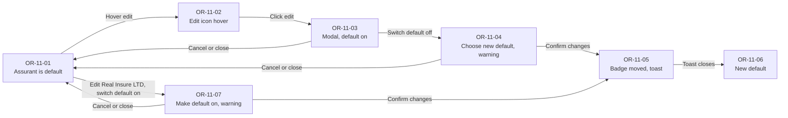
```mermaid
flowchart LR
  A[OR-11-01<br/>Assurant is default] -->|Hover edit| B[OR-11-02<br/>Edit icon hover]
  B -->|Click edit| C[OR-11-03<br/>Modal, default on]
  C -->|Switch default off| D[OR-11-04<br/>Choose new default, warning]
  D -->|Confirm changes| E[OR-11-05<br/>Badge moved, toast]
  E -->|Toast closes| F[OR-11-06<br/>New default]
  A -->|Edit Real Insure LTD, switch default on| G[OR-11-07<br/>Make default on, warning]
  G -->|Confirm changes| E
  C -->|Cancel or close| A
  D -->|Cancel or close| A
  G -->|Cancel or close| A
```

### Steps

| Screen | User action | System response |
| --- | --- | --- |
| OR-11-01 | Views the page | Assurant Inter LTD carries the Default badge. |
| OR-11-02 | Hovers over the edit icon on Assurant Inter LTD | The icon button shows its light blue hover background. |
| OR-11-03 | Clicks the edit icon | The Edit originator modal opens with Make default on. "Confirm changes" is disabled. |
| OR-11-04 | Switches Make default off | The toggle shows "Off". A Choose new default section appears listing every originator: Assurant Inter LTD is disabled and Real Insure LTD, the only other option, is selected. A default change warning appears above the buttons and "Confirm changes" becomes enabled. |
| OR-11-05 | Clicks "Confirm changes" | The modal closes. The Default badge moves to Real Insure LTD. The 32 products that inherited Assurant Inter LTD as the default move with it: every chip now reads Real Insure LTD, and card counts update to 0 and 34 products. Success toast "Default originator changed" appears. |
| OR-11-06 | — | The toast has gone; Real Insure LTD remains the default. |
| OR-11-07 | Alternative route from OR-11-01: clicks edit on Real Insure LTD and switches Make default on | The toggle shows "On". A default change warning naming Real Insure LTD appears above the buttons and "Confirm changes" becomes enabled. Confirming leads to OR-11-05. |

*OR-11-01 · Assurant Inter LTD is the default*

*OR-11-02 · Edit icon hover state on the default card*

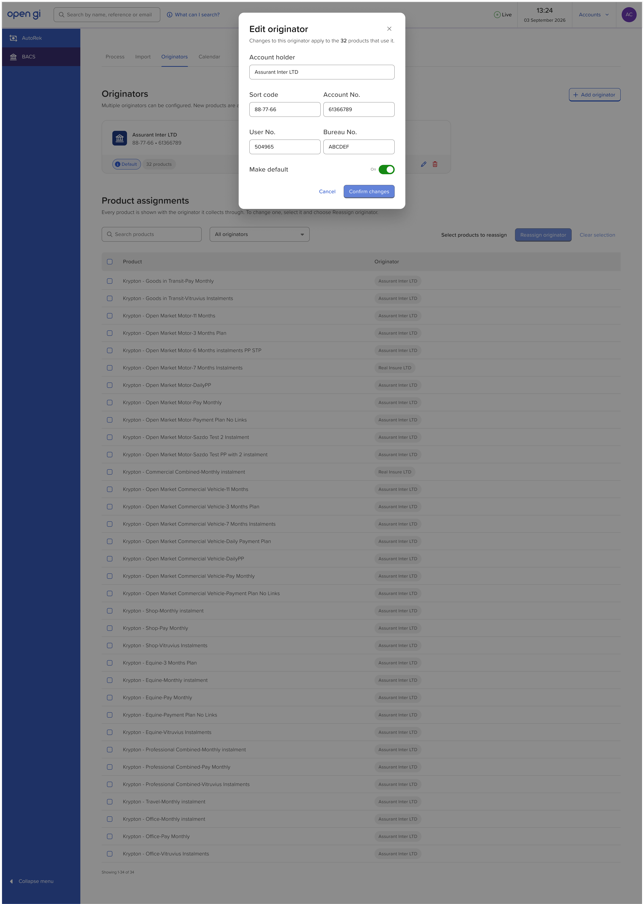

*OR-11-03 · Edit originator modal with Make default on*

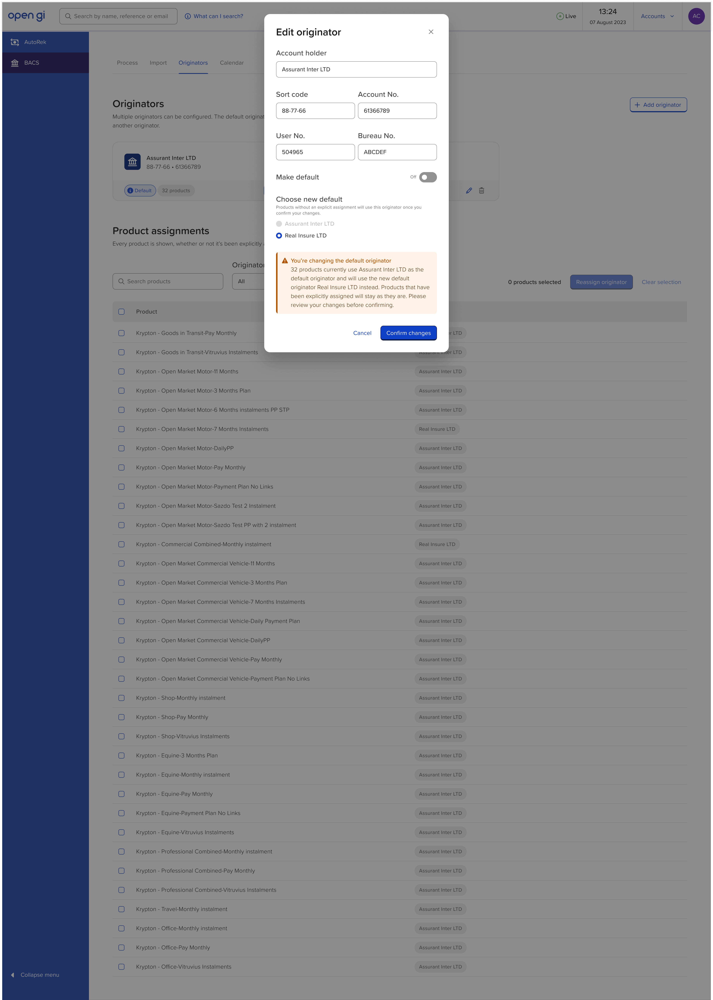

*OR-11-04 · Make default switched off, Choose new default options and default change warning shown*

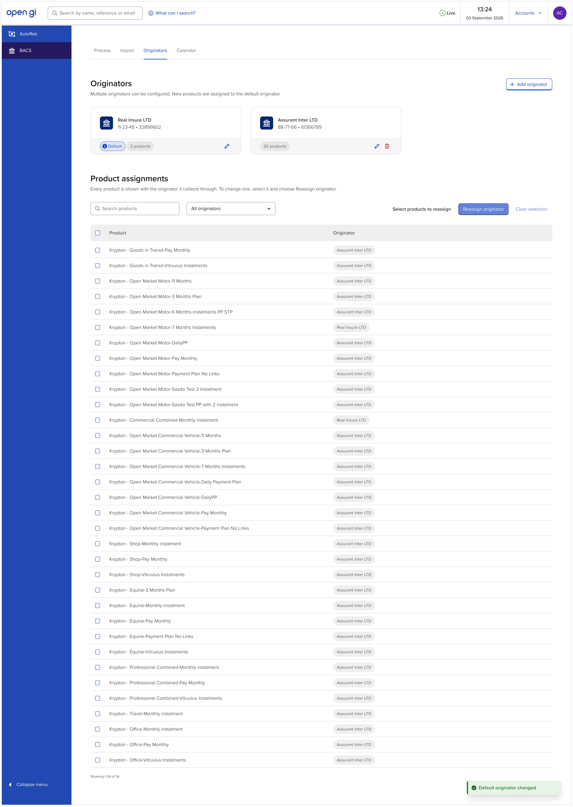

*OR-11-05 · Default badge and all 34 products on Real Insure LTD, success toast*

*OR-11-06 · Real Insure LTD as the default after the toast has gone*

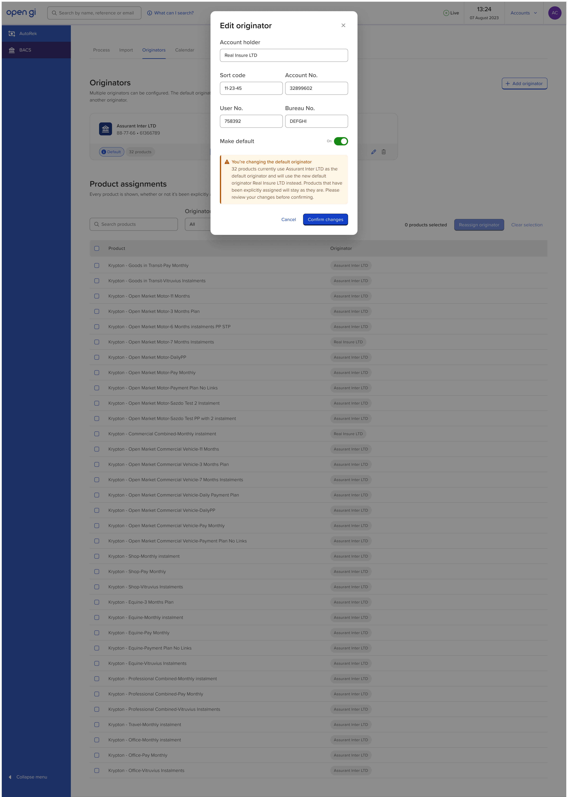

*OR-11-07 · Edit originator modal for Real Insure LTD with Make default switched on and default change warning*

### Choose new default

Shown between the Make default toggle and the warning when Make default is switched off on the current default. The user picks the originator that takes over as default.

- **Heading:** "Choose new default".
- **Helper text:** "Products without an explicit assignment will use this originator once you confirm your changes."
- **Options:** one radio button per originator, in card order. The current default is listed but disabled and greyed out. With two originators, the only other originator is preselected. With three or more, none is preselected and "Confirm changes" stays disabled until one is picked.

### Default change warning

The same amber warning alert as OR-03, shown above the buttons whenever confirming would change the default: below the Choose new default options when Make default is switched off on the current default (OR-11-04), or directly below the toggle when it is switched on for another originator (OR-11-07).

- **Title:** "You're changing the default originator".
- **Body:** "{count} products currently use {current default} as the default originator and will use the new default originator {new default} instead. Products that have been explicitly assigned will stay as they are. Please review your changes before confirming." {count} is the number of products inheriting the current default. OR-11-04 and OR-11-07 use the same wording.

### Rules

- Exactly one originator is always the default.
- Switching Make default off on the current default shows the Choose new default options and the default change warning, and enables "Confirm changes".
- The current default cannot be chosen as its own replacement. On confirming, the Default badge moves to the originator chosen.
- Switching Make default on for another originator shows the default change warning with nothing to choose. On confirming, that originator becomes the default and the previous default loses its badge.
- Products that rely on the default follow the new default; products explicitly assigned elsewhere keep their originator.
- After the change, the old default can be deleted once it has no products (OR-10).

## Open questions

These are unresolved after the flows documented so far; later flows may answer some.

- [x] **Validation (OR-02):** answered. Invalid values show an inline error as they are entered; blank fields are flagged when Save is clicked (OR-02-04, OR-02-05).
- [x] **Make default on add:** answered. Uses the OR-11-07 pattern; the warning gives the number of products that inherit the current default and will move to the new originator.
- [x] **Choosing the new default (OR-11):** answered. Every available originator is listed; with three or more, "Confirm changes" stays disabled until the user picks one.
- [x] **Search matching (OR-04):** answered. Matching is case-insensitive and extra spaces are trimmed.
- [x] **Explicit vs inherited (OR-11):** answered. Inherited products follow the new default; explicitly assigned products keep their originator.
- [x] **Card layout:** answered. Up to four cards per row; further cards wrap onto the next row.
- [x] **Search and filter together (OR-04, OR-05):** answered. Both apply at once.
- [x] **Toast timing (OR-06):** answered. Toasts use Bootstrap's native timing.
- [x] **Select all (OR-07):** answered. With a search or filter active, the header checkbox selects only the visible rows.
- [x] **Field messages (OR-02):** answered. See the Field messages table in OR-02.
- [x] **Reassigning to the default (OR-06):** answered. The product goes back to inheriting the default. The table shows inherited and explicitly assigned products the same way.

## Changes from legacy

The legacy RD app managed originators through a single "BACS Configuration – Originator Details" window, reached from Setup Originator Details on the BACS tab.

| Area | Legacy RD app | Mobius PAS |
| --- | --- | --- |
| Navigation | BACS menu of five links | BACS section with four tabs |
| Originator list | Grid of User No, Bureau No, Sort Code, Account No, Account Holder | Cards showing account holder, sort code and account number |
| Default originator | None; every product associated manually | One default; unassigned products fall back to it |
| Product association | Two lists (Associated, Available) moved with `<` and `>` | One searchable, filterable table with bulk reassignment |
| Adding | Five-field modal, then OK in the modal and again on the main window | Five-field modal plus a Make default toggle; one Save |
| Sort code display | Typed 10-10-10, shown 101010 in the grid | Shown hyphenated, 00-00-00, throughout |
| Validation | None documented | Inline errors as soon as a value is invalid, and on Save for empty or invalid fields with an error summary alert; Account holder limited to 18 characters |
| Editing | Highlight a grid row, click Edit, change fields, then OK in the modal and again on the main window | Edit icon on the card opens a pre-filled modal; Confirm changes is enabled only once something changes; warns when bank details change; one save |
| Finding products | Scroll the Available and Associated Products lists | Type-ahead search that filters the product table on every keystroke |
| Products per originator | Highlight an originator in the grid to see its Associated Products list | Originator dropdown filters the single product table; each card also shows its product count |
| Reassigning a product | Disassociate from one originator with >, then highlight another and associate with < | Select the product, choose the new originator in one modal and confirm; counts update immediately |
| Bulk changes | Ctrl-click to highlight several products, then move them between lists | Checkboxes with a select-all header; the modal warns about bulk changes and lists the products affected |
| Removing | Highlight a grid row, Remove, then Yes to "Are you sure you want to remove this originator?"; blocked while products are associated | Bin icon on the card; blocked with an explanatory tooltip for the default or while products are assigned; red destructive confirmation |
